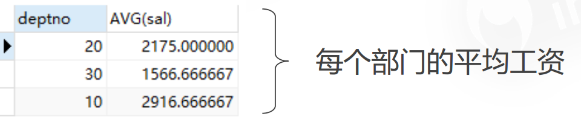

**DQL( Data Query Language 数据查询语言 )**

- 简单的单表查询或多表的复杂查询和嵌套查询
- 是数据库语言中最核心,最重要的语句
- 使用频率最高的语句


### SELECT语法

SELECT [ALL | DISTINCT]
 {* | table.* | [table.field1[as alias1][,table.field2[as alias2]][,...]]}
 FROM table_name [as table_alias]
   [left | right | inner join table_name2]  -- 联合查询
   [WHERE ...]  -- 指定结果需满足的条件
   [GROUP BY ...]  -- 指定结果按照哪几个字段来分组
   [HAVING]  -- 过滤分组的记录必须满足的次要条件
   [ORDER BY ...]  -- 指定查询记录按一个或多个条件排序
   [LIMIT {[offset,]row_count | row_countOFFSET offset}];
   -- 指定查询的记录从哪条至哪条

**注意 : [ ] 括号代表可选的 , { }括号代表必选得**


### 指定查询字段  

-- 查询所有学生信息  SELECT * FROM student;  

-- 查询指定列(学号 , 姓名)  SELECT studentno,studentname FROM student;


### AS 子句作为别名

作用：

- 可给数据列取一个新别名
- 可给表取一个新别名
- 可把经计算或总结的结果用另一个新名称来代替

-- 这里是为列取别名(当然as关键词可以省略)
 SELECT studentno AS 学号,studentname AS 姓名 FROM student;

 -- 使用as也可以为表取别名
 SELECT studentno AS 学号,studentname AS 姓名 FROM student AS s;

 -- 使用as,为查询结果取一个新名字
 -- CONCAT()函数拼接字符串
 SELECT CONCAT('姓名:',studentname) AS 新姓名 FROM student;


### DISTINCT关键字的使用

> 作用 : 去掉SELECT查询返回的记录结果中重复的记录 ( 返回所有列的值都相同 ) , 只返回一条

-- # 查看哪些同学参加了考试(学号) 去除重复项
 SELECT * FROM result; -- 查看考试成绩
 SELECT studentno FROM result; -- 查看哪些同学参加了考试
 SELECT DISTINCT studentno FROM result; -- 了解:DISTINCT 去除重复项 , (默认是ALL)


### 使用表达式的列

数据库中的表达式 : 一般由文本值 , 列值 , NULL , 函数和操作符等组成

应用场景 :

- SELECT语句返回结果列中使用
- SELECT语句中的ORDER BY , HAVING等子句中使用
- DML语句中的 where 条件语句中使用表达式

-- selcet查询中可以使用表达式
 SELECT @@auto_increment_increment; -- 查询自增步长
 SELECT VERSION(); -- 查询版本号
 SELECT 100*3-1 AS 计算结果; -- 表达式

 -- 学员考试成绩集体提分一分查看
 SELECT studentno,StudentResult+1 AS '提分后' FROM result;

- 避免SQL返回结果中包含 ' . ' , ' * ' 和括号等干扰开发语言程序.

 

### 排序 ORDER BY

语法 : SELECT ... FROM … ORDER BY 列名[ASC|DESC]；

 SELECT s.studentno,studentname FROM student ORDER BY grade;

  ASC代表升序（默认,一般省略）， DESC代表降序 

如果排序列是数字类型，数据库就按照数字大小排序，如果是日期

类型就按照日期大小排序，如果是字符串就按照字符集序号排序 

 注:

​	1、如果排序字段内容相同， MySQL会按照主键大小来排序两条数据  ;

​	2、可以有多个排序字段：

### 分页LIMIT

 语法 : SELECT ... FROM … LIMIT  起始值，偏移量；

好处 : (用户体验,网络传输,查询压力)

 推导:
   第一页 : limit 0,5
   第二页 : limit 5,5
   第三页 : limit 10,5
   ......
   第N页 : limit (pageNo-1)*pageSzie,pageSzie
   [pageNo:页码,pageSize:单页面显示条数]

起始值为0时可省略

   SELECT ... FROM … LIMIT 0，10；

   SELECT ... FROM … LIMIT 10；

### where条件查询

- 作用：用于检索数据表中 符合条件 的记录

- where中能用到的运算符：数学运算符、比较运算符、逻辑运算符(AND、OR、NOT)、按位运算符

- 常用查询条件：

  ​	IN 包含   	deptno in(10,20)

  ​	IS NULL/IS NOT NULL

  ​	BETWEEN AND  范围  sal BETWEEN 2000 AND 3000

  ​	LIKE  模糊查询  ename LIKE  "A%"(以A开头)/"%A%"(含有A)      

  ​			常见通配符： `_`任意单个字符 `%`任意多个字符

  ​	REGEXP 正则表达式 ename REGEXP "[a-zA-Z]{4}"

- 各种子句的执行顺序

  ​	FROM -> WHERE -> 	SELECT -> ORDER BY -> LIMIT


测试：

```mysql
 -- 查询姓刘的同学的学号及姓名
 -- like结合使用的通配符 : % (代表0到任意个字符) _ (一个字符)
 SELECT studentno,studentname FROM student
 WHERE studentname LIKE '刘%';

 -- 查询姓刘的同学,后面只有一个字的
 SELECT studentno,studentname FROM student
 WHERE studentname LIKE '刘_';

 -- 查询姓刘的同学,后面只有两个字的
 SELECT studentno,studentname FROM student
 WHERE studentname LIKE '刘__';

 -- 查询姓名中含有 嘉 字的
 SELECT studentno,studentname FROM student
 WHERE studentname LIKE '%嘉%';

 -- 查询学号为1000,1001,1002的学生姓名
 SELECT studentno,studentname FROM student
 WHERE studentno IN (1000,1001,1002);
```


### 分组查询 GROUD BY

SELECT deptno, AVG(sal) FROM t_emp GROUP BY deptno;



注：带有GROUD BY的分组语句中，SELECT 子句只能是GROUP BY后面的分组列和聚合函数

### HAVING

对分组后的语句进行筛选

> 与where的区别：where直接对数据表进行筛选，having对分组后的结果进行筛选。

```
-- 查询每个部门中，1982年以后入职的员I超过2个人的部门门编号

SELECT deptno FROM t_emp
WHERE hi_redate>="1982-01-01"
GROUP BY deptno HAVING COUNT (*)>=2
ORDER BY deptno ASC;
```


### 连接查询 JOIN

```
内连接 [inner] join
   查询两个表中的结果集中的交集
外连接 outer join
   左外连接 left join
       (以左表作为基准,右边表来一一匹配,匹配不上的,返回左表的记录,右表以NULL填充)
   右外连接 right join
       (以右表作为基准,左边表来一一匹配,匹配不上的,返回右表的记录,左表以NULL填充)
```

 连接查询
   如需要多张数据表的数据进行查询,则可通过连接运算符实现多个查询
 内连接 inner join
   查询两个表中的结果集中的交集
 外连接 outer join
   左外连接 left join
     (以左表作为基准,右边表来一一匹配,匹配不上的,返回左表的记录,右表以NULL填充)
   右外连接 right join
     (以右表作为基准,左边表来一一匹配,匹配不上的,返回右表的记录,左表以NULL填充)

​     

### 自连接 JOIN(跟自己连接)

```mysql
-- 查询月薪超过公司平均月薪的员工信息
select e1.ename,e2.avg 
from t_emp e1
join(select AVG(sal) as avg from t_emp) as e2
on e1.sal>e2.avg;

-- 查询每个底薪超过部门平均底薪的员工信息  
select e.empno,e.ename,e.sal,t.avg
from t_emp e join
(select deptno,AVG(sal) as avg from t_emp GROUP BY deptno) t   -- 将查询结果集作为一张表来连接
on e.deptno=t.deptno AND e.sal>t.avg;

-- 查询与SMITH相同部门的员工都有谁？
select e2.ename
from t_emp e1 join t_emp e2
on e1.deptno=e2.deptno
and e1.ename='SMITH' and e2.ename!='SMITH';
```


### 子查询

#### WHERE子查询

最常见，效率低，比较每条记录都需重新执行子查询

```mysql
-- 查询底薪超过公司平均底薪的员工的信息
SELECT empno,ename,sal
FROM t_emp
where sal>=(select AVG(SAL) from t_emp)
```

#### FROM子查询

子查询只执行一次，查询效率高

```
-- 查询月薪超过公司平均月薪的员工信息
select e1.ename,e2.avg 
from t_emp e1
join(select AVG(sal) as avg from t_emp) as e2
on e1.sal>e2.avg;
```

#### 

