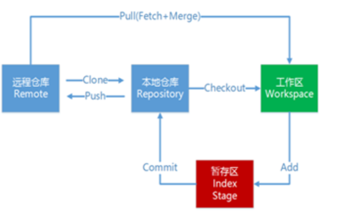
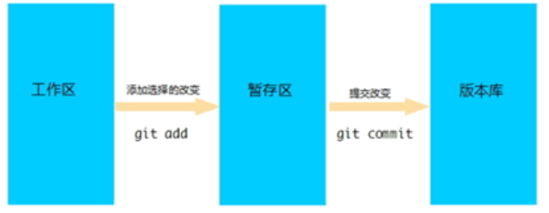

### 一、工作流程如下：

1．从远程仓库中克隆代码到本地仓库 

2．从本地仓库中checkout代码然后进行代码修改 

3．在提交前先将代码提交到暂存区 

4．提交到本地仓库。本地仓库中保存修改的各个历史版本 

5．修改完成后，需要和团队成员共享代码时，将代码push到远程仓库

 

### 二、工作目录、暂存区以及版本库

版本库：.git隐藏文件夹就是版本库，版本库中存储了很多配置信息、日志信息和文件版本信息等

工作目录（工作区）：包含.git文件夹的目录就是工作目录，主要用于存放开发的代码

暂存区：.git文件夹中有很多文件，其中有一个index文件就是暂存区，也可以叫做stage。暂存区是一个临时保存修改文件的地方

###  三、Git工作目录下的文件存在两种状态： 

-  untracked 未跟踪（未被纳入版本控制）

- tracked 已跟踪（被纳入版本控制）
  -  Unmodified 未修改状态

  - Modified 已修改状态

  - Staged 已暂存状态

### 四、常用命令

#### 本地仓库

创建本地仓库

  + 创建目录 

  + 进入目录，执行命令**git init**

    如果在当前目录中看到.git文件夹（此文件夹为隐藏文件夹）则说明Git仓库创建成功

 查看文件状态  git status

使输出信息更加简洁  git status –s 

 将未跟踪的文件加入暂存区

​	**git add file**   将这个文件加入暂存区

​	git add file1 file2 file3  将这三个文件加入暂存区

​	**git add .**    将当前所有有变化的文件加入暂存区

git diff  将当前工作区与上一次commit的版本库内容比较

git diff --cached   对比当前的暂存区和上一个commit的区别

git diff HEAD  对比当前暂且区和工作区的区别

**git commit  -m "提示信息"**  将暂存区的文件修改提交到本地仓库

git reset   撤销add操作，将add了的文件从暂存区拉回到工作区

git checkout   commit_id      让当前的工作区回到特定的某个commit

git checkout master  从过去回到现在

删除文件

​	git rm file

​	git commit  -m "提示信息"

将文件添加至忽略列表

​	创建一个名为 .gitignore 的文件

​	文件模式

 

查看提交日志

git log（q退出）

#### 远程仓库

查看远程仓库   git remote 

创建远程仓库     **git remote add origin  <url>**

 克隆远程仓库     git clone url

移除无效的远程仓库 git remote rm(注：此命令只是从本地移除远程仓库的记录，并不会真正影响到远程仓库)

从远程仓库中抓取与拉取  

​	git fetch 是从远程仓库获取最新版本到本地仓库，不会自动merge

​	git pull 是从远程仓库获取最新版本并merge到本地仓库

推送到远程仓库 **git push -u origin master**

#### git分支

查看分支  git branch

创建分支 git branch xx

切换到分支  git checkout xx

直接创建并切换到新的分支  git checkout -b <branch_name>

 删除分支  git branch -d <name> 

将name分支合并至当前分支  git merge <name> 

分支冲突

#### 标签管理

标签是我们对commit设置的别名

查看标签   git tag

给当前分支的最新commit打标签   git tag <tag_name>

给当前分支旧的commit打上标签  git tag <tag_name> <commit_id>

回到过去的版本  git checkout <tag_name>

删除标签  git tag -d <tag_name>

#### 环境配置

设置用户信息 

   git config --global user.name “itcast”

   git config --global user.email “hello@itcast.cn”

查看配置信息

   git config --list

   git config user.name

通过上面的命令设置的信息会保存在~/.gitconfig文件中

