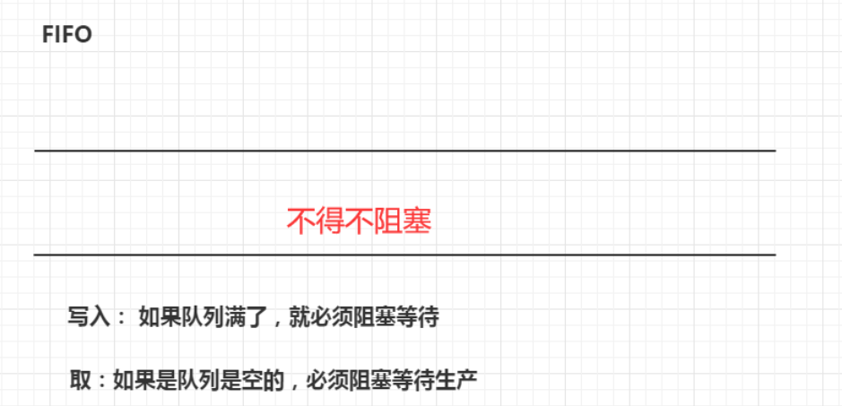
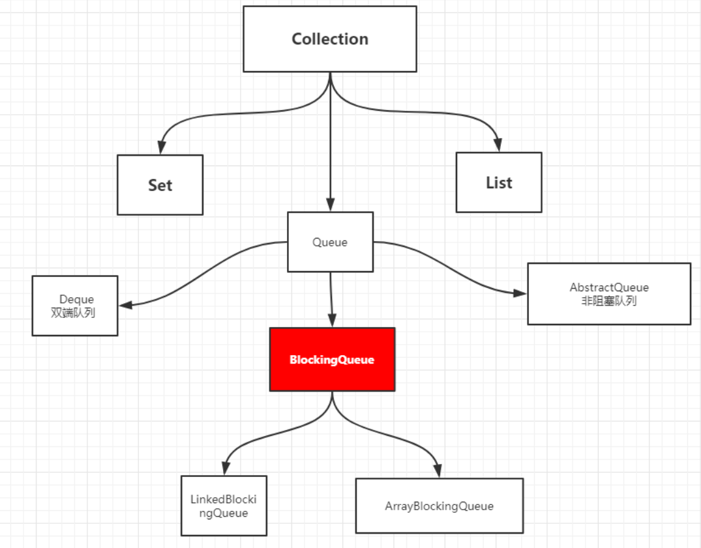
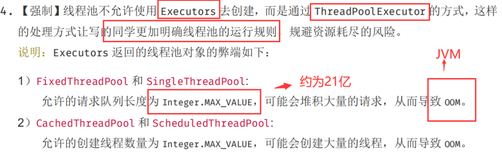
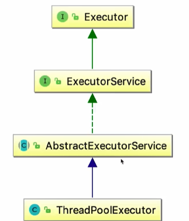
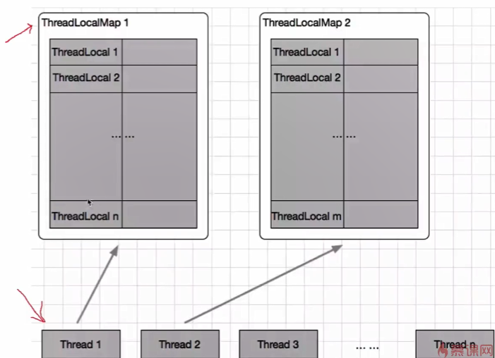
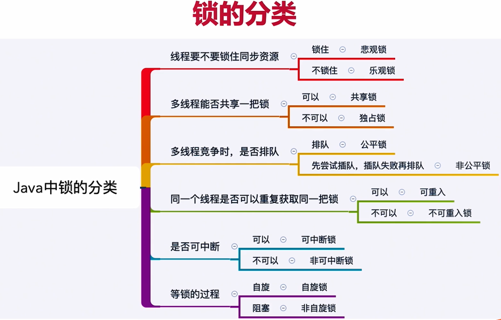
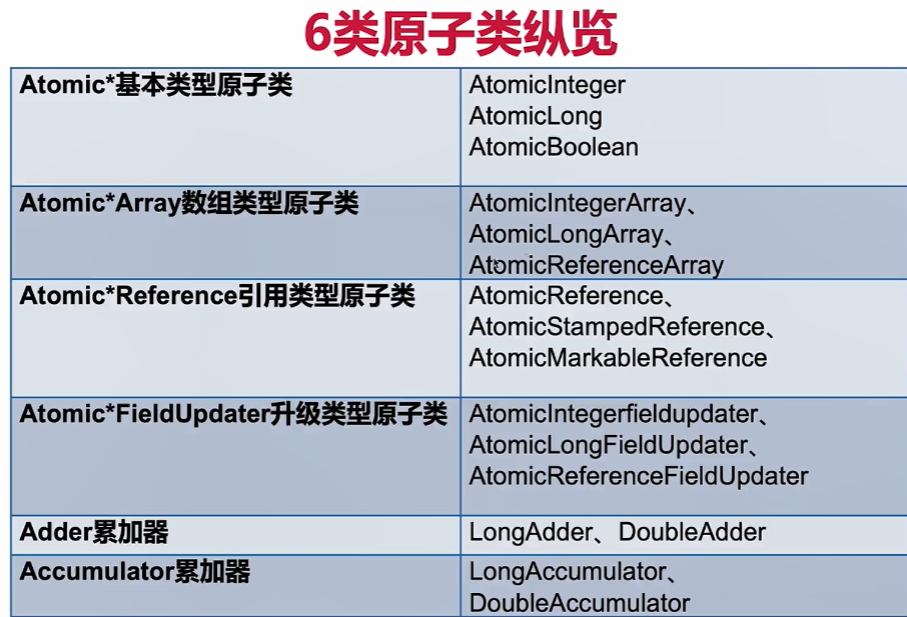

### 锁

1、synchronized修饰的非静态方法，锁是方法的调用者

2、synchronized修饰的静态方法，锁是Class类模板

3、使用同一把锁的方法，谁先拿到谁执行

```java
import java.util.concurrent.TimeUnit;

/**
 * 1、标准情况下，两个线程先打印 发短信还是 打电话？    1/发短信->2/打电话
 * 2、sendSms延迟4秒，两个线程先打印 发短信还是 打电话？   1/发短信->2/打电话
 *原因：两个方法用的是同一个锁时，谁先拿到谁执行！
 */
public class Test1 {
    public static void main(String[] args) {
        Phone phone = new Phone();

        //锁的存在
        new Thread(()->{
            phone.sendSms();
        },"A").start();

        // 捕获
        try {
            TimeUnit.SECONDS.sleep(1);
        } catch (InterruptedException e) {
            e.printStackTrace();
        }

        new Thread(()->{
            phone.call();
        },"B").start();
    }
}

class Phone{

    // synchronized 锁的对象是方法的调用者！、
    // 两个方法用的是同一个锁，谁先拿到谁执行！
    public synchronized void sendSms(){
        try {
            TimeUnit.SECONDS.sleep(4);   //当前线程进入阻塞状态 
        } catch (InterruptedException e) {
            e.printStackTrace();
        }
        System.out.println("发短信");
    }

    public synchronized void call(){
        System.out.println("打电话");
    }
}
```

```java
import java.util.concurrent.TimeUnit;

/**
 * 3、 增加了一个普通方法后！先执行发短信还是Hello？  Hello
 * 4、 两个对象，两个同步方法， 发短信还是 打电话？   打电话
 *原因：没有使用同一个锁，发短信线程sleep时被阻塞了
 */
public class Test2  {
    public static void main(String[] args) {
        // 两个对象，两个调用者，两把锁！
        Phone2 phone1 = new Phone2();
        Phone2 phone2 = new Phone2();

        //锁的存在
        new Thread(()->{
            phone1.sendSms();
        },"A").start();

        // 捕获
        try {
            TimeUnit.SECONDS.sleep(1);
        } catch (InterruptedException e) {
            e.printStackTrace();
        }

        new Thread(()->{
            phone2.call();     //第二个对象
//            phone1.hello();   //普通方法
        },"B").start();
    }
}

class Phone2{

    // synchronized 锁的对象是方法的调用者！
    public synchronized void sendSms(){
        try {
            TimeUnit.SECONDS.sleep(4);
        } catch (InterruptedException e) {
            e.printStackTrace();
        }
        System.out.println("发短信");
    }

    public synchronized void call(){
        System.out.println("打电话");
    }

    // 这里没有锁！不是同步方法，不受锁的影响
    public void hello(){
        System.out.println("hello");
    }

}
```

```java
import java.util.concurrent.TimeUnit;

/**
 * 5、增加两个静态的同步方法，只有一个对象，先打印 发短信？打电话？   发短信
 * 6、两个对象！增加两个静态的同步方法， 先打印 发短信？打电话？    发短信
 *原因：两个对象的Class类模板只有一个，锁的是Class,还是同一把锁
 */
public class Test3  {
    public static void main(String[] args) {
        // 两个对象的Class类模板只有一个，static，锁的是Class
        Phone3 phone1 = new Phone3();
        Phone3 phone2 = new Phone3();

        //锁的存在
        new Thread(()->{
            phone1.sendSms();
        },"A").start();

        // 捕获
        try {
            TimeUnit.SECONDS.sleep(1);
        } catch (InterruptedException e) {
            e.printStackTrace();
        }

        new Thread(()->{
            phone2.call();  //两个对象
            //phone1.call();  //一个对象
        },"B").start();
    }
}

// Phone3唯一的一个 Class 对象
class Phone3{

    // 静态的同步方法 锁的是 Class 类模板
    public static synchronized void sendSms(){
        try {
            TimeUnit.SECONDS.sleep(4);
        } catch (InterruptedException e) {
            e.printStackTrace();
        }
        System.out.println("发短信");
    }

    public static synchronized void call(){
        System.out.println("打电话");
    }
}
```

### 集合类不安全

#### List不安全

```java
import java.util.*;
import java.util.concurrent.CopyOnWriteArrayList;


public class ListTest {
    public static void main(String[] args) {
        // 并发下 ArrayList 不安全,会产生java.util.ConcurrentModificationException 并发修改异常
        /**
         * 解决方案；
         * 1、List<String> list = new Vector<>();
         * 2、List<String> list = Collections.synchronizedList(new ArrayList<>());
         * 3、List<String> list = new CopyOnWriteArrayList<>()；
         */
        // CopyOnWrite 写入时复制  COW  计算机程序设计领域的一种优化策略；
        // 多个线程调用的时候，list，读取的时候，固定的，写入（覆盖）
        // 在写入的时候避免覆盖，造成数据问题！
        // 读写分离
        // CopyOnWriteArrayList  比 Vector Nb 在哪里？

        //List<String> list = new ArraryList<>();产生异常
        List<String> list = new CopyOnWriteArrayList<>();

        for (int i = 1; i <= 10; i++) {
            new Thread(()->{
                list.add(UUID.randomUUID().toString().substring(0,5));
                System.out.println(list);
            },String.valueOf(i)).start();
        }
    }
}

```

#### set不安全

```java
import java.util.Collections;
import java.util.HashSet;
import java.util.Set;
import java.util.UUID;
import java.util.concurrent.CopyOnWriteArraySet;

/**
 * 同理可证 ： ConcurrentModificationException
 * //1、Set<String> set = Collections.synchronizedSet(new HashSet<>());
 * //2、
 */
public class SetTest {
    public static void main(String[] args) {
        Set<String> set = new HashSet<>();
        // hashmap
        // Set<String> set = Collections.synchronizedSet(new HashSet<>());
        // Set<String> set = new CopyOnWriteArraySet<>();

        for (int i = 1; i <=30 ; i++) {
           new Thread(()->{
               set.add(UUID.randomUUID().toString().substring(0,5));
               System.out.println(set);
           },String.valueOf(i)).start();
        }

    }
}

```

#### Map不安全

### Callable

```java
import java.util.concurrent.Callable;
import java.util.concurrent.ExecutionException;
import java.util.concurrent.FutureTask;

public class CallableTest {
    public static void main(String[] args) throws ExecutionException, InterruptedException {
        // new Thread(new Runnable()).start();   
        // new Thread(new FutureTask<V>()).start();
        // new Thread(new FutureTask<V>( Callable )).start();
        new Thread().start(); // 怎么启动Callable   线程都是通过Thread类启动

        MyThread thread = new MyThread();
        FutureTask futureTask = new FutureTask(thread); // 适配类

        new Thread(futureTask,"A").start();
        new Thread(futureTask,"B").start(); // 结果会被缓存，效率高

        Integer o = (Integer) futureTask.get(); //这个get 方法可能会产生阻塞！把他放到最后
        // 或者使用异步通信来处理！
        System.out.println(o);

    }
}

class MyThread implements Callable<Integer> {

    @Override
    public Integer call() {
        System.out.println("call()"); // 会打印几个call
        // 耗时的操作
        return 1024;
    }
}
```

### 常用的辅助类（必会）

#### CountDownLatch

```java
import java.util.concurrent.CountDownLatch;

// 减法计数器,允许一个或多个线程等待,直到这些线程操作都完成时进行统一操作
//每次有线程调用 countDown() 数量-1，假设计数器变为0，countDownLatch.await() 就会被唤醒，继续执行！
public class CountDownLatchDemo {
    public static void main(String[] args) throws InterruptedException {
        // 计数器总数是6
        CountDownLatch countDownLatch = new CountDownLatch(6);

        for (int i = 1; i <=6 ; i++) {
            new Thread(()->{
                System.out.println(Thread.currentThread().getName()+" Go out");
                countDownLatch.countDown(); // 计数器数量-1
            },String.valueOf(i)).start();
        }

        countDownLatch.await(); // 等待计数器归零，然后再向下执行

        System.out.println("Close Door");//上述线程都完成后的统一操作（必须要执行任务）
    }
}
```

#### CyclicBarrier

```java
import java.util.concurrent.BrokenBarrierException;
import java.util.concurrent.CyclicBarrier;

//加法计数器
public class CyclicBarrierDemo {
    public static void main(String[] args) {
        /**
         * 集齐7颗龙珠召唤神龙
         */
        // 召唤龙珠的线程
        CyclicBarrier cyclicBarrier = new CyclicBarrier(8,()->{
            System.out.println("召唤神龙成功！");
        });

        for (int i = 1; i <=7 ; i++) {
            final int temp = i;
            // lambda能操作到 i 吗
            new Thread(()->{
                System.out.println(Thread.currentThread().getName()+"收集"+temp+"个龙珠");
                try {
                    cyclicBarrier.await(); // 等待
                } catch (InterruptedException e) {
                    e.printStackTrace();
                } catch (BrokenBarrierException e) {
                    e.printStackTrace();
                }
            }).start();
        }
    }
}

```

#### Semaphore

```java
//Semaphore：信号量，作用： 多个共享资源互斥的使用！并发限流，控制最大的线程数！
import java.util.concurrent.Semaphore;
import java.util.concurrent.TimeUnit;

//抢车位
public class SemaphoreDemo {
    public static void main(String[] args) {
        // 线程数量：停车位! 限流！
        Semaphore semaphore = new Semaphore(3);//3个停车位

        for (int i = 1; i <=6 ; i++) {    //6辆车
            new Thread(()->{
                // acquire() 得到
                try {
                    semaphore.acquire();//获得，假设如果已经满了，等待，等待被释放为止！
                    System.out.println(Thread.currentThread().getName()+"抢到车位");
                    TimeUnit.SECONDS.sleep(2);
                    System.out.println(Thread.currentThread().getName()+"离开车位");
                } catch (InterruptedException e) {
                    e.printStackTrace();
                } finally {
                    semaphore.release(); // release() 释放，会将当前的信号量释放 + 1，然后唤醒等待的线程！
                }
            },String.valueOf(i)).start();
        }
    }
}

```

### 读写锁

> ReadWriteLock 维护了一对关联的Locks,一个用于只读操作，一个用于写入操作。**读可以同时被多线程读，写的时候只能有一个线程去写。**

```java
import java.util.HashMap;
import java.util.Map;
import java.util.concurrent.locks.Lock;
import java.util.concurrent.locks.ReadWriteLock;
import java.util.concurrent.locks.ReentrantLock;
import java.util.concurrent.locks.ReentrantReadWriteLock;

/**
 * 独占锁（写锁） 一次只能被一个线程占有
 * 共享锁（读锁） 多个线程可以同时占有
 * ReadWriteLock
 * 读-读  可以共存！
 * 读-写  不能共存！
 * 写-写  不能共存！
 */
public class ReadWriteLockDemo {
    public static void main(String[] args) {
        //MyCache myCache = new MyCache();
        MyCacheLock myCache = new MyCacheLock();

        // 写入
        for (int i = 1; i <= 5 ; i++) {
            final int temp = i;
            new Thread(()->{
                myCache.put(temp+"",temp+"");
            },String.valueOf(i)).start();
        }

        // 读取
        for (int i = 1; i <= 5 ; i++) {
            final int temp = i;
            new Thread(()->{
                myCache.get(temp+"");
            },String.valueOf(i)).start();
        }

    }
}

// 加锁的自定义缓存
class MyCacheLock{

    private volatile Map<String,Object> map = new HashMap<>();
    // 读写锁： 更加细粒度的控制
    private ReadWriteLock readWriteLock = new ReentrantReadWriteLock();
    private Lock lock = new ReentrantLock();

    // 存，写入的时候，只希望同时只有一个线程写
    public void put(String key,Object value){
        readWriteLock.writeLock().lock();
        try {
            System.out.println(Thread.currentThread().getName()+"写入"+key);
            map.put(key,value);
            System.out.println(Thread.currentThread().getName()+"写入OK");
        } catch (Exception e) {
            e.printStackTrace();
        } finally {
            readWriteLock.writeLock().unlock();
        }
    }

    // 取，读，所有人都可以读！
    public void get(String key){
        readWriteLock.readLock().lock();
        try {
            System.out.println(Thread.currentThread().getName()+"读取"+key);
            Object o = map.get(key);
            System.out.println(Thread.currentThread().getName()+"读取OK");
        } catch (Exception e) {
            e.printStackTrace();
        } finally {
            readWriteLock.readLock().unlock();
        }
    }
}

/**
 * 未加锁自定义缓存（写入不安全）
 */
class MyCache{

    private volatile Map<String,Object> map = new HashMap<>();

    // 存，写
    public void put(String key,Object value){
        System.out.println(Thread.currentThread().getName()+"写入"+key);
        map.put(key,value);
        System.out.println(Thread.currentThread().getName()+"写入OK");
    }

    // 取，读
    public void get(String key){
        System.out.println(Thread.currentThread().getName()+"读取"+key);
        Object o = map.get(key);
        System.out.println(Thread.currentThread().getName()+"读取OK");
    }

}
```

### 队列

#### 阻塞队列BlockingQueue





##### 使用场景

多线程并发处理，线程池

##### 四组API(根据业务场景选择)


```java
import java.util.Collection;
import java.util.concurrent.ArrayBlockingQueue;
import java.util.concurrent.TimeUnit;

public class Test {
    public static void main(String[] args) throws InterruptedException {
        test4();
    }
    /**
     * 抛出异常
     */
    public static void test1(){
        // 队列的大小
        ArrayBlockingQueue blockingQueue = new ArrayBlockingQueue<>(3);

        System.out.println(blockingQueue.add("a"));
        System.out.println(blockingQueue.add("b"));
        System.out.println(blockingQueue.add("c"));
        // IllegalStateException: Queue full 抛出异常！
        // System.out.println(blockingQueue.add("d"));

        System.out.println("=-===========");

        System.out.println(blockingQueue.element()); // 查看队首元素是谁
        System.out.println(blockingQueue.remove());


        System.out.println(blockingQueue.remove());
        System.out.println(blockingQueue.remove());

        // java.util.NoSuchElementException 抛出异常！
        // System.out.println(blockingQueue.remove());
    }

    /**
     * 有返回值，没有异常
     */
    public static void test2(){
        // 队列的大小
        ArrayBlockingQueue blockingQueue = new ArrayBlockingQueue<>(3);

        System.out.println(blockingQueue.offer("a"));
        System.out.println(blockingQueue.offer("b"));
        System.out.println(blockingQueue.offer("c"));

        System.out.println(blockingQueue.peek());
        // System.out.println(blockingQueue.offer("d")); // false 不抛出异常！
        System.out.println("============================");
        System.out.println(blockingQueue.poll());
        System.out.println(blockingQueue.poll());
        System.out.println(blockingQueue.poll());
        System.out.println(blockingQueue.poll()); // null  不抛出异常！
    }

    /**
     * 等待，阻塞（一直阻塞）
     */
    public static void test3() throws InterruptedException {
        // 队列的大小
        ArrayBlockingQueue blockingQueue = new ArrayBlockingQueue<>(3);

        // 一直阻塞
        blockingQueue.put("a");
        blockingQueue.put("b");
        blockingQueue.put("c");
        // blockingQueue.put("d"); // 队列没有位置了，一直阻塞
        System.out.println(blockingQueue.take());
        System.out.println(blockingQueue.take());
        System.out.println(blockingQueue.take());
        System.out.println(blockingQueue.take()); // 没有这个元素，一直阻塞
    }

    /**
     * 等待，阻塞（等待超时）
     */
    public static void test4() throws InterruptedException {
        // 队列的大小
        ArrayBlockingQueue blockingQueue = new ArrayBlockingQueue<>(3);

        blockingQueue.offer("a");
        blockingQueue.offer("b");
        blockingQueue.offer("c");
        // blockingQueue.offer("d",2,TimeUnit.SECONDS); // 等待超过2秒就退出
        System.out.println("===============");
        System.out.println(blockingQueue.poll());
        System.out.println(blockingQueue.poll());
        System.out.println(blockingQueue.poll());
        blockingQueue.poll(2,TimeUnit.SECONDS); // 等待超过2秒就退出

    }
}
```

#### 同步队列SynchronousQueue

> 没有容量，
> 进去一个元素，必须等待取出来之后，才能再往里面放一个元素！
> put、take  

```java
package com.kuang.bq;

import java.sql.Time;
import java.util.concurrent.BlockingQueue;
import java.util.concurrent.SynchronousQueue;
import java.util.concurrent.TimeUnit;

/**
 * 同步队列
 * 和其他的BlockingQueue 不一样， SynchronousQueue 不存储元素
 * put了一个元素，必须从里面先take取出来，否则不能在put进去值！
 */
public class SynchronousQueueDemo {
    public static void main(String[] args) {
        BlockingQueue<String> blockingQueue = new SynchronousQueue<>(); // 同步队列

        new Thread(()->{
            try {
                System.out.println(Thread.currentThread().getName()+" put 1");
                blockingQueue.put("1");
                System.out.println(Thread.currentThread().getName()+" put 2");
                blockingQueue.put("2");
                System.out.println(Thread.currentThread().getName()+" put 3");
                blockingQueue.put("3");
            } catch (InterruptedException e) {
                e.printStackTrace();
            }
        },"T1").start();


        new Thread(()->{
            try {
                TimeUnit.SECONDS.sleep(3);
                System.out.println(Thread.currentThread().getName()+"=>"+blockingQueue.take());
                TimeUnit.SECONDS.sleep(3);
                System.out.println(Thread.currentThread().getName()+"=>"+blockingQueue.take());
                TimeUnit.SECONDS.sleep(3);
                System.out.println(Thread.currentThread().getName()+"=>"+blockingQueue.take());
            } catch (InterruptedException e) {
                e.printStackTrace();
            }
        },"T2").start();
    }
}

输出结果：
    T1 put 1
    T2=>1
    T1 put 2
    T2=>2
    T1 put 3
    T2=>3
```

### ==线程池==(重点)

线程池：三大方法、7大参数、4种拒绝策略  

> 池化技术

程序的运行，本质：占用系统的资源！ 优化资源的使用！=>池化技术
线程池、连接池、内存池、对象池///..... 创建、销毁。十分浪费资源
池化技术：事先准备好一些资源，有人要用，就来我这里拿，用完之后还给我。  


#### **线程池的好处:**

1、降低资源的消耗
2、提高响应的速度
3、方便管理。
**线程复用、可以控制最大并发数、管理线程**  


#### 三大方法（自动创建）

##### 1、使用

```java
import java.util.concurrent.ExecutorService;
import java.util.concurrent.Executors;

//Executors工具类、三大方法
public class Demo {
    public static void main(String[] args) {
//        ExecutorService threadpool = Executors.newSingleThreadExecutor();//单个线程
//        ExecutorService threadpool = Executors.newFixedThreadPool(5);//创建一个固定的线程池的大小
        ExecutorService threadpool = Executors.newCachedThreadPool();//可伸缩的，遇强则强，遇弱则弱

        try {
            for (int i = 0; i < 100 ; i++) {
                // 使用了线程池之后，使用线程池来创建线程
                // new Thread(()->{}).start();
                threadpool.execute(()->{
                    System.out.println(Thread.currentThread().getName()+" OK");
                });
            }
        } catch (Exception e) {
            e.printStackTrace();
        } finally {
            // 线程池用完，程序结束，关闭线程池
            threadpool.shutdown();
        }
    }
}
```

##### 2、比较

​	2.1 构建函数的参数

​	2.2  对应的阻塞队列

| Parameter     | FixedThreadPool      | CachedThreadPool   | ScheduledThreadPool | SingleThreaded      |
| ------------- | -------------------- | ------------------ | ------------------- | ------------------- |
| corePoolSize  | constructor-arg      | 0                  | constructor-arg     | 1                   |
| maxPoolSize   | same as corePoolSize | Integer.MAX_ VALUE | Integer.MAX_ VALUE  | 1                   |
| keepAliveTime | 0                    | 60 seconds         | 0                   | 0                   |
| BlockingQueue | LinkedBlockingQueue  | SynchronousQueue   | DelayWorkQueue      | LinkedBlockingQueue |
| 描述          |                      |                    |                     |                     |
| 特点          |                      |                    |                     |                     |


##### 3、弊端



#### 7大参数

源码分析

#### 原理



线程实现任务复用的原理 ：相同线程执行不同的任务

源码：

ThreadPoolExecutor中的**execute()**方法、**runWorker**()方法

```java
/**
* Main worker run loop.  Repeatedly gets tasks from queue and
* executes them, while coping with a number of issues:
*/
final void runWorker(Worker w) {
    Thread wt = Thread.currentThread();
    Runnable task = w.firstTask;
    w.firstTask = null;
    w.unlock(); // allow interrupts
    boolean completedAbruptly = true;
    try {
        while (task != null || (task = getTask()) != null) {//从队列中获取任务
            w.lock();
            // If pool is stopping, ensure thread is interrupted;
            // if not, ensure thread is not interrupted.  This
            // requires a recheck in second case to deal with
            // shutdownNow race while clearing interrupt
            if ((runStateAtLeast(ctl.get(), STOP) ||
                 (Thread.interrupted() &&
                  runStateAtLeast(ctl.get(), STOP))) &&
                !wt.isInterrupted())
                wt.interrupt();
            try {
                beforeExecute(wt, task);
                Throwable thrown = null;
                try {
                    task.run(); //执行任务
                } catch (RuntimeException x) {
                    thrown = x; throw x;
                } catch (Error x) {
                    thrown = x; throw x;
                } catch (Throwable x) {
                    thrown = x; throw new Error(x);
                } finally {
                    afterExecute(task, thrown);
                }
            } finally {
                task = null;
                w.completedTasks++;
                w.unlock();
            }
        }
        completedAbruptly = false;
    } finally {
        processWorkerExit(w, completedAbruptly);
    }
}
```

#### submit（）和execute（）的区别

JDK5往后，任务分两类：一类是实现了Runnable接口的类，一类是实现了Callable接口的类。两者都可以被ExecutorService执行，它们的区别是：

- execute(Runnable x) 没有返回值。可以执行任务，但无法判断任务是否成功完成。——实现Runnable接口
- submit(Runnable x) 返回一个future。可以用这个future来判断任务是否成功完成。——实现Callable接口

#### 线程池状态

◆RUNNING :接受新任务并处理排队任务
◆SHUTDOWN : 不接受新任务,但处理排队任务
◆STOP :不接受新任务,也不处理排队任务,并中断正在进行的任务
◆ TIDYING ,中文是整洁 ,理解 了中文就容易理解这个状态了 :所有任务都已终止, workerCount为零时,线程会转换到
◆TIDYING状态,并将运行terminate ( )钩子方法。
◆TERMINATED : terminate ( )运行完成

#### 使用线程池的注意点

◆避免任务堆积
◆避免线程数过度增加
◆排查线程泄漏

### 四大函数式接口

> 函数式接口：只有一个方法的接口
>
> 只要是函数型接口 ,就可以用 lambda表达式简化

#### Function函数式接口

> 一个输入参数，一个返回值

```java
@FunctionalInterface
public interface Function<T, R> {

    /**
     * Applies this function to the given argument.
     *
     * @param t the function argument
     * @return the function result
     */
    R apply(T t);
}
```


```java
import java.util.function.Function;

/**
 * Function 函数型接口, 有一个输入参数，有一个输出
 */
public class Test1 {
    public static void main(String[] args) {
//        Function<String,String> function = new Function<String, String>() {
//
//            @Override
//            public String apply(String s) {
//                return s;
//            }
//        };
        Function<String, String> function = (str)->{return str;};
        
        System.out.println(function.apply("hello"));
    }
}
```

#### Predicate断定型接口

> 有一个输入参数，返回值只能是 布尔值！  

```java
@FunctionalInterface
public interface Predicate<T> {

    /**
     * Evaluates this predicate on the given argument.
     *
     * @param t the input argument
     * @return {@code true} if the input argument matches the predicate,
     * otherwise {@code false}
     */
    boolean test(T t);
}
```


```java
import java.util.function.Predicate;

public class Test2 {
    public static void main(String[] args) {
        // 判断字符串是否为空
//        Predicate<String> predicate = new Predicate<String>() {
//            @Override
//            public boolean test(String str) {
//                return str.isEmpty();
//            }
//        };

        Predicate<String> predicate = (str)->{return str.isEmpty();};

        System.out.println(predicate.test(""));
    }
}
```

#### Consumer消费型接口

### 阻塞队列

> FIFO
>
> 写入：如果队列满了，就必须阻塞等待
>
> 读取：如果队列是空的，必须阻塞阻塞等待生产


4组API

### ThreadLocal

> 典型场景1 :每个线程需要一个独享的对象 (通常是工具类，典型需要使用的类有SimpleDateFormat和Random )
> 典型场景2 :每个线程内需要保存全局变量(例如在拦截器中获取用户信息) ,可以让不同方法直接使用,避免参数传递的麻烦

#### 典型场景1

```java
package threadlocal;

import java.text.SimpleDateFormat;
import java.util.Date;

/**
 * 描述：     10个线程打印日期
 *           重复创建SimpleDateFormat对象，浪费资源
 */
public class ThreadLocalNormalUsage01 {

    public static void main(String[] args) throws InterruptedException {
        for (int i = 0; i < 30; i++) {
            int finalI = i;
            new Thread(new Runnable() {
                @Override
                public void run() {
                    String date = new ThreadLocalNormalUsage01().date(finalI);
                    System.out.println(date);
                }
            }).start();
            Thread.sleep(100);
        }

    }

    public String date(int seconds) {
        //参数的单位是毫秒，从1970.1.1 00:00:00 GMT计时
        Date date = new Date(1000 * seconds);
        SimpleDateFormat dateFormat = new SimpleDateFormat("yyyy-MM-dd HH:mm:ss");
        return dateFormat.format(date);
    }
}
```

```java
package threadlocal;

import java.text.SimpleDateFormat;
import java.util.Date;
import java.util.concurrent.Executor;
import java.util.concurrent.ExecutorService;
import java.util.concurrent.Executors;

/**
 * 描述1：     1000个打印日期的任务，用线程池来执行
 *           重复创建SimpleDateFormat对象，浪费资源
 */
public class ThreadLocalNormalUsage02 {

    public static ExecutorService threadPool = Executors.newFixedThreadPool(10);

    public static void main(String[] args) throws InterruptedException {
        for (int i = 0; i < 1000; i++) {
            int finalI = i;
            threadPool.execute(new Runnable() {
                @Override
                public void run() {
                    String date = new ThreadLocalNormalUsage02().date(finalI);
                    System.out.println(date);
                }
            });
        }
        threadPool.shutdown();
    }

    public String date(int seconds) {
        //参数的单位是毫秒，从1970.1.1 00:00:00 GMT计时
        Date date = new Date(1000 * seconds);
        SimpleDateFormat dateFormat = new SimpleDateFormat("yyyy-MM-dd HH:mm:ss");
        return dateFormat.format(date);
    }
}
```

```java
package threadlocal;

import java.text.SimpleDateFormat;
import java.util.Date;
import java.util.concurrent.ExecutorService;
import java.util.concurrent.Executors;

/**
 * 描述2：     1000个打印日期的任务，用线程池来执行
 *  当所有线程共用一个SimpleDateFormat对象时，发生线程安全问题
 */
public class ThreadLocalNormalUsage03 {

    public static ExecutorService threadPool = Executors.newFixedThreadPool(10);
    static SimpleDateFormat dateFormat = new SimpleDateFormat("yyyy-MM-dd HH:mm:ss");

    public static void main(String[] args) throws InterruptedException {
        for (int i = 0; i < 1000; i++) {
            int finalI = i;
            threadPool.submit(new Runnable() {
                @Override
                public void run() {
                    String date = new ThreadLocalNormalUsage03().date(finalI);
                    System.out.println(date);
                }
            });
        }
        threadPool.shutdown();
    }

    public String date(int seconds) {
        //参数的单位是毫秒，从1970.1.1 00:00:00 GMT计时
        Date date = new Date(1000 * seconds);
        return dateFormat.format(date);
    }
}
```

```java
package threadlocal;

import java.text.SimpleDateFormat;
import java.util.Date;
import java.util.concurrent.ExecutorService;
import java.util.concurrent.Executors;

/**
 * 描述3：     加锁来解决线程安全问题，但会产生性能问题（加锁后任务需排队处理）
 */
public class ThreadLocalNormalUsage04 {

    public static ExecutorService threadPool = Executors.newFixedThreadPool(10);
    static SimpleDateFormat dateFormat = new SimpleDateFormat("yyyy-MM-dd HH:mm:ss");

    public static void main(String[] args) throws InterruptedException {
        for (int i = 0; i < 1000; i++) {
            int finalI = i;
            threadPool.submit(new Runnable() {
                @Override
                public void run() {
                    String date = new ThreadLocalNormalUsage04().date(finalI);
                    System.out.println(date);
                }
            });
        }
        threadPool.shutdown();
    }

    public String date(int seconds) {
        //参数的单位是毫秒，从1970.1.1 00:00:00 GMT计时
        Date date = new Date(1000 * seconds);
        String s = null;
        synchronized (ThreadLocalNormalUsage04.class) {//加锁
            s = dateFormat.format(date);
        }
        return s;
    }
}
```

```java
package threadlocal;

import java.text.SimpleDateFormat;
import java.util.Date;
import java.util.concurrent.ExecutorService;
import java.util.concurrent.Executors;

/**
 * 描述4：     利用ThreadLocal，给每个线程分配自己的dateFormat对象，保证了线程安全，高效利用内存
 */
public class ThreadLocalNormalUsage05 {

    public static ExecutorService threadPool = Executors.newFixedThreadPool(10);

    public static void main(String[] args) throws InterruptedException {
        for (int i = 0; i < 1000; i++) {
            int finalI = i;
            threadPool.submit(new Runnable() {
                @Override
                public void run() {
                    String date = new ThreadLocalNormalUsage05().date(finalI);
                    System.out.println(date);
                }
            });
        }
        threadPool.shutdown();
    }

    public String date(int seconds) {
        //参数的单位是毫秒，从1970.1.1 00:00:00 GMT计时
        Date date = new Date(1000 * seconds);
//        SimpleDateFormat dateFormat = new SimpleDateFormat("yyyy-MM-dd HH:mm:ss");
        //2.利用已创建ThreadLocal对象，获取所当前线程所需的对象
        SimpleDateFormat dateFormat = ThreadSafeFormatter.dateFormatThreadLocal2.get();
        return dateFormat.format(date);
    }
}

class ThreadSafeFormatter {
	//1.创建ThreadLocal对象，重写initialValue()方法
    public static ThreadLocal<SimpleDateFormat> dateFormatThreadLocal = new ThreadLocal<SimpleDateFormat>() {
        @Override
        protected SimpleDateFormat initialValue() {
            return new SimpleDateFormat("yyyy-MM-dd HH:mm:ss");
        }
    };
    //用lambda表达式实现
    public static ThreadLocal<SimpleDateFormat> dateFormatThreadLocal2 = ThreadLocal
            .withInitial(() -> new SimpleDateFormat("yyyy-MM-dd HH:mm:ss"));
}
```

#### 典型场景2

```java
package threadlocal;

/**
 * 描述：     演示ThreadLocal用法2：避免传递参数的麻烦
 */
public class ThreadLocalNormalUsage06 {

    public static void main(String[] args) {
        new Service1().process("");

    }
}

class Service1 {

    public void process(String name) {
        User user = new User("超哥");
        //2.设置TreadLocal对象中的
        UserContextHolder.holder.set(user);
        new Service2().process();
    }
}

class Service2 {

    public void process() {
        User user = UserContextHolder.holder.get();
        //2.获取
        ThreadSafeFormatter.dateFormatThreadLocal.get();
        System.out.println("Service2拿到用户名：" + user.name);
        new Service3().process();
    }
}

class Service3 {

    public void process() {
        User user = UserContextHolder.holder.get();
        System.out.println("Service3拿到用户名：" + user.name);
        UserContextHolder.holder.remove();
    }
}

class UserContextHolder {
    
	//1.创建ThreadLocal对象
    public static ThreadLocal<User> holder = new ThreadLocal<>();


}

class User {

    String name;

    public User(String name) {
        this.name = name;
    }
}
```

#### 原理

> 每个Thread对象中都持有一个ThreadLocalMap成员变量



#### 重要方法

initialValue( )
1.该方法会返回当前线程对应的“初始值”, 这是一个**延迟加载**的方法，只有在**调用get**的时候,才会触发

2.当线程第一次使用get方法访问变量时,将调用此方法,除非线程先前调用了set方法,在这种情况下,不会为线程调用本
initialValue方法

3.通常,每个线程最多调用一次此方法，但如果已经调用了remove()后,再调用get() ,则可以再次调用此方法
4.如果不重写本方法 ,这个方法会返回null。一般使用匿名内部类的方法来重写initialValue()方法,以便在后续使用中可以初
始化副本对象。

## 锁

### 锁的分类



### Lock锁

>  锁是一种工具，用于控制对**共享资源**的访问。

#### 为什么synchronized不够用 ?

1)效率低:锁的释放情况少、试图获得锁时不能设定超时、不能中断一个正在试图获得锁的线程
2)不够灵活(读写锁更灵活) : 加锁和释放的时机单一，每个锁仅有单一的条件(某个对象) , 可能是不够的
3)无法知道是否成功获取到锁

#### 主要方法

> lock(),  获取锁，如果锁已被其他线程获取，则**进行等待**
>
> unLock() 解锁
>
> tryLock()  用来**尝试获取锁**,如果当前锁没有被其他线程占用，则获取成功,则返回true ,否则返回false ,代表获取锁失败；该方法会**立刻返回**
>
> tryLock(long time,TimeUnit unit),   超时就放弃
>
> lockInterruptibly()  相当于tryLock(long time,TimeUnit unit)把超时时间设置为无限。在等待锁的过程中，**线程可以被中断**

#### 使用规范

```java
/**
 * 描述：Lock不会像synchronized一样，异常的时候自动释放锁，所以最佳实践是，finally中释放锁，以便保证发生异常的时候锁一定被释放
 */
public class MustUnlock {

    private static Lock lock = new ReentrantLock();

    public static void main(String[] args) {
        lock.lock();
        try{
            //获取本锁保护的资源
            System.out.println(Thread.currentThread().getName()+"开始执行任务");
        }finally {
            lock.unlock();
        }
    }
}
```

#### 用tryLock来避免死锁

```java
package lock.lock;

import java.util.Random;
import java.util.concurrent.ThreadPoolExecutor;
import java.util.concurrent.TimeUnit;
import java.util.concurrent.locks.Lock;
import java.util.concurrent.locks.ReentrantLock;

/**
 * 描述：     用tryLock来避免死锁
 */
public class TryLockDeadlock implements Runnable {


    int flag = 1;//用标志位，让不同线程执行不同逻辑
    static Lock lock1 = new ReentrantLock();
    static Lock lock2 = new ReentrantLock();

    public static void main(String[] args) {
        TryLockDeadlock r1 = new TryLockDeadlock();
        TryLockDeadlock r2 = new TryLockDeadlock();
        r1.flag = 1;
        r1.flag = 0;
        new Thread(r1).start();
        new Thread(r2).start();

    }

    @Override
    public void run() {
        for (int i = 0; i < 100; i++) {
            if (flag == 1) {
                try {
                    if (lock1.tryLock(800, TimeUnit.MILLISECONDS)) {
                        try {
                            System.out.println("线程1获取到了锁1");
                            Thread.sleep(new Random().nextInt(1000));
                            if (lock2.tryLock(800, TimeUnit.MILLISECONDS)) {
                                try {
                                    System.out.println("线程1获取到了锁2");
                                    System.out.println("线程1成功获取到了两把锁");
                                    break;
                                } finally {
                                    lock2.unlock();
                                    System.out.println("线程1释放锁2");
                                }
                            } else {
                                System.out.println("线程1获取锁2失败，已重试");
                            }
                        } finally {
                            lock1.unlock();
                            System.out.println("线程1释放锁1");
                            Thread.sleep(new Random().nextInt(1000));
                        }
                    } else {
                        System.out.println("线程1获取锁1失败，已重试");
                    }
                } catch (InterruptedException e) {
                    e.printStackTrace();
                }
            }

            if (flag == 0) {
                try {
                    if (lock2.tryLock(3000, TimeUnit.MILLISECONDS)) {
                        try {
                            System.out.println("线程2获取到了锁2");
                            Thread.sleep(new Random().nextInt(1000));
                            if (lock1.tryLock(800, TimeUnit.MILLISECONDS)) {
                                try {
                                    System.out.println("线程2获取到了锁1");
                                    System.out.println("线程2成功获取到了两把锁");
                                    break;
                                } finally {
                                    lock1.unlock();
                                    System.out.println("线程2释放锁1");
                                }
                            } else {
                                System.out.println("线程2获取锁1失败，已重试");
                            }
                        } finally {
                            lock2.unlock();
                            System.out.println("线程2释放锁2");
                            Thread.sleep(new Random().nextInt(1000));
                        }
                    } else {
                        System.out.println("线程2获取锁2失败，已重试");
                    }
                } catch (InterruptedException e) {
                    e.printStackTrace();
                }
            }
        }
    }
}
```

#### lockInterruptibly()  的用法

```java
public class LockInterruptibly implements Runnable {

    private Lock lock = new ReentrantLock();
public static void main(String[] args) {
    LockInterruptibly lockInterruptibly = new LockInterruptibly();
    Thread thread0 = new Thread(lockInterruptibly);
    Thread thread1 = new Thread(lockInterruptibly);
    thread0.start();
    thread1.start();

    try {
        Thread.sleep(2000);
    } catch (InterruptedException e) {
        e.printStackTrace();
    }
    thread1.interrupt();
}
    @Override
    public void run() {
        System.out.println(Thread.currentThread().getName() + "尝试获取锁");
        try {
            lock.lockInterruptibly();
            try {
                System.out.println(Thread.currentThread().getName() + "获取到了锁");
                Thread.sleep(5000);
            } catch (InterruptedException e) {
                System.out.println(Thread.currentThread().getName() + "睡眠期间被中断了");
            } finally {
                lock.unlock();
                System.out.println(Thread.currentThread().getName() + "释放了锁");
            }
        } catch (InterruptedException e) {
            System.out.println(Thread.currentThread().getName() + "获得锁期间被中断了");
        }
    }
}
```

#### 同synchronized，拥有**可见性**保证

### 乐观锁和悲观锁

#### 悲观锁

> 如果我不锁住这个资源,别人就会来争抢,就会造成数据结果错误,所以每次悲观锁**为了确保结果的正确性,会在每次获取**
> **并修改数据时,把数据锁住,让别人无法访问该数据**,这样就可以确保数据内容万无一失
>
> Java中悲观锁的实现就是synchronized和Lock相关类

#### 悲观锁

> ◆认为自己在处理操作的时候不会有其他线程来干扰,所以并**不会锁住被操作对象**
> ◆在更新的时候,去**对比在我修改的期间数据有没有被其他人改变过**如果没被改变过,就说明真的是只有我自己在操作,那我**就正常去修改**数据;如果数据和我一开始拿到的不-一样了 ,说明其他人在这段时间内改过数据,那我就不能继续刚才的更新数据过程了, 我会选择**放弃、报错、重试等策略**
> ◆乐观锁的实现一般都是利用CAS算法来实现的
>
> ◆乐观锁的典型例子就是**原子类、并发容器**等

#### 使用场景

> ◆悲观锁:适合并发写入多的情况,适用于临界区持锁时间比较长的情况，悲观锁可以避免大量的无用自旋等消耗,典型情况:
> 1临界区有**IO**操作
> 2临界区**代码复杂**或者循环量大
> 3临界区**竞争非常激烈**
> ◆乐观锁:适合**并发写入少,大部分是读取**的场景,不加锁的能让读取性能大幅提高。

### 可重入锁和非可重入锁

#### 可重入锁

##### 理解

```java
//可多次获取同一把锁
//例一
public class GetHoldCount {
    private  static ReentrantLock lock =  new ReentrantLock();

    public static void main(String[] args) {
        System.out.println(lock.getHoldCount());
        lock.lock();
        System.out.println(lock.getHoldCount());
        lock.lock();
        System.out.println(lock.getHoldCount());
        lock.lock();
        System.out.println(lock.getHoldCount());
        lock.unlock();
        System.out.println(lock.getHoldCount());
        lock.unlock();
        System.out.println(lock.getHoldCount());
        lock.unlock();
        System.out.println(lock.getHoldCount());
    }
}
```

```java
//例二
public class RecursionDemo {
    private static ReentrantLock lock = new ReentrantLock();
    private static void accessResource() {
        lock.lock();
        try {
            System.out.println("已经对资源进行了处理");
            if (lock.getHoldCount()<5) {
                System.out.println(lock.getHoldCount());
                accessResource();
                System.out.println(lock.getHoldCount());
            }
        } finally {
            lock.unlock();
        }
    }
    public static void main(String[] args) {
        accessResource();
    }
}
```

##### 好处

### 公平锁和非公平锁

##### 非公平锁

> 避免唤醒带来的空档期，提高效率

### 共享锁和排他锁

> ◆排他锁,又称为独占锁、独享锁
> ◆共享锁，又称为读锁,获得共享锁之后,**可以查看但无法修改和删除数据**,其他线程此时也可以获取到共享锁,也可以查看但无法修
> 改和删除数据
> ◆共享锁和排它锁的典型是读写锁ReentrantReadWriteLock ,其中读锁是共享锁,写锁是独享锁

#### 读写锁的作用

> 在没有读写锁之前,我们假设使用ReentrantLock ,那么虽然我们保证:了线程安全,但是也浪费了一定的资源:多个读操作同时进行,并没有线程安全问题
> 在读的地方使用读锁,在写的地方使用写锁,灵活控制,如果没有写锁的情况下,读是无阻塞的,提高了程序的执行效率

#### 读写锁的规则

> 要么是一个或多个线程同时有读锁，要么是只有一个线程有写锁（多读或者一写）

```java
package lock.readwrite;

import java.util.concurrent.locks.ReentrantReadWriteLock;

/**
 * 描述：     TODO
 */
public class CinemaReadWrite {

    private static ReentrantReadWriteLock reentrantReadWriteLock = new ReentrantReadWriteLock();
    private static ReentrantReadWriteLock.ReadLock readLock = reentrantReadWriteLock.readLock();
    private static ReentrantReadWriteLock.WriteLock writeLock = reentrantReadWriteLock.writeLock();

    private static void read() {
        readLock.lock();
        try {
            System.out.println(Thread.currentThread().getName() + "得到了读锁，正在读取");
            Thread.sleep(1000);
        } catch (InterruptedException e) {
            e.printStackTrace();
        } finally {
            System.out.println(Thread.currentThread().getName() + "释放读锁");
            readLock.unlock();
        }
    }

    private static void write() {
        writeLock.lock();
        try {
            System.out.println(Thread.currentThread().getName() + "得到了写锁，正在写入");
            Thread.sleep(1000);
        } catch (InterruptedException e) {
            e.printStackTrace();
        } finally {
            System.out.println(Thread.currentThread().getName() + "释放写锁");
            writeLock.unlock();
        }
    }

    public static void main(String[] args) {
        new Thread(()->read(),"Thread1").start();
        new Thread(()->read(),"Thread2").start();
        new Thread(()->write(),"Thread3").start();
        new Thread(()->write(),"Thread4").start();
    }
}
```

### 原子类



##### 1、演示AtomicInteger的基本用法，对比非原子类的线程安全问题

```java
import java.util.concurrent.atomic.AtomicInteger;

/**
 * 描述：     演示AtomicInteger的基本用法，对比非原子类的线程安全问题，使用了原子类之后，不需要加锁，也可以保证线程安全。
 */
public class AtomicIntegerDemo1 implements Runnable {

    private static final AtomicInteger atomicInteger = new AtomicInteger();

    public void incrementAtomic() {
        atomicInteger.getAndAdd(1);
    }

    private static volatile int basicCount = 0;

//    public synchronized void incrementBasic() {
//        basicCount++;
//    }
    public void incrementBasic() {
        basicCount++;
    }

    public static void main(String[] args) throws InterruptedException {
        AtomicIntegerDemo1 r = new AtomicIntegerDemo1();
        Thread t1 = new Thread(r);
        Thread t2 = new Thread(r);
        t1.start();
        t2.start();
        t1.join();
        t2.join();
        System.out.println("原子类的结果：" + atomicInteger.get());
        System.out.println("普通变量的结果：" + basicCount);
    }

    @Override
    public void run() {
        for (int i = 0; i < 10000; i++) {
            incrementAtomic();
            incrementBasic();
        }
    }
}
```

##### 2、演示原子数组的使用方法

```java
package atomic;

import java.util.concurrent.atomic.AtomicIntegerArray;

/**
 * 描述：     演示原子数组的使用方法
 */
public class AtomicArrayDemo {

    public static void main(String[] args) {
        AtomicIntegerArray atomicIntegerArray = new AtomicIntegerArray(1000);
        Incrementer incrementer = new Incrementer(atomicIntegerArray);
        Decrementer decrementer = new Decrementer(atomicIntegerArray);
        Thread[] threadsIncrementer = new Thread[100];
        Thread[] threadsDecrementer = new Thread[100];
        for (int i = 0; i < 100; i++) {
            threadsDecrementer[i] = new Thread(decrementer);
            threadsIncrementer[i] = new Thread(incrementer);
            threadsDecrementer[i].start();
            threadsIncrementer[i].start();
        }

       //等待上述线程全部完成
        for (int i = 0; i < 100; i++) {
            try {
                threadsDecrementer[i].join();
                threadsIncrementer[i].join();
            } catch (InterruptedException e) {
                e.printStackTrace();
            }
        }

        for (int i = 0; i < atomicIntegerArray.length(); i++) {
//            if (atomicIntegerArray.get(i)!=0) {
//                System.out.println("发现了错误"+i);
//            }
            System.out.println(atomicIntegerArray.get(i));
        }
        System.out.println("运行结束");
    }
}

class Decrementer implements Runnable {

    private AtomicIntegerArray array;

    public Decrementer(AtomicIntegerArray array) {
        this.array = array;
    }

    @Override
    public void run() {
        for (int i = 0; i < array.length(); i++) {
            array.getAndDecrement(i);
        }
    }
}

class Incrementer implements Runnable {

    private AtomicIntegerArray array;

    public Incrementer(AtomicIntegerArray array) {
        this.array = array;
    }

    @Override
    public void run() {
        for (int i = 0; i < array.length(); i++) {
            array.getAndIncrement(i);
        }
    }
}
```

##### 3、演示AtomicIntegerFieldUpdater的用法

```java
package atomic;

import java.util.concurrent.atomic.AtomicIntegerFieldUpdater;

/**
 * 描述：     演示AtomicIntegerFieldUpdater的用法
 */
public class AtomicIntegerFieldUpdaterDemo implements Runnable{

    static Candidate tom;
    static Candidate peter;

    public static AtomicIntegerFieldUpdater<Candidate> scoreUpdater = AtomicIntegerFieldUpdater
            .newUpdater(Candidate.class, "score");

    @Override
    public void run() {
        for (int i = 0; i < 10000; i++) {
            peter.score++;
            scoreUpdater.getAndIncrement(tom);
        }
    }

    public static class Candidate {

        volatile int score;
    }

    public static void main(String[] args) throws InterruptedException {
        tom=new Candidate();
        peter=new Candidate();
        AtomicIntegerFieldUpdaterDemo r = new AtomicIntegerFieldUpdaterDemo();
        Thread t1 = new Thread(r);
        Thread t2 = new Thread(r);
        t1.start();
        t2.start();
        t1.join();
        t2.join();
        System.out.println("普通变量："+peter.score);
        System.out.println("升级后的结果"+ tom.score);
    }
}
```

##### 4、演示高并发场景下，LongAdder比AtomicLong性能好

```java
public class AtomicLongDemo {

    public static void main(String[] args) throws InterruptedException {
        AtomicLong counter = new AtomicLong(0);
        ExecutorService service = Executors.newFixedThreadPool(20);
        long start = System.currentTimeMillis();
        for (int i = 0; i < 10000; i++) {
            service.submit(new Task(counter));
        }
        service.shutdown();
        while (!service.isTerminated()) {

        }
        long end = System.currentTimeMillis();
        System.out.println(counter.get());
        System.out.println("AtomicLong耗时：" + (end - start));
    }

    private static class Task implements Runnable {

        private AtomicLong counter;

        public Task(AtomicLong counter) {
            this.counter = counter;
        }

        @Override
        public void run() {
            for (int i = 0; i < 10000; i++) {
                counter.incrementAndGet();
            }
        }
    }
}
```

```java
public class LongAdderDemo {

    public static void main(String[] args) throws InterruptedException {
        LongAdder counter = new LongAdder();
        ExecutorService service = Executors.newFixedThreadPool(20);
        long start = System.currentTimeMillis();
        for (int i = 0; i < 10000; i++) {
            service.submit(new Task(counter));
        }
        service.shutdown();
        while (!service.isTerminated()) {

        }
        long end = System.currentTimeMillis();
        System.out.println(counter.sum());
        System.out.println("LongAdder耗时：" + (end - start));
    }

    private static class Task implements Runnable {

        private LongAdder counter;

        public Task(LongAdder counter) {
            this.counter = counter;
        }

        @Override
        public void run() {
            for (int i = 0; i < 10000; i++) {
                counter.increment();
            }
        }
    }
}
```

##### 5、演示LongAccumulator的用法

```java
package atomic;

import java.util.concurrent.ExecutorService;
import java.util.concurrent.Executors;
import java.util.concurrent.atomic.LongAccumulator;
import java.util.stream.IntStream;

public class LongAccumulatorDemo {

    public static void main(String[] args) {
        //LongAccumulator构造函数第一个参数是一个表达式，第二个参数是x的初始值。表达式中x是每次的初始值，y是结果
        LongAccumulator accumulator = new LongAccumulator((x, y) ->  x * y, 1);
//        LongAccumulator accumulator = new LongAccumulator((x, y) ->  Math.max(x,y) , 1);
        ExecutorService executor = Executors.newFixedThreadPool(8);
        //每次执行accumulator.accumulate(i)时，参数传给y,最后的计算结果又重新赋值给x
        IntStream.range(1, 10).forEach(i -> executor.submit(() -> accumulator.accumulate(i)));

        executor.shutdown();
        while (!executor.isTerminated()) {

        }
        System.out.println(accumulator.getThenReset());
    }
}

```

### CAS原理

1、模拟CAS操作，等价代码

```java
public class TwoThreadsCompetition implements Runnable {

    private volatile int value;

    public synchronized int compareAndSwap(int expectedValue, int newValue) {
        int oldValue = value;
        if (oldValue == expectedValue) {
            value = newValue;
        }
        return oldValue;
    }

    @Override
    public void run() {
        compareAndSwap(0, 1);
    }

    public static void main(String[] args) throws InterruptedException {
        TwoThreadsCompetition r = new TwoThreadsCompetition();
        r.value = 0;
        Thread t1 = new Thread(r,"Thread 1");
        Thread t2 = new Thread(r,"Thread 2");
        t1.start();
        t2.start();
        t1.join();
        t2.join();
        System.out.println(r.value);
    }
}
```