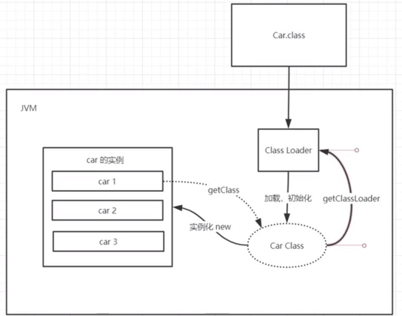
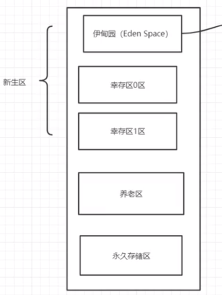
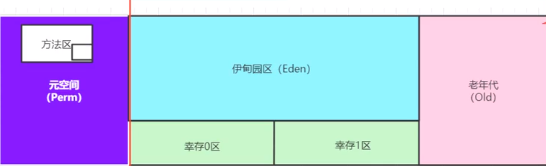
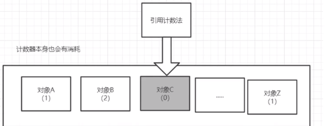

### jvm体系结构




### 类加载器

> **启动类加载器**： `BootstrapClassLoader`，负责加载存放在 `JDK\jre\lib`(JDK代表JDK的安装目录，下同)下，或被 `-Xbootclasspath`参数指定的路径中的，并且能被虚拟机识别的类库（如rt.jar，所有的java.开头的类均被 `BootstrapClassLoader`加载）。启动类加载器是无法被Java程序直接引用的。
> **扩展类加载器**： `ExtensionClassLoader`，该加载器由 `sun.misc.Launcher$ExtClassLoader`实现，它负责加载 `JDK\jre\lib\ext`目录中，或者由 `java.ext.dirs`系统变量指定的路径中的所有类库（如javax.开头的类），开发者可以直接使用扩展类加载器。
> **应用程序类加载器**： `ApplicationClassLoader`，该类加载器由 `sun.misc.Launcher$AppClassLoader`来实现，它负责加载用户类路径（ClassPath）所指定的类，开发者可以直接使用该类加载器，如果应用程序中没有自定义过自己的类加载器，一般情况下这个就是程序中默认的类加载器。

clazz.getClassLoader() 可以获得当前类的加载器类型

### 双亲委派机制

>  双亲委派模型的工作流程是：如果一个类加载器收到了类加载的请求，它首先不会自己去尝试加载这个类，而是把请求委托给父加载器去完成，依次向上，因此，所有的类加载请求最终都应该被传递到顶层的启动类加载器中，只有当父加载器在它的搜索范围中没有找到所需的类时，即无法完成该加载，子加载器才会尝试自己去加载该类。

双亲委派机制:

- 1、当 `AppClassLoader`加载一个class时，它首先不会自己去尝试加载这个类，而是把类加载请求委派给父类加载器`ExtClassLoader`去完成。

- 2、当 `ExtClassLoader`加载一个class时，它首先也不会自己去尝试加载这个类，而是把类加载请求委派给BootStrapClassLoader```去完成。

- 3、如果 `BootStrapClassLoader`加载失败（例如在 `$JAVA_HOME/jre/lib`里未查找到该class），会使用 `ExtClassLoader`来尝试加载；

- 4、若ExtClassLoader也加载失败，则会使用 `AppClassLoader`来加载，如果 `AppClassLoader`也加载失败，则会报出异常 `ClassNotFoundException`。

  

  双亲委派模型意义：

  - 系统类防止内存中出现多份同样的字节码
  - 保证Java程序安全稳定运行
  - 

​		方法区

### native

> 方法带native关键字时，说明java的作用范围到不了，会进入本地方法栈，调用本地方法接口 JNI
>
> JNI的作用：扩展java的使用，融合不同编程语言为java所用

### 方法区 

>  各个线程共享的内存区域，**它用于存储已被虚拟机加载的类信息、常量、静态变量、运行时的常量池

### 栈

> 存放8大基本数据类型、对象引用、实例方法
>
> 不存在垃圾回收问题
>
> 主管程序的运行，生命周期，线程同步
>
> 运行原理：栈帧


### 堆

Heap,一个jvm只有一个堆内存，堆内存的大小可以调节



堆内存分为三个区：

- 新生区（伊甸区）

  ​	类诞生、成长、甚至死亡的地方

  ​	所有对象都是仔伊甸区new出来的

  ​	幸存者区（0,1）

- 养老区

- 永久区（元空间）

  ​	这个区域常驻内存，用来存放jdk自身携带的class对象，interface元数据，存储的是java运行时一些环境或类信息。不存在垃圾回收。关闭虚拟机时会释放这个区域的内存

  

GC垃圾回收，主要在伊甸区和养老区

### 堆内存错误处理

堆内存错误：OOM(OutOfMemoryError)

​		尝试扩大堆内存，查看结果

​		分析内存，查看哪个地方出错（专业工具JProfiler）

编译器设置（在VM Options中）：

 + -Xms1m -Xmx8m -XX:+HeapDumpOnOutOfMemoryError   

   	+ -Xms 设置初始化内存分配大小 ，默认1/64
      	+ -Xmx 设置最大分配内存，默认1/4
   	+ -XX:+PrintGCDetails  打印gc垃圾回收信息
   	+ -XX:+HeapDumpOnOutOfMemoryError   输出错误文件

   > ```java
   > //默认情况下，分配的堆总内存 是电脑内存的1/4，而初始化的内存是1/64
   > //返回虚拟机试图使用的最大内存
   > long maxMemory = Runtime.getRuntime().maxMemory();
   > //返回jvm初始化内存
   > long totalMemory = Runtime.getRuntime().totalMemory();
   > ```

### 垃圾回收

大部分回收都在新生区

GC的算法有哪些?  标记清除法，标记压缩，复制算法，引用计数器

> GC题目：
> Jvm的内存模型和分区~详细到每个区放什么？
> 堆里面的分区有哪些？伊甸园，形式，到，老年区，说说他们的特点！
> GC的算法有哪些？标记清除法，标记压缩，复制算法，引用计数器，怎么用的？
> 轻GC和重GC分别在什么时候发生？



复制算法

> + 每次GC都会从Eden活的对象移到幸存区中:一旦Eden区被GC后，就会是空的.谁空谁是to
> + 当一个对象经历了15次GC,都还没有死-XX: -Xx:MaxTenuringThreshold=9999，通过这个参数可以设定进入老年代的时间