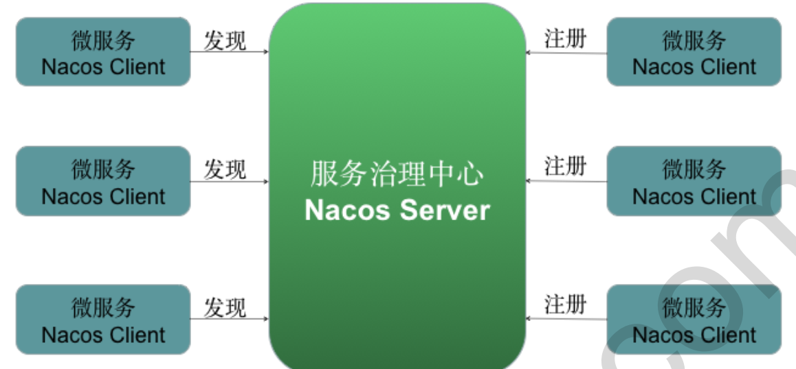

理解：	Nacos = Spring Cloud Eureka + Spring Cloud Config  

## Nacos 服务注册与发现  

> Nacos 提供 Nacos Server 服务端与 Nacos Client 客户端 .
>
> 服务端即是 Nacos 服务注册中心，Nacos 客户端微服务向 Nacos 服务端注册与发现。  

> 1. Nacos Server 是服务端，负责管理各个微服务注册和发现。
>
> 2. 在微服务上添加 Nacos Client 代码，就会访问到 Nacos Server 将此微服务注册在 Nacos Server 中，从而使
>    其他微服务消费方能够找到。
> 3. 微服务（服务消费者）需要调用另一个微服务（服务提供者）时，从 Nacos Server 中获取服务调用地址，进
>    行远程调用  

## 搭建 Nocos 服务端  

### 下载安装包

### 启动服务器

