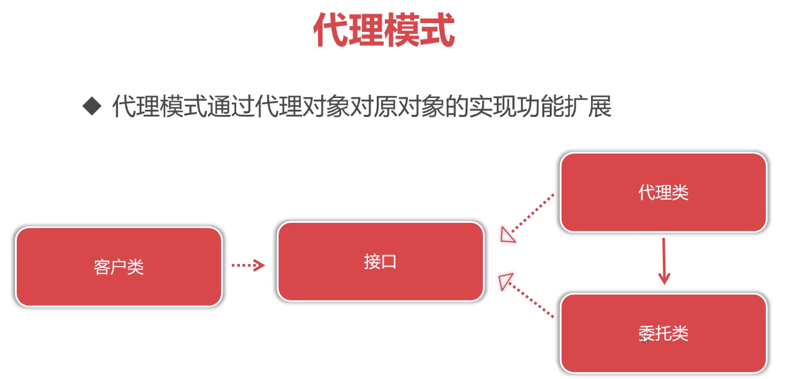

### 静态代理




```java
package com.imooc.spring.aop.service;

public interface UserService {
    public void createUser();
}
```

```java
package com.imooc.spring.aop.service;

public class UserServiceImpl implements UserService{
    public void createUser() {
        System.out.println("执行创建用户业务逻辑");
    }
}
```

```java
package com.imooc.spring.aop.service;

import java.text.SimpleDateFormat;
import java.util.Date;
//静态代理是指<<必须手动创建代理类>>的代理模式使用方式
//实现类每扩展一项功能都需要一个代理类，这会导致臃肿
public class UserServiceProxy implements UserService{
    //持有委托类的对象
    private UserService userService ;
    //传入参数为接口类型，从而能传递其他实现了此接口的代理类
    public UserServiceProxy(UserService userService){
        this.userService = userService;
    }

    public void createUser() {
        System.out.println("=====" + new SimpleDateFormat("yyyy-MM-dd HH:mm:ss SSS").format(new Date()) +"=========");
        userService.createUser();
    }
}
```

```java
package com.imooc.spring.aop.service;

public class UserServiceProxy1 implements UserService{
    private UserService userService ;
    public UserServiceProxy1(UserService userService){
        this.userService = userService;
    }

    public void createUser() {
        userService.createUser();
        System.out.println("========后置扩展功能======");
    }
}
```

```java
package com.imooc.spring.aop;

import com.imooc.spring.aop.service.UserService;
import com.imooc.spring.aop.service.UserServiceImpl;
import com.imooc.spring.aop.service.UserServiceProxy;
import com.imooc.spring.aop.service.UserServiceProxy1;

public class Application {
    public static void main(String[] args) {
//        UserService userService = new UserServiceProxy(new UserServiceImpl());    //增加一项扩展
        UserService userService = new UserServiceProxy1(new UserServiceProxy(new UserServiceImpl()));  //增加两项扩展
        userService.createUser();
    }
}
```

### 动态代理

```java
package com.imooc.spring.aop.service;

public interface UserService {
    public void createUser();
}
```

```java
package com.imooc.spring.aop.service;

public class UserServiceImpl implements UserService{
    public void createUser() {
        System.out.println("执行创建用户业务逻辑");
    }
}
```

```java
package com.imooc.spring.aop.service;

public interface EmployeeService {
    public void createEmployee();
}
```

```java
package com.imooc.spring.aop.service;

public class EmployeeServiceImpl implements EmployeeService {
    public void createEmployee() {
        System.out.println("执行创建员工业务逻辑");
    }
}
```

```java
package com.imooc.spring.aop.service;

import java.lang.reflect.InvocationHandler;
import java.lang.reflect.Method;
import java.lang.reflect.Proxy;
import java.text.SimpleDateFormat;
import java.util.Date;

/**
 * InvocationHandler是JDK提供的反射类,用于在JDK动态代理中对目标方法进行增强
 * InvocationHandler实现类与切面类的环绕通知类似
 */
public class ProxyInvocationHandler implements InvocationHandler {
    private Object target;//目标对象
    private ProxyInvocationHandler(Object target){
        this.target = target;
    }
    /**
     * 在invoke()方法对目标方法进行增强
     * @param proxy 代理类对象
     * @param method 目标方法对象
     * @param args 目标方法实参
     * @return 目标方法运行后返回值
     * @throws Throwable 目标方法抛出的异常
     */
    @Override
    public Object invoke(Object proxy, Method method, Object[] args) throws Throwable {
        System.out.println("=====" + new SimpleDateFormat("yyyy-MM-dd HH:mm:ss SSS").format(new Date()) +"=========");
        Object ret = method.invoke(target, args);//利用调用目标方法,ProceedingJoinPoint.proceed()
        return ret;
    }

    public static void main(String[] args) {
        UserService userService = new UserServiceImpl();
        ProxyInvocationHandler invocationHandler = new ProxyInvocationHandler(userService);
        //动态创建代理类
        //参数：类加载器，实现的接口对象，代理对象
        UserService userServiceProxy = (UserService)Proxy.newProxyInstance(userService.getClass().getClassLoader(),
                userService.getClass().getInterfaces(),
                invocationHandler);
        userServiceProxy.createUser();

        //动态代理,必须实现接口才可以运行
        EmployeeService employeeService = new EmployeeServiceImpl();
        EmployeeService employeeServiceProxy = (EmployeeService)Proxy.newProxyInstance(employeeService.getClass().getClassLoader(),
                employeeService.getClass().getInterfaces(),
                new ProxyInvocationHandler(employeeService));
        employeeServiceProxy.createEmployee();
    }
}
```

