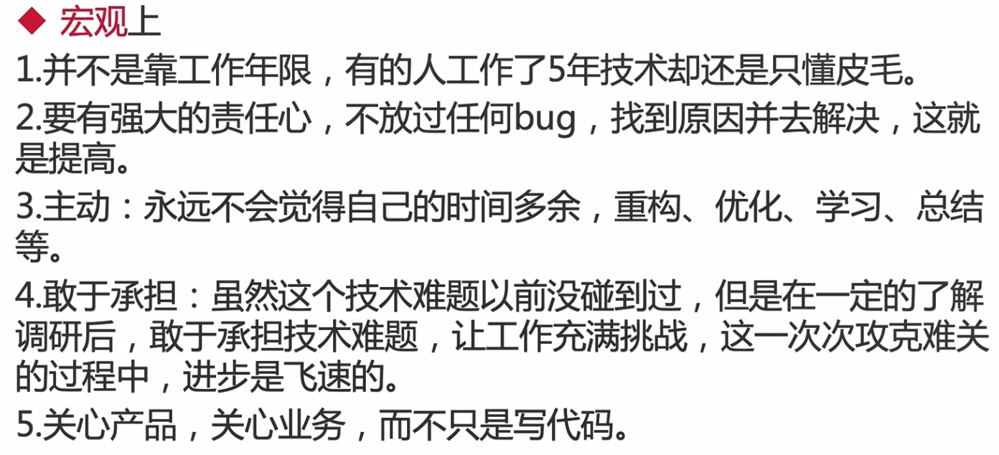
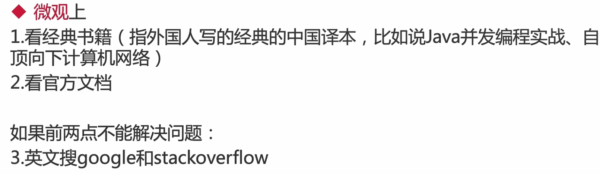

## 内容

第一章

	1. 两种方法的本质对比
 	2. 同时用两种方式实现多线程

第二章

## 线程终止

◆原理介绍:使用interrupt来通知,而不是强制

1、在普通情况下停止线程

```java
package threadcoreknowledge.stopthreads;

/**
 * 描述：     run方法内没有sleep或wait方法时，停止线程
 */
public class RightWayStopThreadWithoutSleep implements Runnable {

    @Override
    public void run() {
        int num = 0;
        //配合中断，没用isInterrupted()判断时，中断请求无效
        while (!Thread.currentThread().isInterrupted() && num <= Integer.MAX_VALUE / 2) {
            if (num % 10000 == 0) {
                System.out.println(num + "是10000的倍数");
            }
            num++;
        }
        System.out.println("任务运行结束了");
    }

    public static void main(String[] args) throws InterruptedException {
        Thread thread = new Thread(new RightWayStopThreadWithoutSleep());
        thread.start();
        Thread.sleep(2000);
        thread.interrupt();//发出中断
    }
}
```

2、线程可能被阻塞

```java
package threadcoreknowledge.stopthreads;

/**
 * 描述：     带有sleep的中断线程的写法
 *    子线程处于阻塞转态时收到中断请求，会抛出异常
 */
public class RightWayStopThreadWithSleep {

    public static void main(String[] args) throws InterruptedException {
        Runnable runnable = () -> {
            int num = 0;
            try {
                while (num <= 300 && !Thread.currentThread().isInterrupted()) {
                    if (num % 100 == 0) {
                        System.out.println(num + "是100的倍数");
                    }
                    num++;
                }
                Thread.sleep(1000);
            } catch (InterruptedException e) {
                e.printStackTrace();
            }
        };
        Thread thread = new Thread(runnable);
        thread.start();
        Thread.sleep(500);//设定时间小于1000，主线程请求中断时子线程处于睡眠（阻塞）状态
        thread.interrupt();//
    }
}
```

```
#运行结果
0是100的倍数
100是100的倍数
200是100的倍数
300是100的倍数
java.lang.InterruptedException: sleep interrupted
	at java.lang.Thread.sleep(Native Method)
	at threadcoreknowledge.stopthreads.RightWayStopThreadWithSleep.lambda$main$0(RightWayStopThreadWithSleep.java:18)
	at java.lang.Thread.run(Thread.java:748)
```

3、线程在每次迭代后都阻塞

```java
package threadcoreknowledge.stopthreads;

/**
 * 描述：     如果在执行过程中，每次循环都会调用sleep或wait等方法，那么不需要每次迭代都检查是否已中断
 */
public class RightWayStopThreadWithSleepEveryLoop {
    public static void main(String[] args) throws InterruptedException {
        Runnable runnable = () -> {
            int num = 0;
            try {
                while (num <= 10000) {
                    if (num % 100 == 0) {
                        System.out.println(num + "是100的倍数");
                    }
                    num++;
                    Thread.sleep(10);
                }
            } catch (InterruptedException e) {
                e.printStackTrace();
            }
        };
        Thread thread = new Thread(runnable);
        thread.start();
        Thread.sleep(5000);
        thread.interrupt();
    }
}

```


## 问题


## 技巧和经验

1. 优质学习路径
2. 如何了解技术前沿动态
3. 如何在业务开发中成长
   1. 偏业务。
      1. 了解核心模型
      2. 复杂业务抽象化
   2. 偏技术
   3. 两个25%理论。发掘多个发方向的长处，并结合起来





