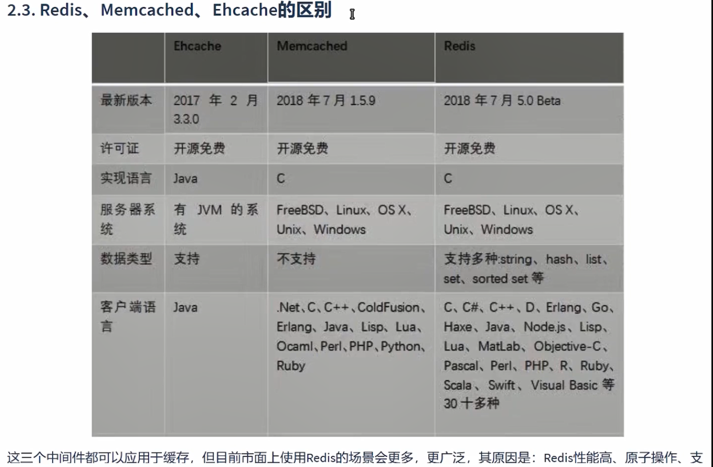
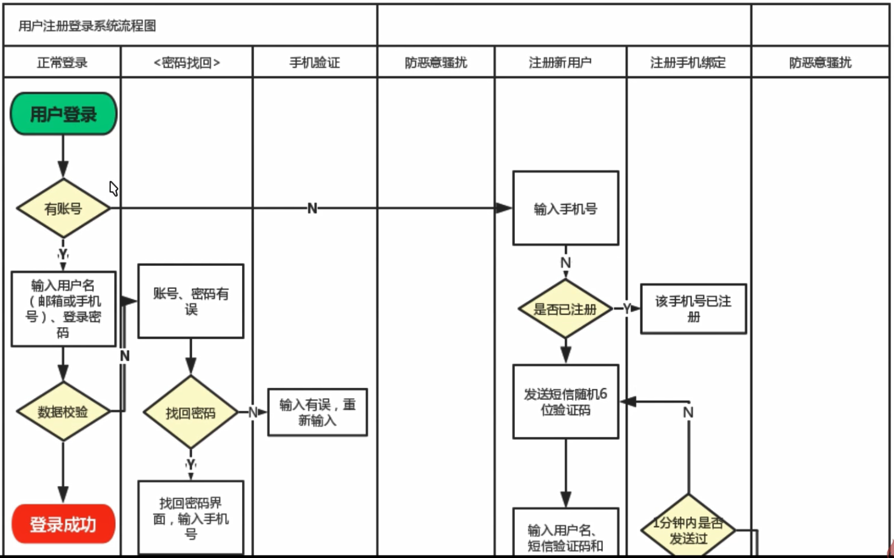

# 整体介绍

## 系统架构


## Redis故障


## 深层内容


# 基础




持多种数据类型，主从复制与哨兵机制，持久化操作等


***


常用修改配置文件redis.conf	

+ bind 0.0.0.0(实际开发中不能这么设置，需设置指定的IP)
+ requirepass 123456（设置密码）
+ logfile "redis.log" (设置日志文件)


### 基本使用

#### 启动

前台启动

​			windowos下：redis-server redis.windows.conf

​			Linux下：进入redis安装路径（/usr/local/redis/Red…）   ./src/redis-server redis.conf

守护进程方式启动 (linux下）

​			修改配置文件redis.conf  将daemonize no 改为 yes

​			启动服务器： redis-server redis.conf

​					查看运行状态 netstat -tulpn(看端口号6379）

​			启动客户端：./src/redis-cli [-h ip] [-p 端口号] -a 密码 

​			退出：exit

#### redis层级存储（对应mysql中的表）

                       

#### 常用命令

info   显示信息

FLASHALL  清除所有Key

#### 数据类型


## SpringBoot集成Redis


```
<dependency>
    <groupId>org.springframework.boot</groupId>
    <artifactId>spring-boot-starter-data-redis</artifactId>
</dependency>
           <!-- 使用lettuce连接池时导入-->
<!--        <dependency>-->
<!--            <groupId>org.apache.commons</groupId>-->
<!--            <artifactId>commons-pool2</artifactId>-->
<!--        </dependency>-->
```

```
  # Redis
  redis:
    port: 6379
    host: 192.168.10.101
    timeout: 3000
    password: 123456
    #配置jedis连接池
#    jedis:
#      pool:
#        max-active: 8
#        max-idle: 8
#        min-idle: 0
#        max-wait: 1000
    #配置lettuce连接池
#    lettuce:
#      pool:
#        max-active: 8
#        max-idle: 8
#        min-idle: 0
#        max-wait: 1000
```

## 项目1


### 登录模块



### 认证授权


## 源码