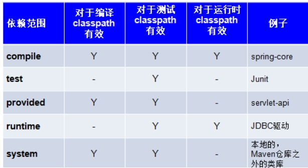

## Maven

### **常见Maven命令**

> ####  （1）**clean**
>
> clean是maven工程的清理命令，执行 clean会删除整个target目录及内容。
>
> #### （2）**compile**
>
> compile是maven工程的编译命令，作用是将src/main/java下的文件编译为class文件输出到target目录下。
>
> #### （3）**test**
>
> test是maven工程的测试命令，会执行src/test/java下的单元测试类。
>
> 注意：
>
> 1、需要注掉pom.xml中打包跳过测试那一段
>
> 2、Maven要求测试类放在src/test/java目录下，且测试方法的
>
> 类名以Test结尾、方法名以test开头
>
> #### （4）**package**
>
> package是maven工程的打包命令，对于java工程执行package打成jar包，对于web工程打成war包。
>
> #### （5）**install**
>
> install是maven工程的安装命令，执行install将项目打成jar包或war包发布到本地仓库。

### **Maven依赖范围**

依赖：项目需要依靠一个jar

依赖范围：依赖一个jar，并不一定是在项目整个生命周期都需要它，可能只是在某一个阶段需要，那么依赖范围就是在定义在哪些阶段依赖这个jar

A依赖B，需要在A的pom.xml文件中添加B的坐标，大家注意到我们之前添加坐标时还有写了一个scope ，这是依赖的范围。

> scope有几个可选值， 如：
>
> 1、compile： 默认值，表示编译依赖范围。即编译、测试、运行时都需要，会被打包。（默认值compile表明该jar一直全程存在/需要）
>
> 2、test：表示测试依赖范围。即测试时需要，编译和运行时不需要，不会被打包。比如：junit。
>
> 3、provided：表示已提供依赖范围。即编译、测试时需要，运行时不需要，不会被打包。比如：servlet-api和jsp-api被tomcat容器提供。
>
> 服务器本身会提供这些jar，避免和服务器上的这些包冲突
>
> 4、runtime:表示运行时提供依赖范围。即编译时不需要，运行和测试时需要，会被打包。比如：jstl、jdbc驱动。
>
> 5、system：system范围依赖与provided类似，但是你必须显式的提供一个对于本地系统中JAR文件的路径，需要指定systemPath磁盘路径，system依赖不推荐使用。

 