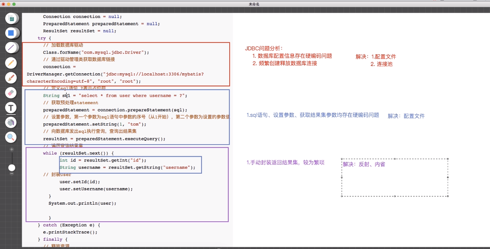
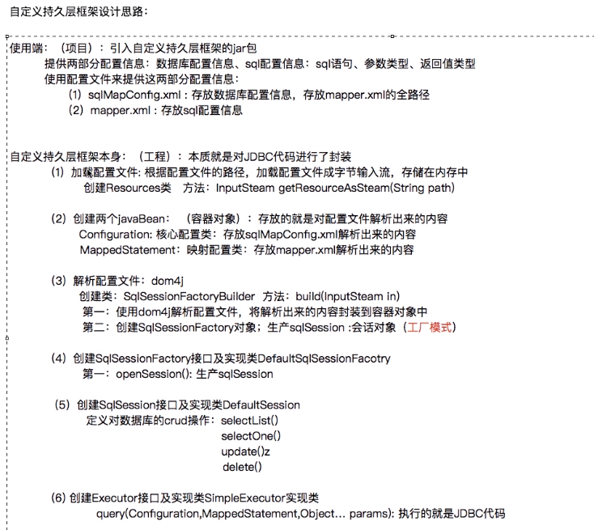
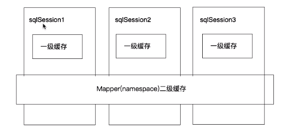

#   Mybatis

## 自定义持久层框架

### 问题



### 框架设计思路



### 实现代码    

（1）

```java
public class Resources {

    // 根据配置文件的路径，将配置文件加载成字节输入流，存储在内存中
    public static InputStream getResourceAsSteam(String path){
        InputStream resourceAsStream = Resources.class.getClassLoader().getResourceAsStream(path);
        return  resourceAsStream;
    }
}
```

(2)

```java
package com.lagou.pojo;

import javax.sql.DataSource;
import java.util.HashMap;
import java.util.Map;

public class Configuration {

    private DataSource dataSource;

    /*
    *   key: statementid  value:封装好的mappedStatement对象
     * */
    Map<String,MappedStatement> mappedStatementMap = new HashMap<>();

	getter...setter...
}
```

```java
package com.lagou.pojo;

public class MappedStatement {

    //id标识
    private String id;
    //返回值类型
    private String resultType;
    //参数值类型
    private String paramterType;
    //sql语句
    private String sql;

	getter...setter...
}
```

(3)

## 缓存

>  缓存就是内存中的数据，常常来自对数据库查询结果的保存，使用缓存，我们可以避免频繁的与数据库进行交互，进而提高响应速度



二级缓存

​	


## Mybatis源码剖析


## 设计模式

### Build构建者模式

#### 介绍

> + 定义：将一个复杂对象的创建与它的定义分离，用另一个对象去创建这个复杂对象。
> + 属于创建类模式
> + -般来说，如果一个对象的构建比较复杂，超出了构造函数所能包含的范围，就可以使用**工厂模式和Builder模式**，相对于**工厂模式会产出一个完整的产品，Builder应用于更加复杂的对象的构建，甚至只会构建产品的一个部分**，直白来说，就是使用多个简单的对象- -步-步构建成一个复杂的对象

```java
public class Computer {
    private String displayer;
    private String mainunit;
    private String mouse;
    private String keyboard;

    public String getDisplayer() {
        return displayer;
    }

    public void setDisplayer(String displayer) {
        this.displayer = displayer;
    }

    public String getMainunit() {
        return mainunit;
    }

    public void setMainunit(String mainunit) {
        this.mainunit = mainunit;
    }

    public String getMouse() {
        return mouse;
    }

    public void setMouse(String mouse) {
        this.mouse = mouse;
    }

    public String getKeyboard() {
        return keyboard;
    }

    public void setKeyboard(String keyboard) {
        this.keyboard = keyboard;
    }

    @Override
    public String toString() {
        return "Computer{" +
                "displayer='" + displayer + '\'' +
                ", mainunit='" + mainunit + '\'' +
                ", mouse='" + mouse + '\'' +
                ", keyboard='" + keyboard + '\'' +
                '}';
    }
}
```

```java
/**
 * @description 用构建者模式来生成Computer
 */

public class ComputerBuilder {
    //1.成员变量：要创建的复杂对象
    private Computer computer = new Computer();

    //2.设置复杂对象的属性
    public void installMouse(String mouse){
        computer.setMouse(mouse);
    }
    public void installMainUnit(String mainUnit){
        computer.setMainunit(mainUnit);
    }
    public void installDisplayer(String dispalyer){
        computer.setDisplayer(dispalyer);
    }
    public void installKeyboard(String keyboard){
        computer.setKeyboard(keyboard);
    }
    //3.获取复杂对象
    public Computer getComputer(){
        return computer;
    }
}
```

```java
public class ConstructorTest {
    public static void main(String[] args) {
        ComputerBuilder computerBuilder = new ComputerBuilder();
        computerBuilder.installDisplayer("显示器");
        computerBuilder.installKeyboard("鼠标");
        computerBuilder.installMainUnit("主机");
        computerBuilder.installKeyboard("键盘");
        Computer computer = computerBuilder.getComputer();
        System.out.println("computer = " + computer);
    }
}
```

#### 在MyBatis中的使用

### 简单工厂模式

### 代理模式	