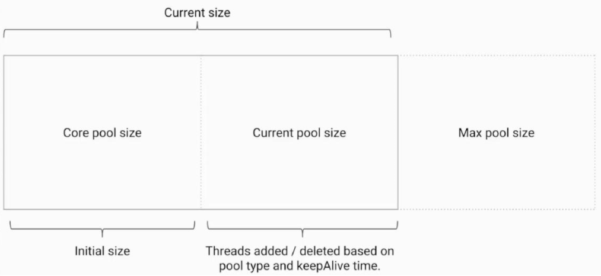

## 线程池

### 线程池创建

#### 构造方法参数


+ corePoolSize 线程池核心线程大小

+ maximumPoolSize 线程池最大线程数量

+ keepAliveTime 空闲线程存活时间

+ unit 空闲线程存活时间单位

+ workQueue 工作队列

+ threadFactory 线程工厂

+ handler 拒绝策略

#### 添加线程规则

> 1.如果线程数小于corePoolSize,即使其他工作线程处于空闲状态，也会创建一个新线程来运行新任务。
>
> 2.如果线程数等于(或大于) corePoolSize但少于MaximumPoolsize，则将任务放入队列.
>
> 3.如果队列已满，并且线程数小于maxPoolSize, 则创建一个新线程来运行任务.
>
> 4.如果队列已满，并且线程数大于或等于maxPoolsize，则拒绝该任务。




> 增减线程的特点
>
> 1.通过设置corePoolSize和maximumPoolSize相同，就可以创建固定大小的线程池。
>
> 2.线程池**希望保持较少的线程数**，并且只有在负载变得很大时才增加它。

#### 常见线程池

###### ◆newFixedThreadPool

```java
public static ExecutorService newFixedThreadPool(int nThreads) {
        return new ThreadPoolExecutor(nThreads, nThreads,
                                      0L, TimeUnit.MILLISECONDS,
                                      new LinkedBlockingQueue<Runnable>());
    }
```


```java
import java.util.concurrent.ExecutorService;
import java.util.concurrent.Executors;

/**
 * 描述：     演示newFixedThreadPool
 */
public class FixedThreadPoolTest {

    public static void main(String[] args) {
        ExecutorService executorService = Executors.newFixedThreadPool(4);
        for (int i = 0; i < 1000; i++) {
            executorService.execute(new Task());
        }
    }
}

class Task implements Runnable {
    @Override
    public void run() {
        try {
            Thread.sleep(500);
        } catch (InterruptedException e) {
            e.printStackTrace();
        }
        System.out.println(Thread.currentThread().getName());
    }
}
```


容易造成大量内存占用，可能会导致OOM

```java
import java.util.concurrent.ExecutorService;
import java.util.concurrent.Executors;

/**
 * 描述：     演示newFixedThreadPool出错的情况
 * 运行前设置VM Options : -Xmx8m -Xms8m
 */
public class FixedThreadPoolOOM {

    private static ExecutorService executorService = Executors.newFixedThreadPool(1);
    public static void main(String[] args) {
        for (int i = 0; i < Integer.MAX_VALUE; i++) {
            executorService.execute(new SubThread());
        }
    }
}

class SubThread implements Runnable {
    @Override
    public void run() {
        try {
            Thread.sleep(1000000000);
        } catch (InterruptedException e) {
            e.printStackTrace();
        }
    }
}

```


###### ◆newSingleThreadExecutor

当请求堆积的时候，可能会占用大量的内存

###### ◆newCachedThreadPool

弊端在于第二个参数maximumPoolSize被设置为了Integer.MAX_ VALUE,这可能会创建数量非常多的线程,甚至导致OOM

###### ◆newScheduledThreadPool

原因和newCachedThreadPool一样

### 停止线程

## 锁

> 同步数据，


## ThreadLocal

### 两大使用场景

◆典型场景1:每个线程需要一个独享的对象(通常是**工具类**，典型需要使用的类有SimpleDateFormat和Random)

◆典型场景2:每个线程内需要保存全局变量(例如在拦截器中获取用户信息)，可以让不同方法直接使用，避免参数传递的麻烦