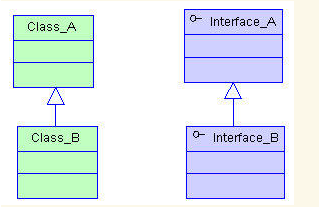
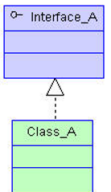
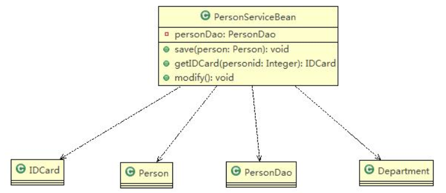
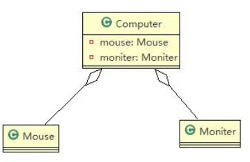
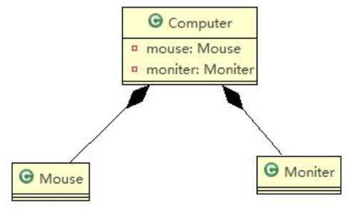
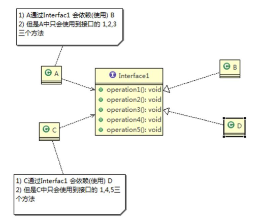
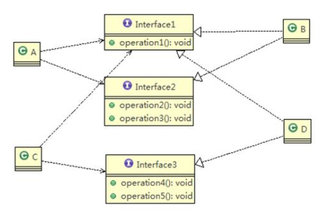
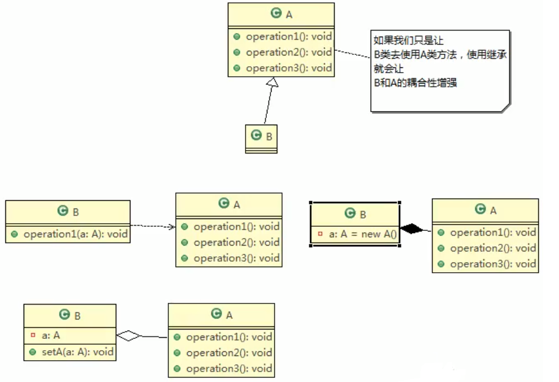

## 一、类之间的关系

>  继承、实现、依赖、关联、聚合、组合

#### 继承



#### 实现



#### 依赖(Dependence)

>  一个类A使用到了另一个类B。类B可以是类A成员属性，方法的参数，方法的返回值，方法中使用到的变量



#### 关联(Association)

> 为类的成员属性，具有导航性和多重性。
>
> 导航性。双向或者单向。
>
> 多重性。如一对一，一对多。

#### 聚合(Aggregation)

> 表示整体和部分的关系。整体和部分**可以分开**。是关联关系的特例。



#### 组合(Composition)

> 表示整体和部分的关系。整体和部分**不可以分开**。是关联关系的特例。



##### 聚合与组合的区别

```java
//聚合
public class Computer {
	private Mouse mouse; //鼠标可以和computer分离
	private Moniter moniter;//显示器可以和Computer分离
	public void setMouse(Mouse mouse) {
		this.mouse = mouse;
	}
	public void setMoniter(Moniter moniter) {
		this.moniter = moniter;
	}	
}
//组合
public class Computer {
	private Mouse mouse = new Mouse(); //鼠标可以和computer不能分离
	private Moniter moniter = new Moniter();//显示器可以和Computer不能分离
	public void setMouse(Mouse mouse) {
		this.mouse = mouse;
	}
	public void setMoniter(Moniter moniter) {
		this.moniter = moniter;
	}	
}

```


## 二、设计原则

#### 目的

+ 1) 代码重用性(即:相同功能的代码，不用多次编写)
+ 2)可读性 (即:编程规范性,便于其他程序员的阅读和理解)
+ 3)可扩 展性(即:当需要增加新的功能时，非常的方便，称为可维护)
+ 4)可靠性 (即:当我们增加新的功能后，对原来的功能没有影响)
+ 5)使程序呈现高内聚，低耦合的特性

#### 核心思想

+ 1) 找出应用中可能需要变化之处，把它们独立出来，不要和那些不需要变化的代码混在一 起。
+ 2)针对 **接口编程**，而不是针对实现编程。
+ 3)为了交互对象之间的**松耦合**设计而努力.

## 三、7 大设计原则

### 单一职责原则

一个类应该只负责一项职责

### 接口隔离原则

客户端不应该依赖它不需要的接口，即**一个类对另一个类的依赖应该建立在最小的接口**上





### 依赖倒转原则

类依赖——>接口依赖

### 里氏替换原则

子类尽量不要重写父类的方法（继承会增加耦合性）——创建基类，让多个类去继承基类而不是彼此继承。

### 开闭原则

+ 最基础，最重要的设计原则

+ 一个软件实体如类，模块和函数应该**对扩展开放（提供方），对修改关闭（使用方）**。用抽象构建框架，用实现扩展细节

  代码1：

    ``` java
  package com.principal.ocp;
  
  public class Ocp {
  	public static void main(String[] args) {
  		GraphicEditor graphicEditor = new GraphicEditor();
  		graphicEditor.drawShape(new Rectangle());
  		graphicEditor.drawShape(new Circle());
  		graphicEditor.drawShape(new Triangle());
  	}
  }
  //使用方
  class GraphicEditor{
      //接受Shape对象，然后根据type来绘图
      public void drawShape(Shape shape){
      	if(shape.m_type == 1) {
      		drawRectangle();
      	}else if(shape.m_type == 2) {
      		drawCircle();
      	}else if(shape.m_type == 3) {
      		drawTriangle();
      	}
      }
      public void drawRectangle(){
          System.out.println("绘制矩形");
      }
      public void drawCircle() {
      	System.out.println("绘制圆形");
      }
      public void drawTriangle() {
      	System.out.println("绘制三角形");
      }
  }
  //基类
  class Shape{
      int m_type;
  }
  //以下类都为提供方
  class Rectangle extends Shape{
      public Rectangle() {
          super.m_type = 1;
      }
  }
  class Circle extends Shape{
      public Circle() {
          super.m_type = 2;
      }
  }
  class Triangle extends Shape{
  
  	public Triangle() {
  		super.m_type = 3;
  	}
  }
    ```

  代码2：遵守开闭原则

  ``` java
  package com.principal.ocp.improve;
  
  public class Ocp1 {
  	public static void main(String[] args) {
  		GraphicEditor graphicEditor = new GraphicEditor();
  		graphicEditor.drawShape(new Circle());
  		graphicEditor.drawShape(new Triangle());
  		graphicEditor.drawShape(new Rectangle());
  	}
  }
  //使用方
  class GraphicEditor{
  	public void drawShape(Shape shape) {
  		shape.draw();
  	}
  }
  //基类
  abstract class Shape{
  	int m_type;
  	public abstract void draw();
  }
  //以下类都为提供方
  class Circle extends Shape{
  	@Override
  	public void draw() {
  		System.out.println("绘制圆形");
  	}
  }
  class Triangle extends Shape{
  	@Override
  	public void draw() {
  		System.out.println("绘制三角形");	
  	}	
  }
  
  class Rectangle extends Shape{
  	@Override
  	public void draw() {
  		System.out.println("绘制矩形");
  	}	
  }
  ```


### 	迪米特法则

+ 类与类关系越密切，耦合度越大

+ 迪米特法则(Demeter Principle)又叫**最少知道原则**，即**一个类对自己依赖的类知道的越少越好**。也就是说，**对于被依赖的类不管多么复杂，都尽量将逻辑封装在类的内部。对外除了提供的public方法，不对外泄露任何信息**

+ 迪米特法则还有个更简单的定义:**只与直接的朋友通信**

  > **耦合**：依赖，关联，组合，聚合等都属于耦合。
  >
  > **直接的朋友**:只要两个对象之间有耦合关系，我们就说这两个对象之间是朋友关系。其中，**成员变量，方法参数，方法返回值**中的类为直接朋友，而**局部变量中的类不是直接的朋友**（这种类尽量避免出现）。

### 合成复用原则

> 尽量使用合成/聚合的方式，而不是继承



## 四、设计模式类型

> 设计模式分为三种类型，共23种
>
> + 1) 创建型模式:**单例模式**、抽象工厂模式、原型模式、建造者模式、**工厂模式**。
> + 2)结构型模式: **适配器模式**、桥接模式、**装饰模式**、组合模式、外观模式、享元模式、**代理模式**。
> + 3)行为型模式: 模版方法模式、命令模式、访问者模式、迭代器模式、**观察者模式**、中介者模式、备忘录模式、

## 五、单例模式

> 采取一定的方法保证在整个的软件系统中，对**某个类只能存在一个对象实例**，并且该类**只提供一个取得其对象实例的方法(静态方法)**。
>

### 应用场景

> 需要**频繁的进行创建和销毁的对象**、创建对象时耗时过多或耗费资源过多(即:**重量级对象**)，但又经常用到的对象、**工具类对象**、频繁访问数据库或文件的对象(比如数据源、session工厂等)

### 8种实现方式

+ 1)**饿汉式(静态常量)**
+ 2)**饿汉式(静态代码块)**
+ 3)懒汉式(线程不安全)
+ 4)懒汉式(线程安全， 同步方法)
+ 5)懒汉式(线程安全，同步代码块)
+ 6)**双重检查**
+ 7)**静态内部类**
+ 8)**枚举**

### 饿汉式(静态常量)

#### 步骤

+ 1) 构造器私有化(防止new )
+ 2)类的内部创建对象
+ 3)向外暴露--个静态的公共方法。getInstance.

#### 代码实现

```java
public class SingletonTest01 {

	public static void main(String[] args) {
		//测试
		Singleton instance = Singleton.getInstance();
		Singleton instance2 = Singleton.getInstance();
		System.out.println(instance == instance2); // true
		System.out.println("instance.hashCode=" + instance.hashCode());//两个hashcode值相同
		System.out.println("instance2.hashCode=" + instance2.hashCode());
	}
}

//饿汉式(静态变量)
class Singleton {	
	//1. 构造器私有化, 外部不能new
	private Singleton() {		
	}
	
	//2.本类内部创建对象实例
	private final static Singleton instance = new Singleton();
	
	//3. 提供一个公有的静态方法，返回实例对象
	public static Singleton getInstance() {
		return instance;
	}	
}
```

#### 优缺点

+ 1)优点:这种写法比较简单，就是**在类装载的时候就完成实例化。避免了线程同步问题。**
+ 2)缺点: 在类装载的时候就完成实例化，没有达到**Lazy Loading**的效果。如果从始至终从未使用过这个实例，则会造成内存的浪费
+ 3)这 种方式基于classloder机制避免了多线程的同步问题，不过，instance 在类装载时就实例化，在单例模式中大多数都是调用getlnstance方法，但是导致类装载的原因有很多种,因此不能确定有其他的方式(或者其他的静态方法)导致类装载，这时候初始化instance就没有达到lazy loading的效果
+ 4)结论: 这种单例模式可用，**可能造成内存浪费**

### 饿汉式(静态代码块)

#### 代码实现

```java
public class SingletonTest02 {

	public static void main(String[] args) {
		//测试
		Singleton instance = Singleton.getInstance();
		Singleton instance2 = Singleton.getInstance();
		System.out.println(instance == instance2); // true
		System.out.println("instance.hashCode=" + instance.hashCode());
		System.out.println("instance2.hashCode=" + instance2.hashCode());
	}
}

//饿汉式(静态代码块)
class Singleton {
	
	//1. 构造器私有化, 外部能new
	private Singleton() {	
	}
	//2.本类内部创建对象实例
	private  static Singleton instance;
	
	static { // 在静态代码块中，创建单例对象
		instance = new Singleton();
	}
	
	//3. 提供一个公有的静态方法，返回实例对象
	public static Singleton getInstance() {
		return instance;
	}	
}
```

#### 优缺点

同上

### 懒汉式(线程不安全)

#### 代码实现

```java
public class SingletonTest03 {

	public static void main(String[] args) {
		System.out.println("懒汉式1 ， 线程不安全~");
		Singleton instance = Singleton.getInstance();
		Singleton instance2 = Singleton.getInstance();
		System.out.println(instance == instance2); // true
		System.out.println("instance.hashCode=" + instance.hashCode());
		System.out.println("instance2.hashCode=" + instance2.hashCode());
	}

}

class Singleton {
	private static Singleton instance;
	
	private Singleton() {}
	
	//提供一个静态的公有方法，当使用到该方法时，才去创建 instance
	//即懒汉式
	public static Singleton getInstance() {
		if(instance == null) {
			instance = new Singleton();
		}
		return instance;
	}
}
```

#### 优缺点

+ 1) 起到了Lazy Loading的效果，但是**只能在单线程下使用**。
+ 2)如果在多线程 下，一个线程进入了if (singleton == null)判断语句块，还未来得及往下执行，另一个线程也通过了这个判断语句，这时便会产生多个实例。所以在多线程环境下不可使用这种方式
+ 3) 结论:在实际开发中，不要使用这种方式.

### 懒汉式(线程安全， 同步方法)

#### 代码实现

```java
public class SingletonTest04 {

	public static void main(String[] args) {
		System.out.println("懒汉式2 ， 线程安全~");
		Singleton instance = Singleton.getInstance();
		Singleton instance2 = Singleton.getInstance();
		System.out.println(instance == instance2); // true
		System.out.println("instance.hashCode=" + instance.hashCode());
		System.out.println("instance2.hashCode=" + instance2.hashCode());
	}

}

// 懒汉式(线程安全，同步方法)
class Singleton {
	private static Singleton instance;
	
	private Singleton() {}
	
	//提供一个静态的公有方法，加入同步处理的代码，解决线程安全问题
	//即懒汉式
	public static synchronized Singleton getInstance() {
		if(instance == null) {
			instance = new Singleton();
		}
		return instance;
	}
}
```

#### 优缺点

+ 1)解决了**线程安全**问题
+ 2)**方法进行同步效率太低**,，每个线程在想获得类的实例时候，执行getInstance(方法都要进行同步。而其实这个方法只执行一次实例化代码就够了，后面的想获得该类实例，直接return就行了。
+ 3) 结论:在实际开发中，不推荐使用这种方式

### 懒汉式(线程安全，同步代码块)

#### 代码实现

```java
public class SingletonTest04 {

	public static void main(String[] args) {
		System.out.println("懒汉式2 ， 线程安全~");
		Singleton instance = Singleton.getInstance();
		Singleton instance2 = Singleton.getInstance();
		System.out.println(instance == instance2); // true
		System.out.println("instance.hashCode=" + instance.hashCode());
		System.out.println("instance2.hashCode=" + instance2.hashCode());
	}
}

// 懒汉式(线程安全，同步代码块)
class Singleton {
	private static Singleton instance;	
	private Singleton() {}	

	public static  Singleton getInstance() {
		if(instance == null) {
            synchronized(Singleton.class){
                instance = new Singleton();
            }	
		}
		return instance;
	}
}
```

#### 优缺点

+ 1)这种方式，本意是想对第四种实现方式的改进，因为前面同步方法效率太低，改为同步产生实例化的的代码块
+ 2)但是**这种同步并不能起到线程同步的作用**。跟第3种实现方式遇到的情形一致，假如一个线程进入了if (singleton == null)判断语句块，还未来得及往下执行，另一个线程也通过了这个判断语句，这时便会产生多个实例
+ 3)结论:在实际开发中，**不能使用**这种方式

### 双重检查

#### 代码实现

```java
public class SingletonTest06 {

	public static void main(String[] args) {
		System.out.println("双重检查");
		Singleton instance = Singleton.getInstance();
		Singleton instance2 = Singleton.getInstance();
		System.out.println(instance == instance2); // true
		System.out.println("instance.hashCode=" + instance.hashCode());
		System.out.println("instance2.hashCode=" + instance2.hashCode());		
	}
}

class Singleton {
    //
	private static volatile Singleton instance;
	
	private Singleton() {}
	
	//提供一个静态的公有方法，加入双重检查代码，解决线程安全问题, 同时解决懒加载问题
	//同时保证了效率, 推荐使用
	
	public static synchronized Singleton getInstance() {
		if(instance == null) {
			synchronized (Singleton.class) {
				if(instance == null) {  //两次判断
					instance = new Singleton();
				}
			}		
		}
		return instance;
	}
}
```

#### 优缺点

+ 1) Double-Check 概念是多线程开发中常使用到的，如代码中所示，我们进行了两次if (singleton == nul)检查，这样就可以保证线程安全了。
+ 2)这样，实例化代码只用执行- -次，后面再次访问时，判断if (singleton == nul)，直接return 实例化对象，也避免的反复进行方法同步.
+ 3)**线程安全; 延迟加载;效率较高**
+ 4)结论: 在实际开发中，**推荐**使用这种单例设计模式

### **静态内部类**

#### 代码实现

```java
public class SingletonTest07 {

	public static void main(String[] args) {
		System.out.println("使用静态内部类完成单例模式");
		Singleton instance = Singleton.getInstance();
		Singleton instance2 = Singleton.getInstance();
		System.out.println(instance == instance2); // true
		System.out.println("instance.hashCode=" + instance.hashCode());
		System.out.println("instance2.hashCode=" + instance2.hashCode());		
	}
}

// 静态内部类完成， 推荐使用
class Singleton {
	private static volatile Singleton instance;
	
	//构造器私有化
	private Singleton() {}
	
	//写一个静态内部类,该类中有一个静态属性 Singleton
	private static class SingletonInstance {
		private static final Singleton INSTANCE = new Singleton(); 
	}
	
	//提供一个静态的公有方法，直接返回SingletonInstance.INSTANCE
	
	public static synchronized Singleton getInstance() {	
		return SingletonInstance.INSTANCE;
	}
}
```

#### 优缺点

+ 1) 这种方式**采用了类装载的机制**来保证初始化实例时只有一个线程。
+ 2)静态内部类方式在Singleton类被装载时并不会立即实例化，而是在需要实例化时，调用getInstance方法，才会装载SingletonInstance类，从而完成Singleton的实例化。
+ 3)类的静态属性只会在第一次加载类的时候初始化，所以在这里,JVM帮助我们保证了线程的安全性，在类进行初始化时，别的线程是无法进入的。
+ 4)优点:**避免了线程不安全**，利用**静态内部类特点实现延迟加载，效率高**
+ 5)结论: **推荐**使用.

### 枚举

#### 代码实现

```java
public class SingletonTest08 {
	public static void main(String[] args) {
		Singleton instance = Singleton.INSTANCE;
		Singleton instance2 = Singleton.INSTANCE;
		System.out.println(instance == instance2);
		
		System.out.println(instance.hashCode());
		System.out.println(instance2.hashCode());
		
		instance.sayOK();
	}
}

//使用枚举，可以实现单例, 推荐
enum Singleton {
	INSTANCE; //属性
	public void sayOK() {
		System.out.println("ok~");
	}
}
```

#### 优缺点

+ 1)这借助JDK1.5中添加的枚举来实现单例模式。不仅能避免多线程同步问题，而且还能防止反序列化重新创建新的对象。
+ 2)这 种方式是Efctive Java作者Josh Bloch提倡的方式
+ 3)结论: **推荐**使用 

## 六、工厂模式

### 简单工厂

