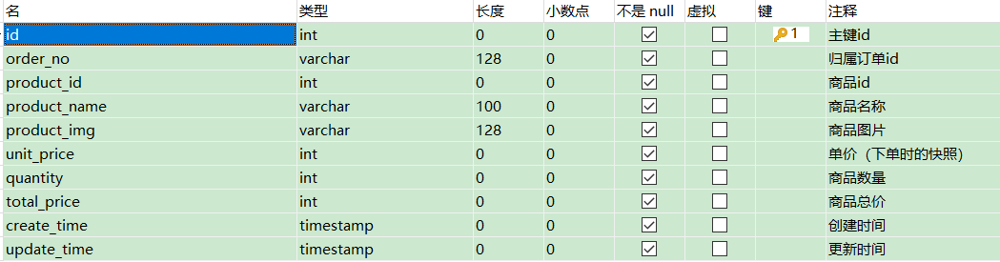
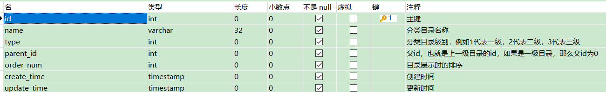
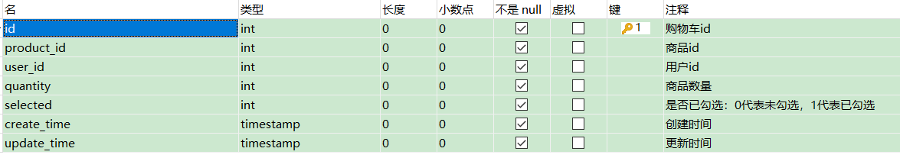
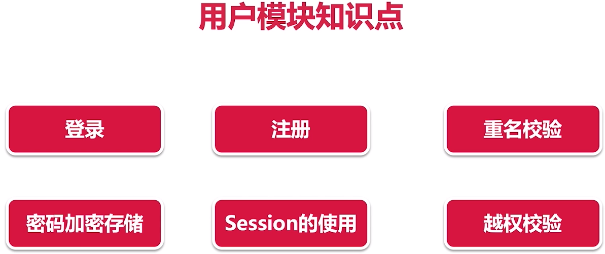
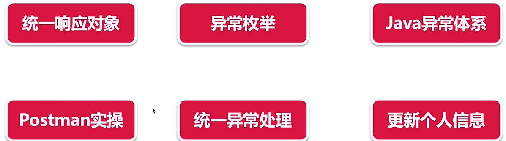

# 1 数据库设计

注意点

create_time 和update_time字段类型都设置为timestamp，并且默认CURRENT_TIMESTAMP。

update_time需额外设置  根据当前时间戳更新（on_update CURRENT_TIMESTAMP)——字段内容发生更改时，时间自动戳更新

imooc_mall_user


imooc_mall_product


注：此处价格以分为单位，不是小数

imooc_mall__order


imooc_mall__order_item



imooc_mall_category



imooc_mall_cart



# 2 技术选型

 

# 3 mybatis-generator（逆向工程）使用

   1.pom.xml添加插件及依赖

| <plugin>  <groupId>org.mybatis.generator</groupId>  <artifactId>mybatis-generator-maven-plugin</artifactId>  <version>1.3.7</version>  <configuration>  <verbose>true</verbose>  <overwrite>true</overwrite>  </configuration>  </plugin> | <dependency>  <groupId>mysql</groupId>  <artifactId>mysql-connector-java</artifactId>  </dependency>  <dependency>  <groupId>org.mybatis.spring.boot</groupId>  <artifactId>mybatis-spring-boot-starter</artifactId>  <version>1.3.2</version>  </dependency> |
| ------------------------------------------------------------ | ------------------------------------------------------------ |
|                                                              |                                                              |

  2.generatorConfig.xml  （放在resources目录下） 

```
 <?**xml** version="1.0" encoding="UTF-8"?>  <!DOCTYPE generatorConfiguration      PUBLIC "-//mybatis.org//DTD MyBatis Generator Configuration 1.0//EN"      "http://mybatis.org/dtd/mybatis-generator-config_1_0.dtd">  <**generatorConfiguration**>    <!-- 配置文件，放在resource目录下即可 -->    <!--数据库驱动个人配置-->    <**classPathEntry**        location="D:\java\apache-maven-3.6.3\repository\mysql\mysql-connector-java\8.0.18\mysql-connector-java-8.0.18.jar"/>    <**context** id="MysqlTables" targetRuntime="MyBatis3">      <**property** name="autoDelimitKeywords" value="true"/>      <!--可以使用``包括字段名，避免字段名与sql保留字冲突报错-->      <**property** name="beginningDelimiter" value="`"/>      <**property** name="endingDelimiter" value="`"/>      <!-- optional，旨在创建class时，对注释进行控制 -->      <**commentGenerator**>        <**property** name="suppressDate" value="true"/>        <**property** name="suppressAllComments" value="true"/>      </**commentGenerator**>      <!--数据库链接地址账号密码-->      <**jdbcConnection** driverClass="com.mysql.cj.jdbc.Driver"              connectionURL="jdbc:[mysql://127.0.0.1:3306/imooc_mall?useUnicode=true&characterEncoding=UTF-8&zeroDateTimeBehavior=convertToNull](mysql://127.0.0.1:3306/imooc_mall?useUnicode=true&characterEncoding=UTF-8&zeroDateTimeBehavior=convertToNull)"              userId="root"              password="123456">        <**property** name="nullCatalogMeansCurrent" value="true"/>      </**jdbcConnection**>      <!-- 非必需，类型处理器，在数据库类型和java类型之间的转换控制-->      <**javaTypeResolver**>        <**property** name="forceBigDecimals" value="false"/>      </**javaTypeResolver**>      <!--生成Model类存放位置-->      <**javaModelGenerator** targetPackage="com.imooc.mall.model.pojo"                targetProject="src/main/java">        <!-- 是否允许子包，即targetPackage.schemaName.tableName -->        <**property** name="enableSubPackages" value="true"/>        <!-- 是否对类CHAR类型的列的数据进行trim操作 -->        <**property** name="trimStrings" value="true"/>        <!-- 建立的Model对象是否 不可改变 即生成的Model对象不会有 setter方法，只有构造方法 -->        <**property** name="immutable" value="false"/>      </**javaModelGenerator**>      <!--生成mapper映射文件存放位置-->      <**sqlMapGenerator** targetPackage="mappers" targetProject="src/main/resources">        <**property** name="enableSubPackages" value="true"/>      </**sqlMapGenerator**>      <!--生成Dao类存放位置-->      <**javaClientGenerator** type="XMLMAPPER" targetPackage="com.imooc.mall.model.dao"                 targetProject="src/main/java">        <**property** name="enableSubPackages" value="true"/>      </**javaClientGenerator**>      <!--生成对应表及类名-->      <**table** schema="root" tableName="imooc_mall_cart" domainObjectName="Cart"          enableCountByExample="false"          enableUpdateByExample="false" enableDeleteByExample="false" enableSelectByExample="false"          selectByExampleQueryId="false">      </**table**>      <**table** tableName="imooc_mall_category" domainObjectName="Category" enableCountByExample="false"          enableUpdateByExample="false" enableDeleteByExample="false" enableSelectByExample="false"          selectByExampleQueryId="false">      </**table**>      <**table** tableName="imooc_mall_order" domainObjectName="Order" enableCountByExample="false"          enableUpdateByExample="false" enableDeleteByExample="false" enableSelectByExample="false"          selectByExampleQueryId="false">      </**table**>      <**table** tableName="imooc_mall_order_item" domainObjectName="OrderItem"          enableCountByExample="false"          enableUpdateByExample="false" enableDeleteByExample="false" enableSelectByExample="false"          selectByExampleQueryId="false">      </**table**>      <**table** tableName="imooc_mall_product" domainObjectName="Product" enableCountByExample="false"          enableUpdateByExample="false" enableDeleteByExample="false" enableSelectByExample="false"          selectByExampleQueryId="false">      </**table**>      <**table** tableName="imooc_mall_user" domainObjectName="User" enableCountByExample="false"          enableUpdateByExample="false" enableDeleteByExample="false" enableSelectByExample="false"          selectByExampleQueryId="false">      </**table**>       </**context**>  </**generatorConfiguration**>  
```


```
3. 运行Maven mybatis-generator：generate 即生成dao,pojo,mappers
4. 创建service,controller并测试
连接数据库（没有配连接池）
```

  spring.datasource.url=jdbc:mysql://127.0.0.1:3306/imooc_mall?useUnicode=true&characterEncoding=utf8&autoReconnect=true&useSSL=false&serverTimezone=Asia/Shanghai  spring.datasource.driver-class-name=com.mysql.cj.jdbc.Driver  spring.datasource.username=root  spring.datasource.password=123456     mybatis.mapper-locations=classpath:mappers/*.xml  

```
主类上  @MapperScan(basePackages="com.imooc.mall.model.dao") 注册mapper接口
(为防止idea中注入mapper爆红，在mapper上添加@Repository）
 
 
```

# 4 log4j2的使用

1. 排除Logback依赖

​    <**dependency**>     <**groupId**>org.springframework.boot</**groupId**>     <**artifactId**>spring-boot-starter-web</**artifactId**>     <**exclusions**>      <**exclusion**>       <**groupId**>org.springframework.boot</**groupId**>       <**artifactId**>spring-boot-starter-logging</**artifactId**>      </**exclusion**>     </**exclusions**>    </**dependency**>  

1. 引入log4j2依赖

​    <**dependency**>     <**groupId**>org.springframework.boot</**groupId**>     <**artifactId**>spring-boot-starter-log4j2</**artifactId**>    </**dependency**>  

1. 配置log4j2

  log4j2.xml  <?**xml** version="1.0" encoding="UTF-8"?>  <**Configuration** status="fatal">   <**Properties**>  <!--  <Property name="baseDir" value="${D:\java\logstesting}/logs"/>  Linux环境下的路径设置-->    <**Property** name="baseDir" value="D:\java\logs\logs"/>   </**Properties**>      <**Appenders**>    <**Console** name="Console" target="SYSTEM_OUT">     <!--控制台只输出level及以上级别的信息（onMatch），其他的直接拒绝（onMismatch） -->     <**ThresholdFilter** level="info" onMatch="ACCEPT"      onMismatch="DENY"/>     <**PatternLayout**      pattern="[%d{MM:dd HH:mm:ss.SSS}] [%level] [%logger{36}] - %msg%n"/>    </**Console**>       <!--debug级别日志文件输出-->    <**RollingFile** name="debug_appender" fileName="${baseDir}/debug.log"     filePattern="${baseDir}/debug_%i.log.%d{yyyy-MM-dd}">     <!-- 过滤器 -->     <**Filters**>      <!-- 限制日志级别在debug及以上在info以下 -->      <**ThresholdFilter** level="debug"/>      <**ThresholdFilter** level="info" onMatch="DENY" onMismatch="NEUTRAL"/>     </**Filters**>     <!-- 日志格式 -->     <**PatternLayout** pattern="[%d{HH:mm:ss:SSS}] [%p] - %l - %m%n"/>     <!-- 策略 -->     <**Policies**>      <!-- 每隔一天转存 -->      <**TimeBasedTriggeringPolicy** interval="1" modulate="true"/>      <!-- 文件大小 -->      <**SizeBasedTriggeringPolicy** size="100 MB"/>     </**Policies**>    </**RollingFile**>       <!-- info级别日志文件输出 -->    <**RollingFile** name="info_appender" fileName="${baseDir}/info.log"     filePattern="${baseDir}/info_%i.log.%d{yyyy-MM-dd}">     <!-- 过滤器 -->     <**Filters**>      <!-- 限制日志级别在info及以上在error以下 -->      <**ThresholdFilter** level="info"/>      <**ThresholdFilter** level="error" onMatch="DENY" onMismatch="NEUTRAL"/>     </**Filters**>     <!-- 日志格式 -->     <**PatternLayout** pattern="[%d{HH:mm:ss:SSS}] [%p] - %l - %m%n"/>     <!-- 策略 -->     <**Policies**>      <!-- 每隔一天转存 -->      <**TimeBasedTriggeringPolicy** interval="1" modulate="true"/>      <!-- 文件大小 -->      <**SizeBasedTriggeringPolicy** size="100 MB"/>     </**Policies**>    </**RollingFile**>       <!-- error级别日志文件输出 -->    <**RollingFile** name="error_appender" fileName="${baseDir}/error.log"     filePattern="${baseDir}/error_%i.log.%d{yyyy-MM-dd}">     <!-- 过滤器 -->     <**Filters**>      <!-- 限制日志级别在error及以上 -->      <**ThresholdFilter** level="error"/>     </**Filters**>     <!-- 日志格式 -->     <**PatternLayout** pattern="[%d{HH:mm:ss:SSS}] [%p] - %l - %m%n"/>     <**Policies**>      <!-- 每隔一天转存 -->      <**TimeBasedTriggeringPolicy** interval="1" modulate="true"/>      <!-- 文件大小 -->      <**SizeBasedTriggeringPolicy** size="100 MB"/>     </**Policies**>    </**RollingFile**>   </**Appenders**>   <**Loggers**>    <**Root** level="debug">     <**AppenderRef** ref="Console"/>     <**AppenderRef** ref="debug_appender"/>     <**AppenderRef** ref="info_appender"/>     <**AppenderRef** ref="error_appender"/>    </**Root**>      </**Loggers**>  </**Configuration**>  

# 5 AOP统一处理web请求日志（也可以用Interceptor实现）

引入依赖

​      <**dependency**>        <**groupId**>org.springframework.boot</**groupId**>        <**artifactId**>spring-boot-starter-aop</**artifactId**>      </**dependency**>  

 

​               2    3    4    5    6    7    8    9    10    11    12    13    14    15    16    17    18    19    20    21    22    23    24    25    26    27    28    29    30    31    32    33    34    35    36    37    38    39            /**     * 描述：   打印请求和响应信息     */    @Aspect    @Component    **public** **class** WebLogAspect {           //使用指定类初始化日志对象，其中参数就是对应的类的class      **private** **final** Logger log = LoggerFactory.getLogger(WebLogAspect.**class**);           @Pointcut("execution(public * com.imooc.mall.controller.*.*(..)))")      **public** **void** webLog() {           }           @Before("webLog()")      **public** **void** doBefore(JoinPoint joinPoint) {        //收到请求，记录请求内容        //RequestContextHolder持有上下文的Request容器。这个类的作用就是通过操作RequestAttributes请求属性来间接处理请求相关的一些东西。        ServletRequestAttributes attributes = (ServletRequestAttributes) RequestContextHolder            .getRequestAttributes();        HttpServletRequest request = attributes.getRequest();             log.info("URL : " + request.getRequestURL().toString());        log.info("HTTP_METHOD :" + request.getMethod());        log.info("IP : " + request.getRemoteAddr());        log.info("CLASS_METHOD : " + joinPoint.getSignature().getDeclaringTypeName() + "."            + joinPoint.getSignature().getName());        log.info("ARGS : " + Arrays.toString(joinPoint.getArgs()));      }           @AfterReturning(returning = "res", pointcut = "webLog()")      **public** **void** doAfterReturning(Object res) **throws** JsonProcessingException {        //处理完请求，返回内容        //ObjectMapper是FastJson所提供的把对象转为json格式的工具        //writeValueAsString（res）：将传入的对象序列化为json，返回给调用者.        log.info("RESPONSE : " + **new** ObjectMapper().writeValueAsString(res));      }    }             

 

# 6 用户模块

知识点



 



接口文档

接口统一返回对象

创建 ApiRestResponse<T> （泛型类） 封装了接口要求返回的各种场景下的数据

​               1    2    3    4    5    6    7    8    9    10    11    12    13    14    15    16    17    18    19    20    21    22    23    24    25    26    27    28    29    30    31    32    33    34    35    36    37    38    39    40    41    42    43    44    45    46            /**     *接口返回对象封装     * @param <T>     */    **public** **class** ApiRestResponse<T> {   //泛型类      **private** Integer status;      **private** String msg;      **private** T data;           **private** **static** **final** Integer OK_STATUS = 10000;      **private** **static** **final** String OK_MSG = "SUCCESS";           **public** ApiRestResponse(Integer status, String msg, T data) {        **this**.status = status;        **this**.msg = msg;        **this**.data = data;      }           **public** ApiRestResponse(Integer status, String msg) {        **this**.status = status;        **this**.msg = msg;      }           **public** ApiRestResponse() {     //默认返回成功        **this**(OK_STATUS, OK_MSG);      }      //成功时返回的对象-不带数据      **public** **static** <T> ApiRestResponse<T> success(){       //泛型方法        **return** **new** ApiRestResponse<>();      }      //成功时返回的对象-带数据      **public** **static** <T> ApiRestResponse<T> success(T result){        ApiRestResponse<T> response = **new** ApiRestResponse<>();        response.setData(result);        **return** response;      }      //错误时返回的对象      **public** **static** <T> ApiRestResponse<T> error(Integer status,String msg){      **return** **new** ApiRestResponse<>(status, msg);      }      **public** **static** <T> ApiRestResponse<T> error(MallExceptionEnum ex){        ApiRestResponse<T> response = **new** ApiRestResponse<>(ex.getCode(), ex.getMsg());        **return** response;      }      getter...setter...    }             

统一异常

​               1    2    3    4    5    6    7    8    9    10    11    12    13    14    15    16    17    18    19    20    21    22    23    24    25    26            /**     * 描述：   统一异常     */    **public** **class** ImoocMallException **extends** RuntimeException {           **private** **final** Integer code;      **private** **final** String message;           **public** ImoocMallException(Integer code, String message) {        **this**.code = code;        **this**.message = message;      }           **public** ImoocMallException(ImoocMallExceptionEnum exceptionEnum) {        **this**(exceptionEnum.getCode(), exceptionEnum.getMsg());      }           **public** Integer getCode() {        **return** code;      }           @Override      **public** String getMessage() {        **return** message;      }    }             

 

创建 异常枚举类 MallExceptionEnum  *封装众多异常信息，调用时，代码会更容易理解、更**系统**化*

​               1    2    3    4    5    6    7    8    9    10    11    12    13    14    15    16    17    18    19    20            /**     *异常枚举：封装众多异常信息，调用时，代码会更容易理解、更合理化     */    **public** **enum** MallExceptionEnum {      NEED_USER_NAME(1001, "用户名不能为空"),      NEED_PASSWORD(1002,"密码不能为空"),      NEED_LONG_PASSWORD(1003,"密码长度不少于8"),      ......      ;           **private** **int** code;      **private** String msg;           MallExceptionEnum(**int** code, String msg) {        **this**.code = code;        **this**.msg = msg;      }           getter...setter...    }             

注册接口开发

在controller中实现/register请求的操作

自定义异常

错误信息处理：controller层输出错误信息，service层抛出异常

统一异常处理

原理：抛出异常时，直接转化成我们定义好的JSON的ApiRestResponce

目的：安全，出现异常时前端只显示我们定义好的信息

 统一请求成功和异常后返回的信息

​               1    2    3    4    5    6    7    8    9    10    11    12    13    14    15    16    17    18    19    20    21    22            /**     * 描述：   处理统一异常的handler     */    @ControllerAdvice  //全局异常捕获    **public** **class** GlobalExceptionHandler {           **private** **final** Logger log = LoggerFactory.getLogger(GlobalExceptionHandler.**class**);           @ExceptionHandler(Exception.**class**)  //异常拦截（Exception及其子类）          系统异常      @ResponseBody        **public** Object handleException(Exception e) {        log.error("Default Exception: ", e);        **return** ApiRestResponse.error(ImoocMallExceptionEnum.SYSTEM_ERROR);      }           @ExceptionHandler(ImoocMallException.**class**)  //自定义业务异常      @ResponseBody      **public** Object handleImoocMallException(ImoocMallException e) {        log.error("ImoocMallException: ", e);        **return** ApiRestResponse.error(e.getCode(), e.getMessage());      }    }             

完成注册功能

小技巧：在实现类中创建方法，添加@Override后再创建接口中的方法；

完成登录功能

完成更新签名、登出功能

小技巧：更新操作时，重新创建一个新对象，并把查找的用户信息注入进去，从而实现更新多个信息

自测：对整个用户模块进行各种场景模拟运行

商品分类模块

新增分类

继承RuntimeException的异常可以不去处理

请求有多个参数时，创建**请求参数类****(**利用POJO的部分属性重新创建新的对象，可用于多个请求参数能实现参数校验**)**；@RequestBody(经Body中的请求信息与请求参数绑定起来）（类似@RequestParam)

对条目（包括用户信息）进行增删改前需要判断其是否存在（通常在service层实现）

@Valid校验入参

@Valid放在请求参数前，在属性上添加@NotNull,@Max(value),@Range(max,min)等注解

对参数校验异常进行处理

​               1    2    3    4    5    6    7    8    9    10    11    12    13    14    15    16    17    18    19    20    21    22    23    24    25              @ExceptionHandler(MethodArgumentNotValidException.**class**)      @ResponseBody      **public** ApiRestResponse handleMethodArgumentNotValidException(          MethodArgumentNotValidException e) {        log.error("MethodArgumentNotValidException: ", e);        **return** handleBindingResult(e.getBindingResult());      }           **private** ApiRestResponse handleBindingResult(BindingResult result) {        //把异常处理为对外暴露的提示        List<String> list = **new** ArrayList<>();        **if** (result.hasErrors()) {          List<ObjectError> allErrors = result.getAllErrors();          **for** (ObjectError objectError : allErrors) {            String message = objectError.getDefaultMessage();            list.add(message);          }        }        **if** (list.size() == 0) {          **return** ApiRestResponse.error(ImoocMallExceptionEnum.REQUEST_PARAM_ERROR);        }        **return** ApiRestResponse            .error(ImoocMallExceptionEnum.REQUEST_PARAM_ERROR.getCode(), list.toString());      }    }             

Swagger自动生成API文档

引入依赖

  <dependency>  <groupId>io.springfox</groupId>  <artifactId>springfox-swagger2</artifactId>  <version>2.9.2</version>  </dependency>  <dependency>  <groupId>io.springfox</groupId>  <artifactId>springfox-swagger-ui</artifactId>  <version>2.9.2</version>  </dependency>  

创建SpringFoxConfig类 （通用） 

  @Configuration  public class  SpringFoxConfig {       //访问http://localhost:8083/swagger-ui.html可以看到API文档    @Bean    public Docket api() {      return new Docket(DocumentationType.SWAGGER_2)          .apiInfo(apiInfo())          .select()          .apis(RequestHandlerSelectors.any())          .paths(PathSelectors.any())          .build();    }       private ApiInfo apiInfo() {      return new ApiInfoBuilder()          .title("慕慕生鲜")          .description("")          .termsOfServiceUrl("")          .build();    }  }  

 

ImoocMallWebMvcConfig类（配置地址映射）

​               1    2    3    4    5    6    7    8    9    10    11            @Configuration    **public** **class** ImoocMallWebMvcConfig **implements** WebMvcConfigurer {           @Override      **public** **void** addResourceHandlers(ResourceHandlerRegistry registry) {        registry.addResourceHandler("swagger-ui.html").addResourceLocations(            "classpath:/META-INF/resources/");        registry.addResourceHandler("/webjars/**").addResourceLocations(            "classpath:/META-INF/resources/webjars/");      }    }             

在controller方法上添加注解@ApiOperation("注释信息")

在主类上添加注解@EnableSwagger2

访问 http://localhost:8080/swagger-ui.html

修改分类

统一校验管理员身份——用filter实现代码重构，对请求进行过滤

​               1    2    3    4    5    6    7    8    9    10    11    12    13    14    15    16    17    18    19    20    21    22    23    24    25    26    27    28    29    30    31    32    33    34    35    36    37    38    39    40    41    42    43    44    45    46    47    48    49    50    51            /**     * 描述：   管理员校验过滤器     */    **public** **class** AdminFilter **implements** Filter {           @Autowired      UserService userService;           @Override      **public** **void** init(FilterConfig filterConfig) **throws** ServletException {      }           @Override      **public** **void** doFilter(ServletRequest servletRequest, ServletResponse servletResponse,          FilterChain filterChain) **throws** IOException, ServletException {        HttpServletRequest request = (HttpServletRequest) servletRequest;        HttpSession session = request.getSession();        User currentUser = (User) session.getAttribute(Constant.IMOOC_MALL_USER);        **if** (currentUser == **null**) {          PrintWriter out = **new** HttpServletResponseWrapper(              (HttpServletResponse) servletResponse).getWriter();          out.write("{\n"              + "  \"status\": 10007,\n"              + "  \"msg\": \"NEED_LOGIN\",\n"              + "  \"data\": null\n"              + "}");          out.flush();  //将缓冲信息输出到页面          out.close();          **return**;        }         //校验是否是管理员        **boolean** adminRole = userService.checkAdminRole(currentUser);        **if** (adminRole) {          filterChain.doFilter(servletRequest, servletResponse);        } **else** {          PrintWriter out = **new** HttpServletResponseWrapper(              (HttpServletResponse) servletResponse).getWriter();          out.write("{\n"              + "  \"status\": 10009,\n"              + "  \"msg\": \"NEED_ADMIN\",\n"              + "  \"data\": null\n"              + "}");          out.flush();          out.close();        }      }           @Override      **public** **void** destroy() {      }    }             

​               1    2    3    4    5    6    7    8    9    10    11    12    13    14    15    16    17    18    19    20    21    22            /**     * 描述：   Admin过滤器的配置     */    @Configuration    **public** **class** AdminFilterConfig {         //把此过滤器注册到容器中      @Bean      **public** AdminFilter adminFilter() {        **return** **new** AdminFilter();      }         //吧此过滤器添加到过滤链中      @Bean(name = "adminFilterConf")      **public** FilterRegistrationBean adminFilterConfig() {        FilterRegistrationBean filterRegistrationBean = **new** FilterRegistrationBean();        filterRegistrationBean.setFilter(adminFilter());        filterRegistrationBean.addUrlPatterns("/admin/category/*");        filterRegistrationBean.addUrlPatterns("/admin/product/*");        filterRegistrationBean.addUrlPatterns("/admin/order/*");        filterRegistrationBean.setName("adminFilterConf");        **return** filterRegistrationBean;      }    }             

 

删除分类

后台分类类别

分页插件pagehelper的使用

引入依赖

  <dependency>  <groupId>com.github.pagehelper</groupId>  <artifactId>pagehelper-spring-boot-starter</artifactId>  <version>1.2.13</version>  </dependency>  

实现分页(service层实现）

  PageHelper.startPage(pageNum, pageSize, "type, order_num"); //设置当前页，总页数，排序规则  PageInfo pageInfo = **new** PageInfo(xxxList);  //根据传入的数据列表创建分页对象  return pageInfo;  

前台数据分类

VO的使用:对前端页面展示数据的封装对象（pojo上添加或者减少属性）

递归的使用

| **public** **class** CategoryVO **implements** Serializable {     **private** Integer id;    **private** String name;    **private** Integer type;    **private** Integer parentId;    **private** Integer orderNum;    **private** Date createTime;     **private** Date updateTime;     **private** List<CategoryVO> childCategory = **new** ArrayList<>();         getter...setter...  } | **public** **class** Category {    **private** Integer id;     **private** String name;    **private** Integer type;     **private** Integer parentId;     **private** Integer orderNum;     **private** Date createTime;    **private** Date updateTime;       getter...setter...  } |
| ------------------------------------------------------------ | ------------------------------------------------------------ |
|                                                              |                                                              |

​               1    2    3    4    5    6    7    8    9    10    11    12    13    14    15    16    17    18    19    20    21              @Override      //@Cacheable(value = "listCategoryForCustomer")      **public** List<CategoryVO> listCategoryForCustomer() {        ArrayList<CategoryVO> categoryVOList = **new** ArrayList<>();        recursivelyFindCategories(categoryVOList, 0);        **return** categoryVOList;      }           **private** **void** recursivelyFindCategories(List<CategoryVO> categoryVOList, Integer parentId) {        //递归获取所有子类别，并组合成为一个“目录树”        List<Category> categoryList = categoryMapper.selectCategoriesByParentId(parentId);        **if** (!CollectionUtils.isEmpty(categoryList)) {          **for** (**int** i = 0; i < categoryList.size(); i++) {            Category category = categoryList.get(i);            CategoryVO categoryVO = **new** CategoryVO();            BeanUtils.copyProperties(category, categoryVO);            categoryVOList.add(categoryVO);                       //获取下一级所有子类别            recursivelyFindCategories(categoryVO.getChildCategory(), categoryVO.getId());          }        }      }             

利用redis缓存加速响应

引入依赖

  <dependency>  <groupId>org.springframework.boot</groupId>  <artifactId>spring-boot-starter-data-redis</artifactId>  </dependency>  <dependency>  <groupId>org.springframework.boot</groupId>  <artifactId>spring-boot-starter-cache</artifactId>  </dependency>  

配置application.properties

  spring.redis.host=193.168.74.130  spring.redis.port=6379  spring.redis.password=123456  

主类上添加注解 @EnableCaching

要缓存的方法上添加注解 @Cacheable(value="listCategoryForCustomer")   value为key值

缓存配置类

​               1    2    3    4    5    6    7    8    9    10    11    12    13    14    15    16    17            @Configuration    @EnableCaching    **public** **class** CachingConfig {           @Bean      **public** RedisCacheManager redisCacheManager(RedisConnectionFactory connectionFactory) {             RedisCacheWriter redisCacheWriter = RedisCacheWriter            .lockingRedisCacheWriter(connectionFactory);        RedisCacheConfiguration cacheConfiguration = RedisCacheConfiguration.defaultCacheConfig();        cacheConfiguration = cacheConfiguration.entryTtl(Duration.ofSeconds(30));//设置缓存有效期30s             RedisCacheManager redisCacheManager = **new** RedisCacheManager(redisCacheWriter,            cacheConfiguration);        **return** redisCacheManager;      }    }             

 

商品模块

新增商品

文件上传

​               1    2    3    4    5    6    7    8    9    10    11    12    13    14    15    16    17    18    19    20    21    22    23    24    25    26    27    28    29    30    31             //还需增加文件登录、类型等校验      @PostMapping("/admin/upload/file")      **public** ApiRestResponse upload(HttpServletRequest httpServletRequest,          @RequestParam("file") MultipartFile file) {            //获取文件后缀名        String fileName = file.getOriginalFilename();        String suffixName = fileName.substring(fileName.lastIndexOf("."));        //生成文件名称UUID        UUID uuid = UUID.randomUUID();        String newFileName = uuid.toString() + suffixName;        //创建文件保存路径（上传到服务器的路径）        File fileDirectory = **new** File(Constant.FILE_UPLOAD_DIR);        File destFile = **new** File(Constant.FILE_UPLOAD_DIR + newFileName);        **if** (!fileDirectory.exists()) {          **if** (!fileDirectory.mkdir()) {            **throw** **new** ImoocMallException(ImoocMallExceptionEnum.MKDIR_FAILED);          }        }       //复制文件        **try** {          file.transferTo(destFile);        } **catch** (IOException e) {          e.printStackTrace();        }                **try** {          **return** ApiRestResponse              .success(getHost(**new** URI(httpServletRequest.getRequestURL() + "")) + "/images/"                  + newFileName);//（返回用户访问图片时的请求路径）stringBufferObj + "" => stringObj          } **catch** (URISyntaxException e) {          **return** ApiRestResponse.error(ImoocMallExceptionEnum.UPLOAD_FAILED);        }      }             

​               1    2    3    4    5    6    7    8    9    10    11    12            //获取一个uri中的主域名部分      **private** URI getHost(URI uri) {        URI effectiveURI;        **try** {          //scheme:协议 userInfo:用户信息 host:服务器地址 port:端口号 query:查询参数 fragment:引用的文档          effectiveURI = **new** URI(uri.getScheme(), uri.getUserInfo(), uri.getHost(), uri.getPort(),              **null**, **null**, **null**);        } **catch** (URISyntaxException e) {          effectiveURI = **null**;        }        **return** effectiveURI;      }             

定义静态资源映射目录

  @Configuration  **public** **class** ImoocMallWebMvcConfig **implements** WebMvcConfigurer {    @Override    **public** **void** addResourceHandlers(ResourceHandlerRegistry registry) {      registry.addResourceHandler("swagger-ui.html")          .addResourceLocations("classpath:/META-INF/resources/");      registry.addResourceHandler("/webjars/**")          .addResourceLocations("classpath:/META-INF/resources/webjars/");      registry.addResourceHandler("/images/**")          .addResourceLocations("file:"+Constant.FILE_UPLOAD_DIR);    }  }  

 

静态变量不能直接注入（Spring认为依赖注入应该发生在实例的生命周期，而不是类的生命周期）

​               1    2    3    4    5    6    7    8    9    10    11    12            @Component   //不添加这个时，@Value不起作用    **public** **class** Constant {      **public** **static** **final** String SALT = "jgag25@{]agfe+";      **public** **static** **final** String MALL_USER = "mall_user";           **public** **static** String FILE_UPLOAD_DIR ;           @Value("${file.upload.dir}")      **public** **void** setFileUploadDir(String fileUploadDir) { //不能为静态方法（没有static）            FILE_UPLOAD_DIR = fileUploadDir;      }    }         file.upload.dir=D:/Download/                          

 

自定义静态资源映射目录

​               1    2    3    4    5    6    7    8    9    10    11    12    13    14    15    16            /**     * 描述：   配置地址映射     */    @Configuration    **public** **class** ImoocMallWebMvcConfig **implements** WebMvcConfigurer {           @Override      **public** **void** addResourceHandlers(ResourceHandlerRegistry registry) {        registry.addResourceHandler("/images/**")            .addResourceLocations("file:" + Constant.FILE_UPLOAD_DIR);        registry.addResourceHandler("swagger-ui.html").addResourceLocations(            "classpath:/META-INF/resources/");        registry.addResourceHandler("/webjars/**").addResourceLocations(            "classpath:/META-INF/resources/webjars/");      }    }             

更新商品

删除商品

批量上下架

数组请求参数

  /admin/product/batchUpdateSellStatus?ids=1,2,4&sellStatus=1        int batchUpdateSellStatus(@Param("ids") Integer[] ids,@Param("sellStatus")  Integer sellStatus);   <**update** id="batchUpdateSellStatus">    update imooc_mall_product    set status=#{sellStatus}    where id in    <**foreach** collection="ids" close=")" item="id" open="(" separator=",">     #{id}    </**foreach**>   </**update**>  

 

 

后台商品列表

前台商品详情

前台商品列表

| **//****请求参数对象（作用在****controller****方法参数中）**  **public** **class** ProductListReq {    **private** String keyword;    **private** Integer categoryId;    **private** String orderBy;    **private** Integer pageNum = 1;    **private** Integer pageSize = 10;    getter...setter...  } | **//****查询对象（作用在****mybatis****查询参数中）**  **public** **class** ProductListQuery {    **private** String keyword;    **private** List<Integer> categoryIds;    getter...setter...  } |
| ------------------------------------------------------------ | ------------------------------------------------------------ |
|                                                              |                                                              |

有多个参数查询时，构建Query对象（类似于MybatisPlus中的QueryWrapper)

   <select id="selectList" resultMap="BaseResultMap"    parameterType="com.imooc.mall.model.query.ProductListQuery">    select    <include refid="Base_Column_List"/>    from imooc_mall_product    <where>     <**if** test="query.keyword != null">      and name like #{query.keyword}     </**if**>     <**if** test="query.categoryIds != null">      and category_id in      <foreach collection="query.categoryIds" close=")" item="item" open="(" separator=",">       #{item}      </foreach>     </**if**>     and status = 1    </where>    order by update_time desc   </select>     List<Product> selectList(@Param("query") ProductListQuery query);  

​               1    2    3    4    5    6    7    8    9    10    11    12    13    14    15    16    17    18    19    20    21    22    23    24    25    26    27    28    29    30    31    32    33    34    35    36    37    38    39    40    41    42    43    44    45    46              @Override      **public** PageInfo list(ProductListReq productListReq) {        //构建Query对象        ProductListQuery productListQuery = **new** ProductListQuery();             //搜索处理        **if** (!StringUtils.isEmpty(productListReq.getKeyword())) {          String keyword = **new** StringBuilder().append("%").append(productListReq.getKeyword())              .append("%").toString();          productListQuery.setKeyword(keyword);        }             //目录处理：如果查某个目录下的商品，不仅是需要查出该目录下的，还要把所有子目录的所有商品都查出来，所以要拿到一个目录id的List        **if** (productListReq.getCategoryId() != **null**) {          List<CategoryVO> categoryVOList = categoryService              .listCategoryForCustomer(productListReq.getCategoryId());          ArrayList<Integer> categoryIds = **new** ArrayList<>();          categoryIds.add(productListReq.getCategoryId());          getCategoryIds(categoryVOList, categoryIds);          productListQuery.setCategoryIds(categoryIds);        }             //排序处理        String orderBy = productListReq.getOrderBy();        **if** (ProductListOrderBy.PRICE_ASC_DESC.contains(orderBy)) {          PageHelper              .startPage(productListReq.getPageNum(), productListReq.getPageSize(), orderBy);        } **else** {          PageHelper              .startPage(productListReq.getPageNum(), productListReq.getPageSize());        }             List<Product> productList = productMapper.selectList(productListQuery);        PageInfo pageInfo = **new** PageInfo(productList);        **return** pageInfo;      }           **private** **void** getCategoryIds(List<CategoryVO> categoryVOList, ArrayList<Integer> categoryIds) {        **for** (**int** i = 0; i < categoryVOList.size(); i++) {          CategoryVO categoryVO = categoryVOList.get(i);          **if** (categoryVO != **null**) {            categoryIds.add(categoryVO.getId());            getCategoryIds(categoryVO.getChildCategory(), categoryIds);          }        }      }             