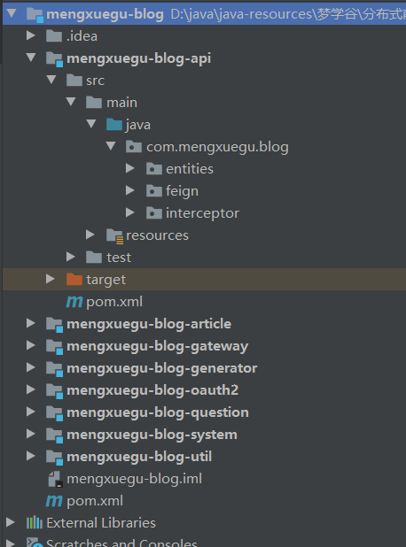
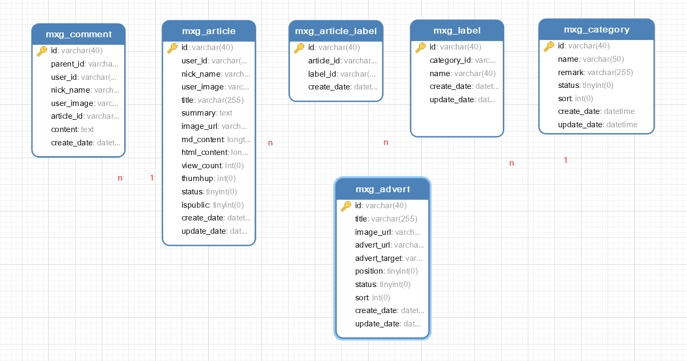

##   搭建工程



### 搭建父模块

pom文件

```xml
<dependencyManagement>
    <dependencies>
        <!-- spring cloud -->
        <dependency>
            <groupId>org.springframework.cloud</groupId>
            <artifactId>spring-cloud-dependencies</artifactId>
            <version>${spring-cloud.version}</version>
            <!--maven不支持多继承，使用 import 和pom来引入父模块-->
            <type>pom</type>
            <scope>import</scope>
        </dependency>
    </dependencies>dependencies>
 </dependencies>dependencyManagement>
```

```xml
<build>
  <resources>
    <resource>
        <!--编译时，默认情况下不会将    mapper.xml文件编译进去，
        src/main/java 资源文件的路径，
        **/*.xml 需要编译打包的文件类型是xml文件，
        -->
        <directory>src/main/java</directory>
        <includes>
            <include>**/*.xml</include>
        </includes>
    </resource>
    <resource>
        <directory>src/main/resources</directory>
    </resource>
</resources>  
</build>
```

### 搭建公共工具模块

#### 整合Lombok

添加依赖

```xml
<dependency>
    <groupId>org.projectlombok</groupId>
    <artifactId>lombok</artifactId>
</dependency>
```

安装插件

常用注解

> @Getter生成getter方法。
> @Setter生成setter方法。
> @ToString生成toString方法。
> **@NoArgsConstructor**生成无参构造方法。
> **@AllArgsConstructor**生成包含所有属性的构造方法。
> @RequiredArgsConstructor 会一 个包含常量,和标识了NotNull的变量的构造方法。生成的构造方法是私有的private。
> 主要使用@NoArgsConstructor 和@AllArgsConstructor 两个注解,这样就不需要自己写构造方法,代码简洁规范。
> **@Data**生成setter、getter、toString、hashCode 、equals 和@RequiredArgsConstructor 实现方法。

> **@Accessors**(chain = true) 生成的setter方法返回当前对象
>
> ```
> public Category setName(String name){
> 	this.name = name;
> 	return this;//会返回this当前对象
> }
> ```
>
> 类上未加**@Accessors**(chain = true) 时，生成的setter方法无返回值
>
> ```
> public void setName(String name){
> 	this.name = name;
> }
> ```
>
> 用法
>
> 可以在一行代码中执行多次set方法(级联操作)
>
> ```
> public static void main(String[] args){
> 	User user = new User;
> 	user.setAge();
> 	user.setName();
> 	
> 	user.setAge().setName().setSex();//在一行代码中执行多次set方法
> }
> ```

#### 接口统一响应结果类Result

```java
package com.mengxuegu.blog.util.base;

import com.mengxuegu.blog.util.enums.ResultEnum;
import lombok.AllArgsConstructor;
import lombok.Data;
import lombok.NoArgsConstructor;
import org.slf4j.Logger;
import org.slf4j.LoggerFactory;

import java.io.Serializable;

/**
 * 用于封装接口统一响应结果
 */
@Data
@NoArgsConstructor // 无参构造方法
@AllArgsConstructor // 有参构造方法
public final class Result implements Serializable {

    private static final Logger logger = LoggerFactory.getLogger(Result.class);

    private static final long serialVersionUID = 1L;

    /**
     * 响应业务状态码
     */
    private Integer code;

    /**
     * 响应信息
     */
    private String message;

    /**
     * 响应中的数据
     */
    private Object data;

    public static Result ok() {
        return new Result(ResultEnum.SUCCESS.getCode(), ResultEnum.SUCCESS.getDesc(), null);
    }

    public static Result ok(Object data) {
        return new Result(ResultEnum.SUCCESS.getCode(), ResultEnum.SUCCESS.getDesc(), data);
    }

    public static Result ok(String message, Object data) {
        return new Result(ResultEnum.SUCCESS.getCode(), message, data);
    }

    public static Result error(String message) {
        logger.debug("返回错误：code={}, message={}", ResultEnum.ERROR.getCode(), message);
        return new Result(ResultEnum.ERROR.getCode(), message, null);
    }

    //枚举类里没有时，自定义状态码，
    public static Result build(int code, String message) {
        logger.debug("返回结果：code={}, message={}", code, message);
        return new Result(code, message, null);
    }

    public static Result build(ResultEnum resultEnum) {
        logger.debug("返回结果：code={}, message={}", resultEnum.getCode(), resultEnum.getDesc());
        return new Result(resultEnum.getCode(), resultEnum.getDesc(), null);
    }

}
```

#### 请求参数基础类

```java
package com.mengxuegu.blog.util.base;

import com.baomidou.mybatisplus.core.metadata.IPage;
import com.baomidou.mybatisplus.extension.plugins.pagination.Page;
import io.swagger.annotations.ApiModelProperty;
import lombok.Data;
import lombok.experimental.Accessors;

import java.io.Serializable;

/**
 * 请求参数基础类、带分页参数
 * @param <T>
 */
@Accessors(chain = true)
@Data
public class BaseRequest<T> implements Serializable {

    @ApiModelProperty(value = "页码", required = true)
    private long current;

    @ApiModelProperty(value = "每页显示多少条", required = true)
    private long size;

    /**
     * 封装分页对象
     * @return
     */
    @ApiModelProperty(hidden = true) // 不在swagger接口文档中显示
    public IPage<T> getPage() {
        return new Page<T>().setCurrent(this.current).setSize(this.size);
    }

}
```

### 搭建API接口模块

#### 作用

> 在Api接口模块中统一管理项目模型类(实体类)，和统一定义Feign远程调用的接口，原因如下:
>
> + 接口的定义离不开数据模型,所以统-在此处定义模型类。
> + Api模块中定义的接口将作为各微服务间远程调用使用，Spring Cloud Feign中使用
> + 接口统-管理，方便维护.

### 搭建文章分类管理模块


### MyBatis-plus使用（SpringBoot）

1、基本使用

2、Api

​			 IPage xxxMapper.selectPage(E page,Wrapper queryWrapper)  分页条件查询

​			List<T> selectList(Wrapper queryWrapper);  按条件查询所有记录

3、条件构造器

```java
package com.mengxuegu.blog.article.config;

import com.baomidou.mybatisplus.extension.plugins.PaginationInterceptor;
import javafx.scene.control.Pagination;
import org.mybatis.spring.annotation.MapperScan;
import org.springframework.context.annotation.Bean;
import org.springframework.context.annotation.Configuration;
import org.springframework.transaction.annotation.EnableTransactionManagement;

@EnableTransactionManagement // 开启事务管理
@MapperScan("com.mengxuegu.blog.article.mapper") // 扫描mapper接口
@Configuration
public class MyBatisPlusConfig {

    /**
     * 分页插件
     * @return
     */
    @Bean
    public PaginationInterceptor paginationInterceptor() {
        return new PaginationInterceptor();
    }
}

```


```java
    //1、用Mybatis-plus API进行分页
	//  <E extends IPage<T>> E selectPage(E page,  Wrapper<T> queryWrapper);
	@Override
    public Result queryPage(CategoryREQ req) {
        // 查询条件对象
        QueryWrapper<Category> wrapper = new QueryWrapper();
        // 分类名称、状态
        if( StringUtils.isNotEmpty(req.getName()) ){
            wrapper.like("name", req.getName());
        }

        if(req.getStatus() != null) {
            wrapper.eq("status", req.getStatus());
        }
        
        wrapper.orderByDesc("status").orderByAsc("sort");//按指定字段排序

        // 第1个参数是Page分页对象，第2个参数查询条件(为null时表示查询所有)
        IPage<Category> data = baseMapper.selectPage(req.getPage(), wrapper);//
        return Result.ok(data);
    }

```

```java
//2、自定义分页查询
//mapper
IPage<Label> queryPage(IPage<Label> page, @Param("req") LabelREQ req);
```

```xml
    <select id="queryPage" resultType="Label">
        SELECT
            m1.id,
            m1.category_id,
            m1.`name`,
            m1.create_date,
            m1.update_date,
            m2.`name` category_name
        FROM
            mxg_label m1
            JOIN mxg_category m2
            ON m1.category_id = m2.id
        WHERE 1=1
        <if test="req.name != null and req.name != ''">
            AND m1.`name` LIKE CONCAT('%', #{req.name}, '%')
        </if>
        <if test="req.categoryId != null and req.categoryId != ''">
            AND m1.category_id = #{req.categoryId}
        </if>
        ORDER BY m1.update_date DESC
    </select>
```

```java
   //service
	@Override
    public Result queryPage(LabelREQ req) {
        // 条件分页查询
        IPage<Label> page = baseMapper.queryPage(req.getPage(), req);
        return Result.ok(page);
    }
```


#### 4、代码生成器

1. 引入依赖

   ```xml
            <dependency>
               <groupId>com.baomidou</groupId>
               <artifactId>mybatis-plus-boot-starter</artifactId>
           </dependency>
   		<dependency>
               <groupId>com.baomidou</groupId>
               <artifactId>mybatis-plus-generator</artifactId>
               <version>3.3.2</version>
           </dependency>
   
           <dependency>
               <groupId>org.freemarker</groupId>
               <artifactId>freemarker</artifactId>
           </dependency>
   ```

2. 创建新子模块

3. 生成代码

   ```java
   package com.mengxuegu.generator;
   
   import com.baomidou.mybatisplus.annotation.IdType;
   import com.baomidou.mybatisplus.core.exceptions.MybatisPlusException;
   import com.baomidou.mybatisplus.core.toolkit.StringUtils;
   import com.baomidou.mybatisplus.generator.AutoGenerator;
   import com.baomidou.mybatisplus.generator.config.DataSourceConfig;
   import com.baomidou.mybatisplus.generator.config.GlobalConfig;
   import com.baomidou.mybatisplus.generator.config.PackageConfig;
   import com.baomidou.mybatisplus.generator.config.StrategyConfig;
   import com.baomidou.mybatisplus.generator.config.rules.DateType;
   import com.baomidou.mybatisplus.generator.config.rules.NamingStrategy;
   import com.baomidou.mybatisplus.generator.engine.FreemarkerTemplateEngine;
   
   import java.util.Scanner;
   
   // 执行 main 方法控制台输入模块表名回车自动生成对应项目目录中
   public class CodeGenerator {
   
       // 生成的代码放到哪个工程中
       private static String PROJECT_NAME = "mengxuegu-blog-article";
   
       // 数据库名称
       private static String DATABASE_NAME = "mxg_blog_article";
   
       // 子包名
       private static String MODULE_NAME = "article";
   
       public static void main(String[] args) {
           // 代码生成器
           AutoGenerator mpg = new AutoGenerator();
   
           // 数据源配置
           DataSourceConfig dsc = new DataSourceConfig();
           dsc.setUrl("jdbc:mysql://localhost:3306/"+ DATABASE_NAME +"?useUnicode=true&characterEncoding=utf8&useSSL=false&serverTimezone=GMT%2B8");
           dsc.setDriverName("com.mysql.cj.jdbc.Driver");
           dsc.setUsername("root");
           dsc.setPassword("root");
           mpg.setDataSource(dsc);
   
           // 全局配置
           GlobalConfig gc = new GlobalConfig();
           String projectPath = System.getProperty("user.dir") + "/";
           gc.setOutputDir(projectPath + PROJECT_NAME +"/src/main/java");
           gc.setIdType(IdType.ASSIGN_ID); // 分布式id
           gc.setAuthor("梦学谷-www.mengxuegu.com");
           gc.setFileOverride(true); //覆盖现有的
           gc.setOpen(false); //是否生成后打开
           gc.setDateType(DateType.ONLY_DATE);
           gc.setSwagger2(true); //实体属性 Swagger2 注解
           mpg.setGlobalConfig(gc);
   
           // 包配置
           PackageConfig pc = new PackageConfig();
           pc.setParent("com.mengxuegu.blog"); //父包名
           pc.setController(MODULE_NAME+".controller"); // com.mengxuegu.blog.aritcle.controller
           pc.setService(MODULE_NAME+".service");
           pc.setServiceImpl(MODULE_NAME+".service.impl");
           pc.setMapper(MODULE_NAME+".mapper");
           pc.setXml(MODULE_NAME+".mapper.xml");
           pc.setEntity("entities");//实体类存储包名 com.mengxuegu.blog.entities
           mpg.setPackageInfo(pc);
   
   
           // 策略配置
           StrategyConfig strategy = new StrategyConfig();
           strategy.setNaming(NamingStrategy.underline_to_camel);
           strategy.setColumnNaming(NamingStrategy.underline_to_camel);
           strategy.setEntityLombokModel(true); //使用lombok
           strategy.setEntitySerialVersionUID(true);// 实体类的实现接口Serializable
           strategy.setRestControllerStyle(true); // @RestController
           strategy.setInclude(scanner("表名，多个英文逗号分割").split(","));
           strategy.setControllerMappingHyphenStyle(true);
           strategy.setTablePrefix("mxg_"); // 去掉表前缀
           mpg.setStrategy(strategy);
   
           mpg.setTemplateEngine(new FreemarkerTemplateEngine());
           mpg.execute();
       }
   
   
       /**
        * <p>
        * 读取控制台内容
        * </p>
        */
       public static String scanner(String tip) {
           Scanner scanner = new Scanner(System.in);
           StringBuilder help = new StringBuilder();
           help.append("请输入" + tip + "：");
           System.out.println(help.toString());
           if (scanner.hasNext()) {
               String ipt = scanner.next();
               if (StringUtils.isNotBlank(ipt)) {
                   return ipt;
               }
           }
           throw new MybatisPlusException("请输入正确的" + tip + "！");
       }
   
   }
   ```

   5、其他

   > 1、实体类中新增的属性（对应的表中没有该字段），需添加注解  @TableFiled(exit = false)

#### 请求类REQ

> 将查询请求参数封装为一个对象

### Swagger的使用

#### 0、添加依赖

```
<!-- Swagger -->
<dependency>
    <groupId>com.spring4all</groupId>
    <artifactId>swagger-spring-boot-starter</artifactId>
    <version>1.9.1.RELEASE</version>
</dependency>
```

#### 1、Controller上添加注解


#### 2、启动类添加注解@EnableSwagger2

## 文章管理模块

数据库分析




## Spring Cloud使用

### Feign远程调用使用

#### 0、添加依赖

```
<dependency>
    <groupId>org.springframework.cloud</groupId>
    <artifactId>spring-cloud-starter-openfeign</artifactId>
</dependency>
```


#### 1、在api工程中定义feign接口,统一管理；

```java
// value 指定目标微服务名字，path 目标微服务的上下路径contextPath值，如果目标微服务没有配置contextPath则不需要此path。
@FeignClient(value = "article-server", path = "/article")
public interface IFeignArticleController {

//    allowMultiple = true 表示是数组格式的参数，  dataType = "String" 数组中参数的类型
    @ApiImplicitParam(allowMultiple = true, dataType = "String"
            , name="ids", value = "标签ID集合", required = true)
    @ApiOperation("Feign接口-根据标签ids查询对应的标签信息")
    @GetMapping("/api/feign/label/list/{ids}")
    List<Label> getLabelListByIds(@PathVariable("ids") List<String> labelIds);

    @ApiOperation("Feign接口-更新文章表和评论表中的用户信息")
    @PutMapping("/feign/article/user")
    boolean updateUserInfo(@RequestBody UserInfoREQ req);

}

```

> @FeignClient注解中，
>
> value 指定目标微服务名字，path 目标微服务的上下路径contextPath值，如果目标微服务没有配置contextPath则不需要此path

#### 2、在目标服务中定义feign接口实现类；

```java
package com.mengxuegu.blog.article.feign;

import com.mengxuegu.blog.article.service.IArticleService;
import com.mengxuegu.blog.article.service.ILabelService;
import com.mengxuegu.blog.entities.Label;
import com.mengxuegu.blog.feign.IFeignArticleController;
import com.mengxuegu.blog.feign.req.UserInfoREQ;
import io.swagger.annotations.Api;
import org.springframework.beans.factory.annotation.Autowired;
import org.springframework.web.bind.annotation.RestController;

import java.util.List;

@Api(value = "被远程调用的文章微服务接口", description = "被远程调用的文章微服务接口")
@RestController // 注意不能少
public class FeignArticleController implements IFeignArticleController {

    @Autowired
    private ILabelService labelService;

    @Override
    public List<Label> getLabelListByIds(List<String> labelIds) {
        // IService<Label>中已经实现了此批量查询标签信息功能，mybatis-plus已经提供的
        return labelService.listByIds(labelIds);
    }

    @Autowired
    private IArticleService articleService;

    @Override
    public boolean updateUserInfo(UserInfoREQ req) {
        return articleService.updateUserInfo(req);
    }
}
```

> 1、feign接口实现类需添加注解@RestController
>
> 2、feign接口实现类完成后，可以直接调用feign接口api测试一下

#### 3、在调用服务中调用feign接口；

```java
package com.mengxuegu.blog.question.service.impl;

@Service
public class QuestionServiceImpl extends ServiceImpl<QuestionMapper, Question> implements IQuestionService {
    @Autowired // 不要少了， 下面红线忽略它
    private IFeignArticleController feignArticleController;

    @Override
    public Result findById(String id) {
        // 1. 查询问题详情与标签ids
        Question question = baseMapper.findQuestionAndLabelIdsById(id);

        if(question == null) {
            return Result.error("没有问题详情信息");
        }

        // TODO 2. Feign 远程调用  Article 服务查询标签信息
        if(CollectionUtils.isNotEmpty(question.getLabelIds())) {
            List<Label> labelList = feignArticleController.getLabelListByIds(question.getLabelIds());
            question.setLabelList(labelList);
        }

        return Result.ok(question);
    }
}
```

> 调用后再测试一下

#### 4、调用feign接口服务启动类添加注解

```java
@EnableFeignClients // 扫描 @Feign 接口进行远程调用
@EnableDiscoveryClient // 开启Nacos服务注册与发现功能
@EnableSwagger2Doc // 开启swagger功能
@SpringBootApplication
public class QuestionApplication {

    public static void main(String[] args) {
        SpringApplication.run(QuestionApplication.class, args);
    }

}
```

#### 5、feign使用注意事项

> 微服务 Feign 接口提供给远程调用，定义接口时使用SpringMVC注解接收请求数据，需要注意  :
>
> + @PathVariable 获取路径变量的值。如：请求 /get/{id} ，获取 @PathVariable("id") 括号中要指明属性名  
> + @RequestParam 获取请求参数的值。如：请求 /get?id=1 获取 @RequestParam("id") 括号中要指明属性名  
> + @ResponseBody 获取请求体中的 json 。  
>   + 针对普通数据类型集合参数，如 List<String> ，获取 void list( @ResponseBody String[] ids ) 要使用数组形式接收  

## 系统权限管理模块


### ==各模块增删改查常用接口==

增:

改:

删（按id删，批量删）:

查（按id查，按单条件查，**按多条件查--构建请求对象**，查所有）:

> 1、新增或修改任何表单时，都应将updateDate设置为当前时间。（所有表都应有create_date和update_date两个字段）


### 问题

1. mybatisplus  中 mapper对应的xml文件在哪里，其原理是什么？

2. 在分页查询mapper中,queryPage方法如何理解？xml中能直接获取传入参数的属性，不需要get方法获取？

   ```xml
       <select id="queryPage" resultType="Label">
           SELECT
               m1.id,
               m1.category_id,
               m1.`name`,
               m1.create_date,
               m1.update_date,
               m2.`name` category_name
           FROM
               mxg_label m1
               JOIN mxg_category m2
               ON m1.category_id = m2.id
           WHERE 1=1
           <if test="req.name != null and req.name != ''">
               AND m1.`name` LIKE CONCAT('%', #{req.name}, '%')
           </if>
           <if test="req.categoryId != null and req.categoryId != ''">
               AND m1.category_id = #{req.categoryId}
           </if>
           ORDER BY m1.update_date DESC
       </select>
   ```

   ```
   /**
    * 如果自定义sql要分页查询，只要在mapper写不带分页功能的查询sql语句，mybatis-plus它会自动将sql进行分页
    * 第1个参数必须传入分页对象 Page, 第2个参数是你查询条件的参数, 取一个别名
    * 最终会将查询到的数据封装到 IPage实现类中
    * @return
    */
   IPage<Label> queryPage(IPage<Label> page, @Param("req") LabelREQ req);
   ```

​		3.mybatisplus  中的 baseMapper是什么东西？

### 小技巧

1. sql语句

   ```xml
           SELECT
               m1.id,
               m1.category_id,
               m1.`name`,
               m1.create_date,
               m1.update_date,
               m2.name category_name
           FROM
               mxg_label m1
               JOIN mxg_category m2 ON m1.category_id = m2.id
           WHERE
               1 = 1           
               <if test="req.name != null and req.name != ''">
                   AND m1.`name` LIKE CONCAT( '%', #{req.name}, '%' )
               </if>
               <if test="req.categoryId != null and req.categoryId 1= ''">
                   AND m1.category_id=#{req.categoryId}
               </if>
           ORDER BY
               m1.update_date DESC
   ```

   > 1. 用 1=1 拼接可能存在的条件；
   > 2. 先创建好sql语句，测试并美化后，再放入java中
   > 3. name是sql关键字，需添加符号   ``(Tab上面的键)