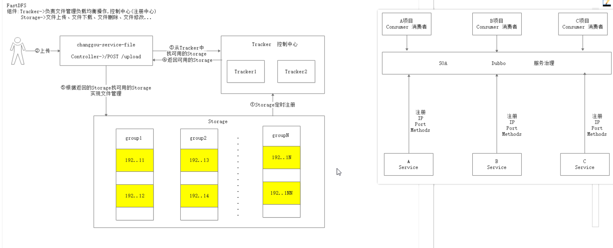

### 第一章 框架搭建

#### 技术架构

#### 系统架构图

#### 项目结构

#### 工程搭建

### 第二章

#### FastDFS

+ 是一个开源的轻量级**分布式文件系统**,对文件进行管理
+ 主要分为 Tracker server 和 Storage server两个组件，Storage server 负责文件上传和下载，Tracker server负载均衡和调度

##### 上传流程

