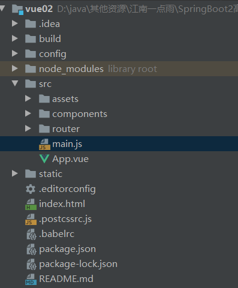

## Vue

SPA（single page application）:单页面应用，前端都通过一个html文件展示，后台管理系统用的比较多。

### 创建单页面应用项目

先安装node.js（运行前端项目）和npm（前端包管理工具）


**执行** npm install … **命令时，默认使用的是国外的下载源 ，可以通过如下代码配置为使用淘宝的镜像：**

>  npm config set registry https://registry.npm.taobao.org

安装vue工具vue-cli2

npm install -g vue-cli

#### **用vue-cli2创建vue工程**

> vue init webpack my-project # 使用webpack模板创建一个vue项目
>
> cd my-project #进入到项目目录中
>
> npm install # 下载依赖（如果在项目创建的最后一步选择了自动执行npm install，则该步骤可以省略）
>
> **npm run dev** # 启动项目	（可以在Run/Debug Configurations中配置便捷运行（template选npm,Command选run,Scripts选dev））

 工程目录



main.js

```javascript
import Vue from 'vue'
import App from './App'
import router from './router'

Vue.config.productionTip = false

/* eslint-disable no-new */
new Vue({
  el: '#app',
  router:router,
  components: {
    App
  },
  template: '<App/>'
})
```

App.vue

```css
<template>
  <div id="app">
    
    <router-view/>
  </div>
</template>

<script>
export default {
  name: 'App'
}
</script>

<style>
#app {
  font-family: 'Avenir', Helvetica, Arial, sans-serif;
  -webkit-font-smoothing: antialiased;
  -moz-osx-font-smoothing: grayscale;
  text-align: center;
  color: #2c3e50;
  margin-top: 60px;
}
</style>

```


安装vue工具vue-cli3

npm install -g @vue/cli版本号

（卸载：npm uninstall -g @vue/cli）

#### 用vue-cli3创建vue工程

> vue create my-project
>
> cd my-project
>
> npm run server

工程文件介绍

views 可以是完整页面，也可以是组件


### 权限管理

基于数据库


资源——(N-N）角色（N-N）——用户


#### 用户操作hr

##### 1、model 

实现UserDetails接口，重写相应方法

```java
public class Hr implements UserDetails {
    private Integer id;

    private String name;

    private String phone;

    private String telephone;

    private String address;
    ......
            @Override
    public boolean isAccountNonExpired() {
        return true;
    }

    @Override
    public boolean isAccountNonLocked() {
        return true;
    }

    @Override
    public boolean isCredentialsNonExpired() {
        return true;
    }

    @Override
    public boolean isEnabled() {
        return enabled;
    }
    ......
}
```

##### 2、servcie

实现UserDetailsService接口，重写loadUserByUsername（）方法

```java
@Service
public class HrService implements UserDetailsService {
    @Autowired
    HrMapper hrMapper;

    @Override
    public UserDetails loadUserByUsername(String s) throws UsernameNotFoundException {
        Hr hr = hrMapper.selectByName(s);
        if(hr==null){
            throw new UsernameNotFoundException("用户未找到");
        }
        return hr;
    }
}
```

##### 3、WebSecurityConfig

最初版，验证是否根据数据库中的账号登录（简单测试）

```java
@Configuration
public class WebSecurityConfig extends WebSecurityConfigurerAdapter {
    @Autowired
    private HrService hrService;

    @Override
    protected void configure(AuthenticationManagerBuilder auth) throws Exception {
        auth.userDetailsService(hrService);
    }

    @Bean
    PasswordEncoder passwordEncoder(){
        return new BCryptPasswordEncoder();
    }
}
```

完善登录（**认证**）接口

```java
package com.ox.config;

import com.fasterxml.jackson.databind.ObjectMapper;
import com.ox.model.Hr;
import com.ox.service.HrService;
import com.ox.utils.RespBean;
import org.springframework.beans.factory.annotation.Autowired;
import org.springframework.context.annotation.Bean;
import org.springframework.context.annotation.Configuration;
import org.springframework.security.authentication.*;
import org.springframework.security.config.annotation.authentication.builders.AuthenticationManagerBuilder;
import org.springframework.security.config.annotation.web.builders.HttpSecurity;
import org.springframework.security.config.annotation.web.builders.WebSecurity;
import org.springframework.security.config.annotation.web.configuration.WebSecurityConfigurerAdapter;
import org.springframework.security.core.Authentication;
import org.springframework.security.core.AuthenticationException;
import org.springframework.security.crypto.bcrypt.BCryptPasswordEncoder;
import org.springframework.security.crypto.password.PasswordEncoder;
import org.springframework.security.web.authentication.AuthenticationFailureHandler;
import org.springframework.security.web.authentication.AuthenticationSuccessHandler;
import org.springframework.security.web.authentication.logout.LogoutSuccessHandler;

import javax.servlet.ServletException;
import javax.servlet.http.HttpServletRequest;
import javax.servlet.http.HttpServletResponse;
import java.io.IOException;
import java.io.PrintWriter;

@Configuration
public class WebSecurityConfig extends WebSecurityConfigurerAdapter {
    @Autowired
    private HrService hrService;

    @Bean
    PasswordEncoder passwordEncoder(){
        return new BCryptPasswordEncoder();
    }

    @Override
    protected void configure(AuthenticationManagerBuilder auth) throws Exception {
        auth.userDetailsService(hrService);
    }

    @Override
    protected void configure(HttpSecurity http) throws Exception {
        http.authorizeRequests()
                .anyRequest().authenticated()
                .and()
                .formLogin()
                .usernameParameter("username")
                .passwordParameter("password")
                .loginProcessingUrl("/doLogin")  //  登录请求地址 http://127.0.0.1:8081/doLogin
                .loginPage("/login")         //登录页面地址，创建html页面或请求地址为此的controller
                .successHandler(new AuthenticationSuccessHandler() {
                    @Override
                    public void onAuthenticationSuccess(HttpServletRequest httpServletRequest, HttpServletResponse resp, Authentication authentication) throws IOException, ServletException {
                        //登录成功，则返回并登录成功对象
                        resp.setContentType("application/json;charset=utf-8");
                        PrintWriter out = resp.getWriter();
                        Hr hr = (Hr) authentication.getPrincipal();//登录成功的对象
                        hr.setPassword(null);//隐藏输出信息中的密码值
                        RespBean ok = RespBean.ok("登录成功", hr);
                        //ObjectMapper是FastJson所提供的把对象转为json格式的工具
        				//writeValueAsString（res）：将传入的对象序列化为json，返回给调用者.
                        String s = new ObjectMapper().writeValueAsString(ok);
                        out.write(s);
                        out.flush();
                        out.close();
                    }
                })
                .failureHandler(new AuthenticationFailureHandler() {
                    @Override
                    public void onAuthenticationFailure(HttpServletRequest req, HttpServletResponse resp, AuthenticationException exception) throws IOException, ServletException {
                        //登录失败，分别在前后台输出错误信息
                        resp.setContentType("application/json;charset=utf-8");
                        PrintWriter out = resp.getWriter();
                        exception.printStackTrace();
                        RespBean respBean = RespBean.error("登录失败");

                        if(exception instanceof LockedException){
                            respBean.setMessage("账号被锁定，请联系管理员");
                        }else if(exception instanceof DisabledException){
                            respBean.setMessage("账号被禁用，请联系管理员");
                        }else if(exception instanceof CredentialsExpiredException){
                            respBean.setMessage("密码过期，请联系管理员");
                        }else if(exception instanceof AccountExpiredException) {
                            respBean.setMessage("账号过期，请联系管理员");
                        }else if(exception instanceof BadCredentialsException){
                            respBean.setMessage("账号或密码错误，请重新输入");
                        }
                        String s = new ObjectMapper().writeValueAsString(respBean);
                        out.write(s);
                        out.flush();
                        out.close();
                    }
                })
                .permitAll()
                .and()
                .logout()    //使用默认地址 http://127.0.0.1:8081/logout
                .logoutSuccessHandler(new LogoutSuccessHandler() {
                    @Override
                    public void onLogoutSuccess(HttpServletRequest httpServletRequest, HttpServletResponse resp, Authentication authentication) throws IOException, ServletException {
                        resp.setContentType("application/json;charset=utf-8");
                        PrintWriter out = resp.getWriter();
                        RespBean ok = RespBean.error("注销成功");
                        String s = new ObjectMapper().writeValueAsString(ok);
                        out.write(s);
                        out.flush();
                        out.close();
                    }
                })
                .permitAll()
                .and()
                .csrf().disable();//允许postman测试
    }
}

```

#### 菜单操作menu

目的：根据当前登录用户id展示具有的菜单

##### 1、model

```java
package com.ox.model;

import java.util.List;

public class Menu {
    private Integer id;

    private String url;

    private String path;

    private String component;

    private String name;

    private String iconCls;

    private Meta meta;//把这俩个字段独立封装出来（一对一）

    private Integer parentId;

    private Boolean enabled;

    private List<Menu> children;//=========（一对多）

	getter...setter...
}
```

```java
package com.ox.model;

public class Meta {
    private Boolean keepAlive;

    private Boolean requireAuth;
	getter...setter...
}
```

##### 2、mapper

```xml
<?xml version="1.0" encoding="UTF-8" ?>
<!DOCTYPE mapper PUBLIC "-//mybatis.org//DTD Mapper 3.0//EN" "http://mybatis.org/dtd/mybatis-3-mapper.dtd" >
<mapper namespace="com.ox.mapper.MenuMapper" >
  <resultMap id="BaseResultMap" type="com.ox.model.Menu" >
    <id column="id" property="id" jdbcType="INTEGER" />
    <result column="url" property="url" jdbcType="VARCHAR" />
    <result column="path" property="path" jdbcType="VARCHAR" />
    <result column="component" property="component" jdbcType="VARCHAR" />
    <result column="name" property="name" jdbcType="VARCHAR" />
    <result column="iconCls" property="iconCls" jdbcType="VARCHAR" />
<!--    <result column="keepAlive" property="keepAlive" jdbcType="BIT" />-->
<!--    <result column="keepAlive" property="keepAlive" jdbcType="BIT" />-->
    <result column="parentId" property="parentId" jdbcType="INTEGER" />
    <result column="enabled" property="enabled" jdbcType="BIT" />
	<!--一对一-->
    <association  property="meta" javaType="com.ox.model.Meta">
      <result column="keepAlive" property="keepAlive" jdbcType="BIT"/>
      <result column="requireAuth" property="requireAuth" jdbcType="BIT"/>
    </association>
  </resultMap>
  <!--一对多-->
  <resultMap id="Menus2" type="com.ox.model.Menu" extends="BaseResultMap">
    <collection property="children" ofType="com.ox.model.Menu">
      <id column="id2" property="id" jdbcType="INTEGER" />
      <result column="url2" property="url" jdbcType="VARCHAR" />
      <result column="path2" property="path" jdbcType="VARCHAR" />
      <result column="component2" property="component" jdbcType="VARCHAR" />
      <result column="name2" property="name" jdbcType="VARCHAR" />
      <result column="iconCls2" property="iconCls" jdbcType="VARCHAR" />
      <!--    <result column="keepAlive" property="keepAlive" jdbcType="BIT" />-->
      <!--    <result column="keepAlive" property="keepAlive" jdbcType="BIT" />-->
      <result column="parentId2" property="parentId" jdbcType="INTEGER" />
      <result column="enabled2" property="enabled" jdbcType="BIT" />

      <association  property="meta" javaType="com.ox.model.Meta">
        <result column="keepAlive2" property="keepAlive" jdbcType="BIT"/>
        <result column="requireAuth2" property="requireAuth" jdbcType="BIT"/>
      </association>
    </collection>
  </resultMap>

  <!--根据登录用户id查找具有的菜单-->
  <select id="getMenusByHrId" resultMap="Menus2">
    select DISTINCT m1.*,m2.id as id2,m2.path as path2,m2.url as url2,m2.component as component2,m2.`name` as name2,m2.iconCls as iconCls2,m2.keepAlive as keepAlive2,m2.parentId as parentId2,m2.enabled as enabled2
    from menu m1,menu m2,menu_role mr,hr_role hrr
    where m1.id=m2.parentId and hrr.hrid=#{hrId} and hrr.rid=mr.rid and mr.mid=m2.id and m2.enabled=1
    order by m1.id,m2.id
  </select>
</mapper>
```

##### 3、service

```java
@Service
public class MenuService {
    @Autowired
    MenuMapper menuMapper;

    public List<Menu> getMenusByHrId(){
        //获取当前登录用户
        Hr hr = (Hr) SecurityContextHolder.getContext().getAuthentication().getPrincipal();
        return menuMapper.getMenusByHrId(hr.getId());
    }
}
```

##### 4、controller

```java
@RestController
@RequestMapping("/system/config")
public class SystemConfigController {
    @Autowired
    private MenuService menuService;
    //获取登录用户的菜单信息
    @GetMapping("/menu")
    public List<Menu> getMenuByHrId(){
        return menuService.getMenusByHrId();
    }
}
```

#### 权限设计

### 通用API操作

#### 批量删除

```java
@DeleteMapping("/")
public RespBean deletePositionsByIds(Integer[] ids) {
    if (positionService.deletePositionsByIds(ids) == ids.length) {
        return RespBean.ok("删除成功!");
    }
    return RespBean.error("删除失败!");
}
```

```java
public Integer deletePositionsByIds(Integer[] ids) {
    return positionMapper.deletePositionsByIds(ids);
}
```

```java
Integer deletePositionsByIds(@Param("ids") Integer[] ids);
```

```xml
<delete id="deletePositionsByIds">
    delete from position where id in
    <foreach collection="ids" item="id" separator="," open="(" close=")">
        #{id}
    </foreach>
</delete>
```

#### 多级内容访问

(微人事视频72节)

>  方法1：直接用递归实现
>
> 方法2：用mybatis延迟加载（select）实现递归

department表


```java
public class Department implements Serializable {
    private Integer id;

    private String name;

    private Integer parentId;

    private String depPath;

    private Boolean enabled;

    private Boolean isParent;
    private List<Department> children = new ArrayList<>();
	getter...setter...
}
```

```java
@RestController
@RequestMapping("/system/basic/department")
public class DepartmentController {
    @Autowired
    DepartmentService departmentService;
    @GetMapping("/")
    public List<Department> getAllDepartments() {
        return departmentService.getAllDepartments();
    }
}
```

```java
@Service
public class DepartmentService {
    @Autowired
    DepartmentMapper departmentMapper;
    public List<Department> getAllDepartments() {
        return departmentMapper.getAllDepartmentsByParentId(-1);
    }
}
```

```java
List<Department> getAllDepartmentsByParentId(Integer pid);
```

```xml
<?xml version="1.0" encoding="UTF-8" ?>
<!DOCTYPE mapper PUBLIC "-//mybatis.org//DTD Mapper 3.0//EN" "http://mybatis.org/dtd/mybatis-3-mapper.dtd" >
<mapper namespace="org.javaboy.vhr.mapper.DepartmentMapper">
    <resultMap id="BaseResultMap" type="org.javaboy.vhr.model.Department">
        <id column="id" property="id" jdbcType="INTEGER"/>
        <result column="name" property="name" jdbcType="VARCHAR"/>
        <result column="parentId" property="parentId" jdbcType="INTEGER"/>
        <result column="depPath" property="depPath" jdbcType="VARCHAR"/>
        <result column="enabled" property="enabled" jdbcType="BIT"/>
        <result column="isParent" property="isParent" jdbcType="BIT"/>
    </resultMap>
    <resultMap id="DepartmentWithChildren" type="org.javaboy.vhr.model.Department" extends="BaseResultMap">
        <collection property="children" ofType="org.javaboy.vhr.model.Department"
                    select="org.javaboy.vhr.mapper.DepartmentMapper.getAllDepartmentsByParentId" column="id"/>
    </resultMap>
    <sql id="Base_Column_List">
    id, name, parentId, depPath, enabled, isParent
  </sql>
    <select id="getAllDepartmentsWithOutChildren" resultMap="BaseResultMap">
        select
        <include refid="Base_Column_List">
        </include>
        from department;
    </select>
   <select id="getAllDepartmentsByParentId" resultMap="DepartmentWithChildren">
    	select * from department where parentId=#{pid};
   </select>
</mapper>
```

http://localhost:8081/system/basic/department/访问部分结果


#### employee表操作


```java
public class Employee implements Serializable {
    private Integer id;

    private String name;

    private String gender;

    @JsonFormat(pattern = "yyyy-MM-dd",timezone = "Asia/Shanghai")
    private Date birthday;

    private String idCard;

    private String wedlock;

    private Integer nationId;

    private String nativePlace;

    private Integer politicId;

    private String email;

    private String phone;

    private String address;

    private Integer departmentId;

    private Integer jobLevelId;

    private Integer posId;

    private String engageForm;

    private String tiptopDegree;

    private String specialty;

    private String school;

    @JsonFormat(pattern = "yyyy-MM-dd",timezone = "Asia/Shanghai")
    private Date beginDate;

    private String workState;

    private String workID;

    private Double contractTerm;

    @JsonFormat(pattern = "yyyy-MM-dd",timezone = "Asia/Shanghai")
    private Date conversionTime;

    @JsonFormat(pattern = "yyyy-MM-dd",timezone = "Asia/Shanghai")
    private Date notWorkDate;

    @JsonFormat(pattern = "yyyy-MM-dd",timezone = "Asia/Shanghai")
    private Date beginContract;

    @JsonFormat(pattern = "yyyy-MM-dd",timezone = "Asia/Shanghai")
    private Date endContract;

    private Integer workAge;
    private Nation nation;
    private Politicsstatus politicsstatus;
    private Department department;
    private JobLevel jobLevel;
    private Position position;
    private Salary salary;
	getter...setter..
}
```


##### 查询所有员工信息

```xml
<?xml version="1.0" encoding="UTF-8" ?>
<!DOCTYPE mapper PUBLIC "-//mybatis.org//DTD Mapper 3.0//EN" "http://mybatis.org/dtd/mybatis-3-mapper.dtd" >
<mapper namespace="org.javaboy.vhr.mapper.EmployeeMapper">
    <resultMap id="BaseResultMap" type="org.javaboy.vhr.model.Employee">
        <id column="id" property="id" jdbcType="INTEGER"/>
        <result column="name" property="name" jdbcType="VARCHAR"/>
        <result column="gender" property="gender" jdbcType="CHAR"/>
        <result column="birthday" property="birthday" jdbcType="DATE"/>
        <result column="idCard" property="idCard" jdbcType="CHAR"/>
        <result column="wedlock" property="wedlock" jdbcType="CHAR"/>
        <result column="nationId" property="nationId" jdbcType="INTEGER"/>
        <result column="nativePlace" property="nativePlace" jdbcType="VARCHAR"/>
        <result column="politicId" property="politicId" jdbcType="INTEGER"/>
        <result column="email" property="email" jdbcType="VARCHAR"/>
        <result column="phone" property="phone" jdbcType="VARCHAR"/>
        <result column="address" property="address" jdbcType="VARCHAR"/>
        <result column="departmentId" property="departmentId" jdbcType="INTEGER"/>
        <result column="jobLevelId" property="jobLevelId" jdbcType="INTEGER"/>
        <result column="posId" property="posId" jdbcType="INTEGER"/>
        <result column="engageForm" property="engageForm" jdbcType="VARCHAR"/>
        <result column="tiptopDegree" property="tiptopDegree" jdbcType="CHAR"/>
        <result column="specialty" property="specialty" jdbcType="VARCHAR"/>
        <result column="school" property="school" jdbcType="VARCHAR"/>
        <result column="beginDate" property="beginDate" jdbcType="DATE"/>
        <result column="workState" property="workState" jdbcType="CHAR"/>
        <result column="workID" property="workID" jdbcType="CHAR"/>
        <result column="contractTerm" property="contractTerm" jdbcType="DOUBLE"/>
        <result column="conversionTime" property="conversionTime" jdbcType="DATE"/>
        <result column="notWorkDate" property="notWorkDate" jdbcType="DATE"/>
        <result column="beginContract" property="beginContract" jdbcType="DATE"/>
        <result column="endContract" property="endContract" jdbcType="DATE"/>
        <result column="workAge" property="workAge" jdbcType="INTEGER"/>
    </resultMap>
    <resultMap id="AllEmployeeInfo" type="org.javaboy.vhr.model.Employee" extends="BaseResultMap">
        <association property="nation" javaType="org.javaboy.vhr.model.Nation">
            <id column="nid" property="id"/>
            <result column="nname" property="name"/>
        </association>
        <association property="politicsstatus" javaType="org.javaboy.vhr.model.Politicsstatus">
            <id column="pid" property="id"/>
            <result column="pname" property="name"/>
        </association>
        <association property="department" javaType="org.javaboy.vhr.model.Department">
            <id column="did" property="id"/>
            <result column="dname" property="name"/>
        </association>
        <association property="jobLevel" javaType="org.javaboy.vhr.model.JobLevel">
            <id column="jid" property="id"/>
            <result column="jname" property="name"/>
        </association>
        <association property="position" javaType="org.javaboy.vhr.model.Position">
            <id column="posid" property="id"/>
            <result column="posname" property="name"/>
        </association>
    </resultMap>
    
    <select id="getEmployeeById" resultMap="AllEmployeeInfo">
        select e.*,p.`id` as pid,p.`name` as pname,n.`id` as nid,n.`name` as nname,d.`id` as did,d.`name` as
        dname,j.`id` as jid,j.`name` as jname,pos.`id` as posid,pos.`name` as posname 
        from employee e,nation
        n,politicsstatus p,department d,joblevel j,position pos 
        where e.`nationId`=n.`id` and e.`politicId`=p.`id` and e.`departmentId`=d.`id` and e.`jobLevelId`=j.`id` and e.`posId`=pos.`id` and e.`id`=#{id}
    </select>
    <select id="getEmployeeByPage" resultMap="AllEmployeeInfo">
        select e.*,p.`id` as pid,p.`name` as pname,n.`id` as nid,n.`name` as nname,d.`id` as did,d.`name` as
        dname,j.`id` as jid,j.`name` as jname,pos.`id` as posid,pos.`name` as posname 
        from employee e,nation
        n,politicsstatus p,department d,joblevel j,position pos 
        where e.`nationId`=n.`id` and e.`politicId`=p.`id` and e.`departmentId`=d.`id` and e.`jobLevelId`=j.`id` and e.`posId`=pos.`id`
        <if test="emp.name !=null and emp.name!=''">
            and e.name like concat('%',#{emp.name},'%')
        </if>
        <if test="emp.politicId !=null">
            and e.politicId =#{emp.politicId}
        </if>
        <if test="emp.nationId !=null">
            and e.nationId =#{emp.nationId}
        </if>
        <if test="emp.departmentId !=null">
            and e.departmentId =#{emp.departmentId}
        </if>
        <if test="emp.jobLevelId !=null">
            and e.jobLevelId =#{emp.jobLevelId}
        </if>
        <if test="emp.engageForm !=null and emp.engageForm!=''">
            and e.engageForm =#{emp.engageForm}
        </if>
        <if test="emp.posId !=null">
            and e.posId =#{emp.posId}
        </if>
        <if test="beginDateScope !=null">
            and e.beginDate between #{beginDateScope[0]} and #{beginDateScope[1]}
        </if>
        <if test="page !=null and size!=null">
            limit #{page},#{size}
        </if>
    </select>
```


### 邮箱发送

1、依赖

Thymeleaf.Spring for rabbitmq.Java mail sender

2、配置文件

3、模板

### MybatisGenerator使用

1. 修改generator.xml文件中的
   + <jdbcConnection>标签中的driverClass、connectionURL
   + 修改mapper,model,sqlmap对应的生成路径
   + 修改<table>标签项
   + 注意<classPathEntry>标签中数据库驱动对应
2. 运行  java -jar lib/mybatis-generator-core-1.3.1.jar -configfile generator.xml -overwrite (写入.bat文件时，直接运行)
3. 注意：有些字段没有驼峰转换，需更改

### 小技巧

> 注解
>
> ​	在属性上添加注解@JsonIgnore: 在json序列化时，将java bean中的一些属性忽略掉。返回的json数据即不包含该属性
>
> ​	在属性上添加注解@JsonFormat(pattern = "yyyy-MM-dd",timezone = "Asia/Shanghai")，格式化输出日期
>
> 在service中进行增或改操作时，需修改create_date或update_date属性

